# AI-Driven Optimization Strategies Integration Analysis

## Table of Contents
- [1. Executive Summary](#1-executive-summary)
- [2. Introduction](#2-introduction)
- [3. Overview of AI-Driven Optimization Strategies](#3-overview-of-ai-driven-optimization-strategies)
- [4. Data Requirements Analysis](#4-data-requirements-analysis)
  - [4.1 Dynamic Hashrate Tuning](#41-dynamic-hashrate-tuning)
  - [4.2 Intelligent Overclocking](#42-intelligent-overclocking)
  - [4.3 Adaptive Cooling Management](#43-adaptive-cooling-management)
  - [4.4 Market Trend Analysis](#44-market-trend-analysis)
  - [4.5 Pool Selection Optimization](#45-pool-selection-optimization)
  - [4.6 Risk Assessment](#46-risk-assessment)
- [5. Data Pipeline Integration](#5-data-pipeline-integration)
  - [5.1 Data Collection Enhancements](#51-data-collection-enhancements)
  - [5.2 Data Transformation Extensions](#52-data-transformation-extensions)
  - [5.3 Data Storage Considerations](#53-data-storage-considerations)
  - [5.4 Data Flow Diagrams](#54-data-flow-diagrams)
- [6. ML Recommendation Engine Integration](#6-ml-recommendation-engine-integration)
  - [6.1 Model Architecture Considerations](#61-model-architecture-considerations)
  - [6.2 Feature Engineering Requirements](#62-feature-engineering-requirements)
  - [6.3 Model Training Approaches](#63-model-training-approaches)
  - [6.4 Inference Pipeline Adaptations](#64-inference-pipeline-adaptations)
- [7. Performance Metrics and Evaluation](#7-performance-metrics-and-evaluation)
  - [7.1 Dynamic Hashrate Tuning Metrics](#71-dynamic-hashrate-tuning-metrics)
  - [7.2 Intelligent Overclocking Metrics](#72-intelligent-overclocking-metrics)
  - [7.3 Adaptive Cooling Management Metrics](#73-adaptive-cooling-management-metrics)
  - [7.4 Market Trend Analysis Metrics](#74-market-trend-analysis-metrics)
  - [7.5 Pool Selection Optimization Metrics](#75-pool-selection-optimization-metrics)
  - [7.6 Risk Assessment Metrics](#76-risk-assessment-metrics)
- [8. Implementation Roadmap](#8-implementation-roadmap)
  - [8.1 Phase 1: Foundation Enhancement](#81-phase-1-foundation-enhancement)
  - [8.2 Phase 2: Core AI Implementation](#82-phase-2-core-ai-implementation)
  - [8.3 Phase 3: Advanced Integration](#83-phase-3-advanced-integration)
  - [8.4 Phase 4: Optimization and Scale](#84-phase-4-optimization-and-scale)
- [9. Challenges and Mitigations](#9-challenges-and-mitigations)
- [10. Conclusion](#10-conclusion)

## 1. Executive Summary

This document analyzes the integration of six advanced AI-driven optimization strategies into our existing cryptocurrency mining monitoring system. The strategies—dynamic hashrate tuning, intelligent overclocking, adaptive cooling management, market trend analysis, pool selection optimization, and risk assessment—represent significant enhancements to our current capabilities.

Our analysis reveals that while our existing data pipeline and ML recommendation architecture provide a solid foundation, several extensions are required to fully support these advanced AI techniques. Key findings include:

1. **Data Requirements**: Each AI strategy requires additional data points and increased collection frequencies, particularly for real-time optimization strategies like dynamic hashrate tuning and adaptive cooling management.

2. **Model Architecture**: The new strategies necessitate more sophisticated modeling approaches, including reinforcement learning for dynamic optimization, physics-informed neural networks for thermal management, and ensemble methods for market analysis.

3. **Integration Points**: Clear integration pathways exist between the new AI strategies and our current recommendation system, with opportunities to enhance existing recommendation types and introduce new ones.

4. **Implementation Approach**: A phased implementation approach is recommended, starting with foundation enhancements to the data pipeline, followed by core AI implementation, advanced integration, and finally optimization and scaling.

The successful integration of these AI-driven strategies is expected to significantly improve mining profitability, operational efficiency, and hardware longevity. This document provides a comprehensive roadmap for this integration, including data requirements, modeling approaches, performance metrics, and implementation phases.

## 2. Introduction

The cryptocurrency mining industry is rapidly evolving, with artificial intelligence playing an increasingly critical role in optimizing operations. Our existing cryptocurrency mining monitoring system already provides valuable insights and recommendations through its ML recommendation engine. However, to maintain competitive advantage and maximize mining efficiency, we need to incorporate more advanced AI-driven optimization strategies.

This document analyzes how six key AI-driven optimization strategies would integrate with our existing data pipeline and ML recommendation engine:

1. **Dynamic Hashrate Tuning**: Real-time adjustment of mining parameters based on network conditions, energy prices, and market data.
2. **Intelligent Overclocking**: Machine learning-optimized GPU and ASIC performance settings that balance hashrate, power consumption, and hardware longevity.
3. **Adaptive Cooling Management**: AI-driven optimization of cooling systems to reduce energy consumption while maintaining safe operating temperatures.
4. **Market Trend Analysis**: Advanced time-series forecasting and multi-factor market models to adapt to changing cryptocurrency markets.
5. **Pool Selection Optimization**: AI-driven analysis of mining pool performance, reward mechanisms, and reliability.
6. **Risk Assessment**: Predictive models for hardware failures, operational risks, and financial vulnerabilities.

For each strategy, we analyze:
- Data requirements and sources
- Integration points with the existing data pipeline
- Model architecture considerations
- Performance metrics and evaluation approaches
- Implementation roadmap and challenges

This analysis aims to provide a comprehensive understanding of how these advanced AI techniques can be integrated into our existing system to enhance mining profitability, operational efficiency, and hardware longevity.

## 3. Overview of AI-Driven Optimization Strategies

Before diving into integration details, let's briefly summarize each AI-driven optimization strategy and its potential benefits:

### Dynamic Hashrate Tuning

Dynamic hashrate tuning uses AI algorithms to optimize mining hardware performance in real-time based on network conditions, energy prices, and market data. Key capabilities include:

- Real-time adaptive control systems that continuously monitor and adjust mining parameters
- Multi-factor optimization algorithms that process variables like network difficulty, energy prices, and market conditions
- Predictive hashrate management that forecasts network difficulty changes and price movements

**Benefits**: Up to 30% reduction in operational costs through compute optimization, improved energy efficiency, and maximized profitability across changing market conditions.

### Intelligent Overclocking

Intelligent overclocking uses machine learning to optimize GPU and ASIC performance settings while balancing hashrate, power consumption, and hardware longevity. Key approaches include:

- Hardware-specific optimization models trained on performance data from thousands of identical cards
- Adaptive overclocking techniques that adjust to changing conditions
- Efficiency-focused approaches that find the optimal point on the power-hashrate curve

**Benefits**: Increased hashrate without proportional power increase, extended hardware lifespan through optimized settings, and algorithm-specific optimization for maximum efficiency.

### Adaptive Cooling Management

Adaptive cooling management uses AI to optimize cooling systems in mining operations, reducing energy consumption while maintaining safe operating temperatures. Key techniques include:

- Physics-informed reinforcement learning frameworks that model complex thermal dynamics
- Digital twins of mining facilities that simulate airflow and thermal patterns
- Thermal prediction and proactive management to anticipate and prevent thermal issues

**Benefits**: 14-21% energy savings for cooling systems, reduced thermal throttling, extended hardware lifespan, and optimized cooling resource allocation.

### Market Trend Analysis

AI-driven market trend analysis helps mining operations adapt to changing cryptocurrency markets and maximize profitability. Key approaches include:

- Advanced time-series forecasting using LSTM and Transformer models
- Multi-factor market models incorporating on-chain metrics, social sentiment, and technical indicators
- Adaptive mining strategies that translate market insights into actionable mining decisions

**Benefits**: Improved coin switching decisions, optimal entry and exit points, risk-adjusted mining strategies, and better long-term planning.

### Pool Selection Optimization

AI-driven pool selection optimization helps miners choose the most profitable and reliable mining pools. Key capabilities include:

- Comprehensive pool performance analysis across reward mechanisms, fees, and stability
- Dynamic pool switching strategies based on real-time profitability comparison
- Risk-reward optimization balancing profitability with centralization and security risks

**Benefits**: Increased mining rewards, reduced fees, improved stability, and optimized MEV (Miner Extractable Value) opportunities.

### Risk Assessment

AI-driven risk assessment helps mining operations identify and mitigate various risks, from hardware failures to market volatility. Key approaches include:

- Hardware failure prediction using anomaly detection and survival analysis
- Operational risk management for power supply, network connectivity, and environmental factors
- Financial risk assessment including profitability thresholds and break-even analysis

**Benefits**: Reduced downtime, preventive maintenance optimization, improved operational stability, and better financial planning.

## 4. Data Requirements Analysis

Each AI-driven optimization strategy requires specific data inputs to function effectively. This section analyzes the data requirements for each strategy and identifies gaps in our current data collection.

### 4.1 Dynamic Hashrate Tuning

#### Current Data Availability
Our existing data pipeline already collects several data points needed for dynamic hashrate tuning:
- Miner hashrate (overall and per hashboard)
- Power consumption and efficiency metrics
- Pool performance and profitability data
- Basic market data (prices, volumes)

#### Additional Data Requirements

| Data Category | Data Points | Source | Collection Frequency | Purpose |
|---------------|-------------|--------|---------------------|---------|
| **Energy Data** | Time-of-day electricity pricing | Energy provider APIs | Hourly | Optimize mining based on electricity costs |
| | Grid load and stability metrics | Energy provider APIs | Hourly | Predict potential power constraints |
| | Renewable energy availability | Energy provider APIs | Hourly | Optimize for green energy usage |
| **Network Data** | Real-time network difficulty | Blockchain APIs | 5-15 minutes | Adjust hashrate based on network conditions |
| | Block propagation times | Custom monitoring | 1-5 minutes | Optimize for network conditions |
| | Transaction fee markets | Blockchain APIs | 5-15 minutes | Target high-fee periods |
| **Hardware Response** | Hashrate response curves to power changes | Internal testing | One-time with updates | Model hardware behavior |
| | Thermal response to hashrate changes | Internal testing | One-time with updates | Predict thermal impact of changes |
| | Stability thresholds | Internal testing | One-time with updates | Ensure stable operation |

#### Data Collection Challenges
- Real-time electricity pricing data may require special agreements with energy providers
- Hardware response curves require controlled testing environments
- Network data needs reliable, low-latency sources with high availability

### 4.2 Intelligent Overclocking

#### Current Data Availability
Our existing data pipeline collects basic data needed for overclocking:
- Hashrate and power consumption
- Temperature readings
- Error rates and stability indicators
- Current overclock settings

#### Additional Data Requirements

| Data Category | Data Points | Source | Collection Frequency | Purpose |
|---------------|-------------|--------|---------------------|---------|
| **Hardware-Specific Data** | Chip quality variation | Internal testing | One-time per batch | Account for silicon lottery |
| | Memory timing response | Internal testing | One-time per model | Optimize memory overclocking |
| | Voltage/frequency curves | Internal testing | One-time per model | Find optimal operating points |
| **Stability Metrics** | Memory error rates | Enhanced firmware API | 1-5 minutes | Detect memory instability |
| | Hardware-level error counters | Enhanced firmware API | 1-5 minutes | Detect computation errors |
| | Power delivery metrics | Enhanced firmware API | 1-5 minutes | Monitor power stability |
| **Environmental Context** | Ambient temperature trends | Temperature sensors | 1-5 minutes | Adjust for environmental conditions |
| | Humidity levels | Humidity sensors | 5-15 minutes | Account for cooling efficiency |
| | Airflow measurements | Airflow sensors | 5-15 minutes | Understand cooling context |

#### Data Collection Challenges
- Hardware-specific testing requires dedicated test benches and methodology
- Enhanced firmware API access may require vendor partnerships
- Environmental sensors need proper placement and calibration

### 4.3 Adaptive Cooling Management

#### Current Data Availability
Our current data pipeline collects basic thermal data:
- Chip and PCB temperatures
- Fan speeds and status
- Ambient temperature (limited)

#### Additional Data Requirements

| Data Category | Data Points | Source | Collection Frequency | Purpose |
|---------------|-------------|--------|---------------------|---------|
| **Thermal Sensors** | Spatial temperature distribution | Additional sensors | 1-5 minutes | Create thermal map of facility |
| | Intake and exhaust air temperatures | Additional sensors | 1-5 minutes | Measure cooling efficiency |
| | Component-level temperatures | Enhanced firmware API | 1-5 minutes | Detailed thermal monitoring |
| **Cooling System Data** | HVAC power consumption | Power meters | 1-5 minutes | Measure cooling costs |
| | Cooling capacity utilization | HVAC system API | 1-5 minutes | Optimize resource allocation |
| | Airflow rates and patterns | Airflow sensors | 5-15 minutes | Understand cooling dynamics |
| **Facility Context** | Rack layout and density | Configuration database | Static with updates | Model spatial relationships |
| | Building thermal characteristics | Thermal modeling | Static with updates | Account for facility constraints |
| | External weather conditions | Weather APIs | 15-60 minutes | Anticipate external factors |

#### Data Collection Challenges
- Additional sensors require installation and maintenance
- HVAC system integration may require specialized interfaces
- Spatial modeling requires accurate facility mapping

### 4.4 Market Trend Analysis

#### Current Data Availability
Our existing pipeline collects basic market data:
- Cryptocurrency prices and volumes
- Market capitalization
- Simple price change metrics

#### Additional Data Requirements

| Data Category | Data Points | Source | Collection Frequency | Purpose |
|---------------|-------------|--------|---------------------|---------|
| **On-Chain Metrics** | Transaction volume and fees | Blockchain APIs | 15-60 minutes | Measure network activity |
| | Active addresses | Blockchain APIs | 15-60 minutes | Gauge user engagement |
| | Mining difficulty projections | Blockchain APIs | 1-6 hours | Anticipate mining conditions |
| | Hash ribbon indicators | Derived metrics | 1-6 hours | Track miner capitulation |
| **Social & News Data** | Social media sentiment | Social APIs, NLP processing | 1-6 hours | Gauge market sentiment |
| | News analysis | News APIs, NLP processing | 1-6 hours | Track market-moving events |
| | Developer activity | GitHub APIs | Daily | Assess project health |
| | Regulatory developments | News APIs, specialized sources | Daily | Track regulatory risks |
| **Technical Indicators** | Advanced price patterns | Derived from price data | 1-6 hours | Technical analysis |
| | Volatility metrics | Derived from price data | 1-6 hours | Risk assessment |
| | Liquidity indicators | Exchange APIs | 1-6 hours | Assess market depth |
| | Cross-market correlations | Derived from price data | 1-6 hours | Understand market relationships |

#### Data Collection Challenges
- On-chain data requires reliable blockchain API access
- Social and news data require NLP processing capabilities
- Technical indicators need proper implementation and validation

### 4.5 Pool Selection Optimization

#### Current Data Availability
Our current pipeline collects basic pool data:
- Worker hashrate and share statistics
- Earnings data
- Pool difficulty

#### Additional Data Requirements

| Data Category | Data Points | Source | Collection Frequency | Purpose |
|---------------|-------------|--------|---------------------|---------|
| **Pool Performance** | Reward mechanisms details | Pool APIs, web scraping | Daily with updates | Understand payment structures |
| | Fee structures | Pool APIs, web scraping | Daily with updates | Calculate net profitability |
| | Historical luck factor | Pool APIs, calculated metrics | 1-6 hours | Assess block finding efficiency |
| | MEV distribution policies | Pool documentation, APIs | Daily with updates | Evaluate additional revenue |
| **Pool Reliability** | Historical uptime | Monitoring service | Continuous | Assess reliability |
| | Orphaned block rates | Pool APIs, blockchain data | 1-6 hours | Measure efficiency |
| | Payment reliability | Payment history, community reports | Daily | Assess payment risks |
| | Support responsiveness | Support tickets, community reports | Weekly | Evaluate support quality |
| **Network Factors** | Latency to pool servers | Network monitoring | 15-60 minutes | Optimize connection quality |
| | Geographic distribution | Pool documentation, APIs | Weekly with updates | Assess centralization risks |
| | Server redundancy | Pool documentation | Monthly with updates | Evaluate failover capabilities |
| | DDoS protection | Pool documentation, history | Monthly with updates | Assess security measures |

#### Data Collection Challenges
- Comprehensive pool data may require multiple sources and web scraping
- Reliability metrics need long-term monitoring
- Community-based data requires sentiment analysis

### 4.6 Risk Assessment

#### Current Data Availability
Our current pipeline collects some risk-related data:
- Basic hardware health metrics
- Error rates and anomalies
- Simple profitability metrics

#### Additional Data Requirements

| Data Category | Data Points | Source | Collection Frequency | Purpose |
|---------------|-------------|--------|---------------------|---------|
| **Hardware Risk** | Component-level health metrics | Enhanced firmware API | 5-15 minutes | Detailed health monitoring |
| | Acoustic and vibration data | Specialized sensors | 5-15 minutes | Detect mechanical issues |
| | Power quality metrics | Power monitoring equipment | 1-5 minutes | Identify electrical risks |
| | Historical failure patterns | Maintenance database | Ongoing | Train predictive models |
| **Operational Risk** | Network reliability metrics | Network monitoring | 5-15 minutes | Assess connectivity risks |
| | Physical security events | Security systems | Real-time | Monitor security threats |
| | Environmental hazards | Environmental sensors | 5-15 minutes | Detect environmental risks |
| | Staff activity logs | Access control systems | Real-time | Monitor human factors |
| **Financial Risk** | Detailed cost breakdown | Accounting systems | Daily | Accurate profitability analysis |
| | Cash flow projections | Financial models | Daily | Liquidity planning |
| | Cryptocurrency holdings | Wallet APIs | Hourly | Asset risk management |
| | Market correlation metrics | Derived from market data | Daily | Portfolio risk assessment |

#### Data Collection Challenges
- Component-level diagnostics may require firmware modifications
- Specialized sensors need proper installation and calibration
- Financial data integration requires secure access to sensitive systems

## 5. Data Pipeline Integration

This section analyzes how the additional data requirements for AI-driven optimization strategies can be integrated into our existing data pipeline.

### 5.1 Data Collection Enhancements

Our current data pipeline collects data from three primary sources: Vnish firmware API, Prohashing.com API, and market data APIs. To support the new AI-driven optimization strategies, we need to enhance data collection in several ways:

#### Enhanced Vnish Firmware API Integration

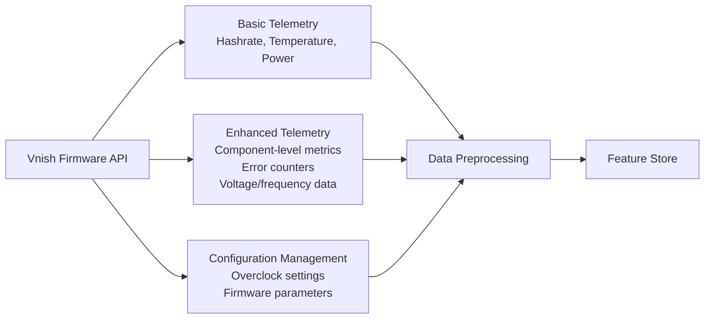
```mermaid
flowchart LR
    A[Vnish Firmware API] --> B[Basic Telemetry\nHashrate, Temperature, Power]
    A --> C[Enhanced Telemetry\nComponent-level metrics\nError counters\nVoltage/frequency data]
    A --> D[Configuration Management\nOverclock settings\nFirmware parameters]
    B & C & D --> E[Data Preprocessing]
    E --> F[Feature Store]
```

**Required Enhancements:**
1. **Increased Collection Frequency**: Reduce polling interval from 5 minutes to 1-2 minutes for critical metrics to support real-time optimization.
2. **Extended API Access**: Work with Vnish to access additional low-level metrics such as memory error rates, voltage readings, and component-level diagnostics.
3. **Batch Collection Optimization**: Implement more efficient batch collection to handle increased data volume without overwhelming miner APIs.
4. **Configuration Management**: Enhance two-way communication to not only read but also apply configuration changes for dynamic optimization.

#### Additional Sensor Integration

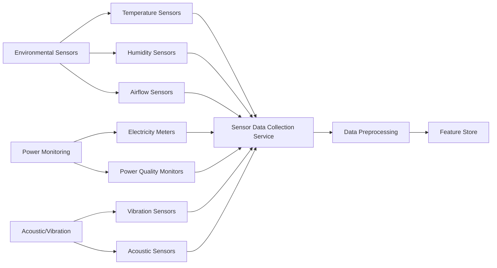
```mermaid
flowchart LR
    A[Environmental Sensors] --> B[Temperature Sensors]
    A --> C[Humidity Sensors]
    A --> D[Airflow Sensors]
    E[Power Monitoring] --> F[Electricity Meters]
    E --> G[Power Quality Monitors]
    H[Acoustic/Vibration] --> I[Vibration Sensors]
    H --> J[Acoustic Sensors]
    B & C & D & F & G & I & J --> K[Sensor Data Collection Service]
    K --> L[Data Preprocessing]
    L --> M[Feature Store]
```

**Implementation Approach:**
1. **Sensor Network**: Deploy a network of environmental sensors throughout the mining facility, connected via wired or wireless protocols (e.g., Modbus, MQTT).
2. **Data Collection Service**: Develop a dedicated service to collect, validate, and standardize sensor data.
3. **Integration Layer**: Create an integration layer that combines sensor data with miner telemetry for a comprehensive view of the operating environment.
4. **Calibration System**: Implement regular sensor calibration and validation to ensure data accuracy.

#### External API Expansion

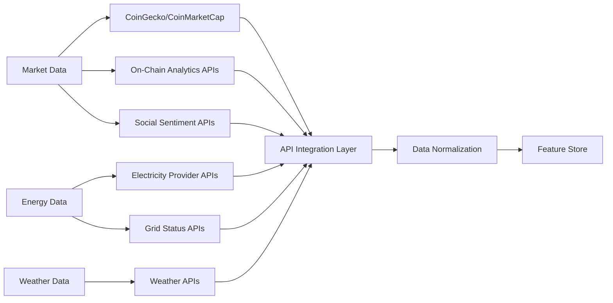
```mermaid
flowchart LR
    A[Market Data] --> B[CoinGecko/CoinMarketCap]
    A --> C[On-Chain Analytics APIs]
    A --> D[Social Sentiment APIs]
    E[Energy Data] --> F[Electricity Provider APIs]
    E --> G[Grid Status APIs]
    H[Weather Data] --> I[Weather APIs]
    B & C & D & F & G & I --> J[API Integration Layer]
    J --> K[Data Normalization]
    K --> L[Feature Store]
```

**Required Enhancements:**
1. **API Portfolio Expansion**: Integrate additional data sources including on-chain analytics (Glassnode, CryptoQuant), social sentiment (Santiment, LunarCrush), and energy pricing APIs.
2. **Rate Limit Management**: Implement sophisticated rate limit management to handle multiple API sources with different constraints.
3. **Fallback Mechanisms**: Develop robust fallback mechanisms to handle API outages or limitations.
4. **Data Quality Validation**: Enhance validation of external data to detect anomalies or inconsistencies across sources.

### 5.2 Data Transformation Extensions

Our existing data transformation pipeline needs to be extended to process the additional data and derive new features required for AI-driven optimization strategies.

#### Enhanced Feature Engineering Pipeline

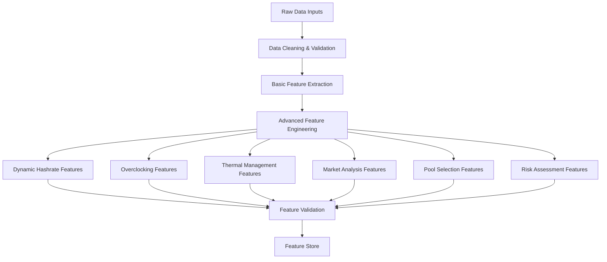
```mermaid
flowchart TD
    A[Raw Data Inputs] --> B[Data Cleaning & Validation]
    B --> C[Basic Feature Extraction]
    C --> D[Advanced Feature Engineering]
    D --> E1[Dynamic Hashrate Features]
    D --> E2[Overclocking Features]
    D --> E3[Thermal Management Features]
    D --> E4[Market Analysis Features]
    D --> E5[Pool Selection Features]
    D --> E6[Risk Assessment Features]
    E1 & E2 & E3 & E4 & E5 & E6 --> F[Feature Validation]
    F --> G[Feature Store]
```

**Key Enhancements:**

1. **Real-time Feature Computation**:
   - Implement streaming feature computation for latency-sensitive features
   - Develop incremental update mechanisms for complex features
   - Create feature freshness monitoring to ensure timely updates

2. **Cross-Source Feature Derivation**:
   - Enhance joining of data across different sources and time scales
   - Implement time-alignment for data collected at different frequencies
   - Develop feature lineage tracking for complex derived features

3. **Advanced Analytical Features**:
   - Implement time-series feature extraction (trends, seasonality, anomalies)
   - Develop spectral analysis for vibration and acoustic data
   - Create graph-based features for thermal and network relationships

4. **Contextual Feature Enrichment**:
   - Add geographical context (location, climate zone, energy grid)
   - Incorporate hardware-specific context (model, batch, age)
   - Include operational context (maintenance history, configuration changes)

#### New Derived Features by Strategy

| Strategy | Feature Category | Example Features | Computation Method |
|----------|------------------|------------------|-------------------|
| **Dynamic Hashrate Tuning** | Efficiency Optimization | Power-adjusted profitability curves | Regression on historical data |
| | Market Responsiveness | Price-hashrate elasticity | Time-series correlation |
| | Energy Optimization | Time-of-day efficiency targets | Pattern analysis with energy pricing |
| **Intelligent Overclocking** | Hardware Response | Hashrate-voltage-frequency response surfaces | Controlled testing and interpolation |
| | Stability Prediction | Error probability curves | Statistical modeling of error rates |
| | Thermal Impact | Thermal response to overclock changes | Physics-informed modeling |
| **Adaptive Cooling Management** | Thermal Mapping | 3D thermal gradients | Spatial interpolation from sensors |
| | Cooling Efficiency | Cooling power per heat dissipated | Energy balance calculations |
| | Predictive Cooling | Thermal forecast features | Time-series forecasting |
| **Market Trend Analysis** | Technical Indicators | Advanced pattern recognition features | Signal processing techniques |
| | Sentiment Analysis | NLP-derived sentiment scores | Text processing and classification |
| | Cross-market Dynamics | Inter-market correlation features | Statistical correlation analysis |
| **Pool Selection Optimization** | Reward Efficiency | Expected value per hashrate | Statistical analysis of pool data |
| | Reliability Metrics | Weighted uptime scores | Time-decay weighted averaging |
| | Network Optimization | Latency-adjusted profitability | Network performance modeling |
| **Risk Assessment** | Failure Prediction | Component survival probability | Survival analysis models |
| | Operational Risk | Composite risk scores | Multi-factor risk modeling |
| | Financial Exposure | Break-even analysis features | Financial modeling |

### 5.3 Data Storage Considerations

The enhanced data collection and transformation requirements will impact our data storage architecture. Here are the key considerations and recommendations:

#### Storage Volume Projections

| Data Category | Current Daily Volume | Projected Daily Volume | Growth Factor | Storage Implications |
|---------------|----------------------|------------------------|---------------|---------------------|
| Miner Telemetry | ~500 MB per 100 miners | ~2-3 GB per 100 miners | 4-6x | Increased storage capacity, improved compression |
| Environmental Sensors | Minimal | ~1-2 GB per facility | New | Dedicated storage for sensor data |
| Market & External Data | ~100 MB | ~500 MB - 1 GB | 5-10x | Enhanced API data storage |
| Derived Features | ~200 MB | ~1-2 GB | 5-10x | Expanded feature store capacity |

#### Storage Architecture Enhancements

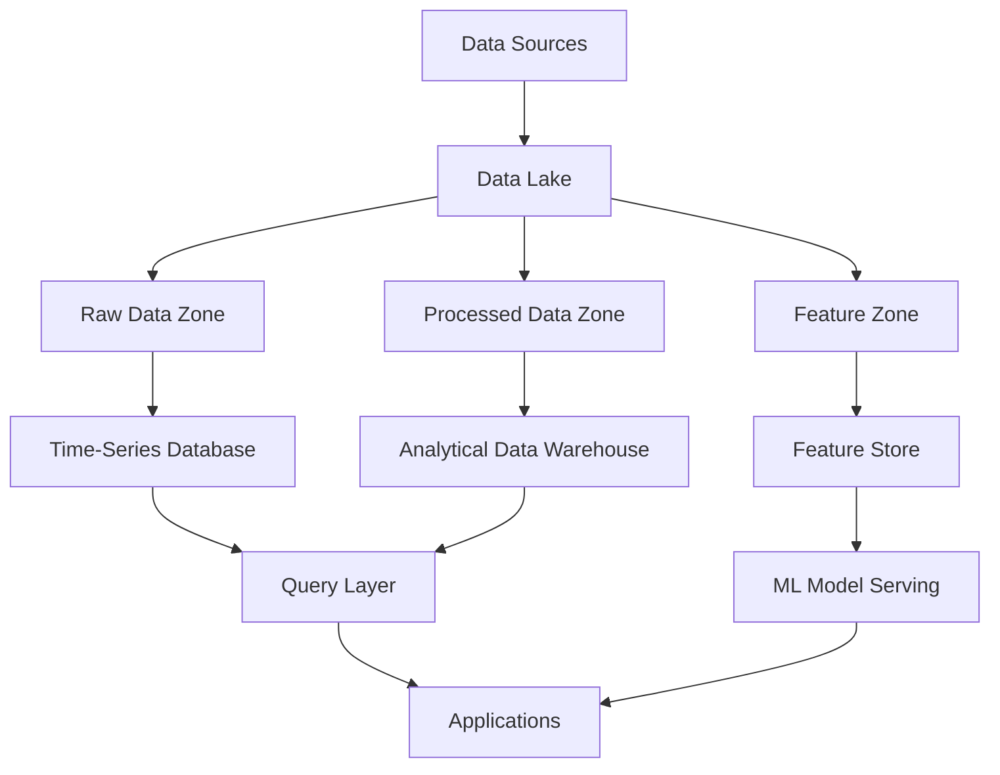
```mermaid
flowchart TD
    A[Data Sources] --> B[Data Lake]
    B --> C[Raw Data Zone]
    B --> D[Processed Data Zone]
    B --> E[Feature Zone]
    C --> F[Time-Series Database]
    D --> G[Analytical Data Warehouse]
    E --> H[Feature Store]
    F & G --> I[Query Layer]
    H --> J[ML Model Serving]
    I & J --> K[Applications]
```

**Recommended Enhancements:**

1. **Time-Series Database Optimization**:
   - Implement specialized time-series database (e.g., InfluxDB, TimescaleDB) for high-frequency telemetry data
   - Configure appropriate downsampling policies for historical data
   - Optimize indexing for time-range and entity-based queries

2. **Multi-tier Storage Strategy**:
   - Hot storage: Recent data (7-30 days) on high-performance storage
   - Warm storage: Medium-term data (1-6 months) on standard storage
   - Cold storage: Historical data (6+ months) on low-cost storage
   - Implement automated data migration between tiers

3. **Enhanced Data Partitioning**:
   - Refine time-based partitioning for optimal query performance
   - Implement entity-based partitioning for large mining operations
   - Create strategy-specific partitioning for specialized data (e.g., thermal data, market data)

4. **Compression and Archiving**:
   - Implement columnar compression for analytical data
   - Use specialized compression for time-series data
   - Develop intelligent archiving policies based on data importance and query patterns

### 5.4 Data Flow Diagrams

The following diagrams illustrate the enhanced data flows required to support the AI-driven optimization strategies.

#### Overall Data Pipeline Architecture

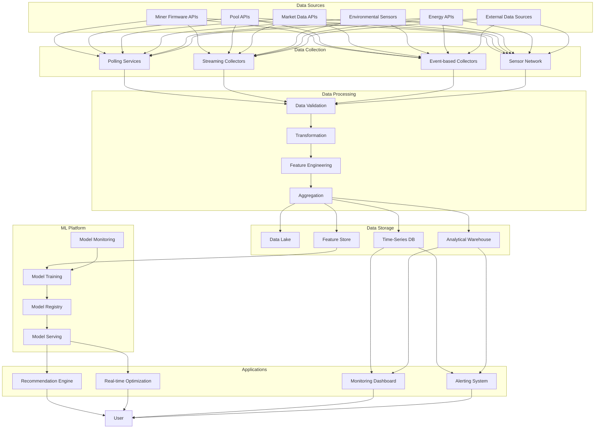
```mermaid
flowchart TD
    subgraph Data Sources
        A1[Miner Firmware APIs]
        A2[Pool APIs]
        A3[Market Data APIs]
        A4[Environmental Sensors]
        A5[Energy APIs]
        A6[External Data Sources]
    end
    
    subgraph Data Collection
        B1[Polling Services]
        B2[Streaming Collectors]
        B3[Event-based Collectors]
        B4[Sensor Network]
    end
    
    subgraph Data Processing
        C1[Data Validation]
        C2[Transformation]
        C3[Feature Engineering]
        C4[Aggregation]
    end
    
    subgraph Data Storage
        D1[Data Lake]
        D2[Time-Series DB]
        D3[Feature Store]
        D4[Analytical Warehouse]
    end
    
    subgraph ML Platform
        E1[Model Training]
        E2[Model Registry]
        E3[Model Serving]
        E4[Model Monitoring]
    end
    
    subgraph Applications
        F1[Recommendation Engine]
        F2[Real-time Optimization]
        F3[Monitoring Dashboard]
        F4[Alerting System]
    end
    
    A1 & A2 & A3 & A4 & A5 & A6 --> B1 & B2 & B3 & B4
    B1 & B2 & B3 & B4 --> C1
    C1 --> C2 --> C3 --> C4
    C4 --> D1 & D2 & D3 & D4
    D3 --> E1
    E1 --> E2 --> E3
    E3 --> F1 & F2
    D2 & D4 --> F3 & F4
    E4 --> E1
    F1 & F2 & F3 & F4 --> User
```

#### Dynamic Hashrate Tuning Data Flow

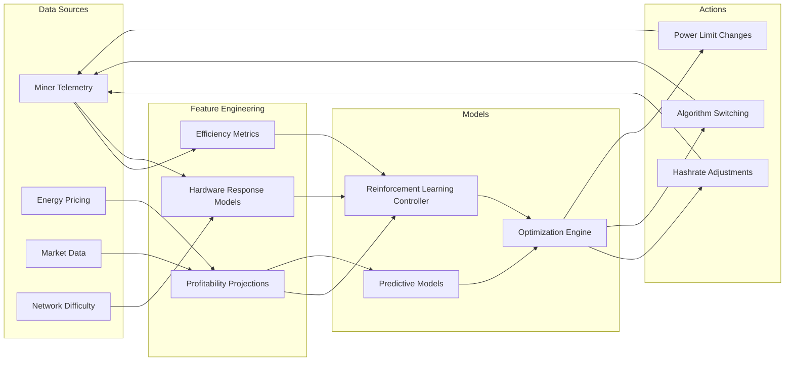
```mermaid
flowchart LR
    subgraph Data Sources
        A1[Miner Telemetry]
        A2[Energy Pricing]
        A3[Market Data]
        A4[Network Difficulty]
    end
    
    subgraph Feature Engineering
        B1[Efficiency Metrics]
        B2[Profitability Projections]
        B3[Hardware Response Models]
    end
    
    subgraph Models
        C1[Reinforcement Learning Controller]
        C2[Predictive Models]
        C3[Optimization Engine]
    end
    
    subgraph Actions
        D1[Hashrate Adjustments]
        D2[Algorithm Switching]
        D3[Power Limit Changes]
    end
    
    A1 --> B1
    A2 & A3 --> B2
    A1 & A4 --> B3
    B1 & B2 & B3 --> C1
    B2 --> C2
    C1 & C2 --> C3
    C3 --> D1 & D2 & D3
    D1 & D2 & D3 --> A1
```

#### Adaptive Cooling Management Data Flow

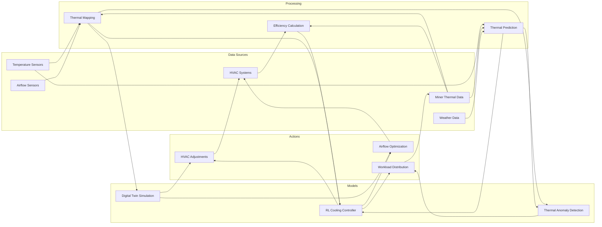
```mermaid
flowchart LR
    subgraph Data Sources
        A1[Temperature Sensors]
        A2[Miner Thermal Data]
        A3[HVAC Systems]
        A4[Airflow Sensors]
        A5[Weather Data]
    end
    
    subgraph Processing
        B1[Thermal Mapping]
        B2[Efficiency Calculation]
        B3[Thermal Prediction]
    end
    
    subgraph Models
        C1[Digital Twin Simulation]
        C2[RL Cooling Controller]
        C3[Thermal Anomaly Detection]
    end
    
    subgraph Actions
        D1[HVAC Adjustments]
        D2[Airflow Optimization]
        D3[Workload Distribution]
    end
    
    A1 & A2 & A4 --> B1
    A2 & A3 --> B2
    A1 & A2 & A5 --> B3
    B1 --> C1
    B1 & B2 & B3 --> C2
    B1 & B3 --> C3
    C1 & C2 --> D1 & D2
    C2 & C3 --> D3
    D1 & D2 --> A3
    D3 --> A2
```

## 6. ML Recommendation Engine Integration

This section analyzes how the new AI-driven optimization strategies can be integrated with our existing ML recommendation engine.

### 6.1 Model Architecture Considerations

Our current ML recommendation engine uses a variety of algorithms including Gradient Boosting Decision Trees, LSTM Neural Networks, Bayesian Optimization, Isolation Forest, and Survival Analysis models. The new AI-driven strategies require more sophisticated modeling approaches.

#### Dynamic Hashrate Tuning Model Architecture

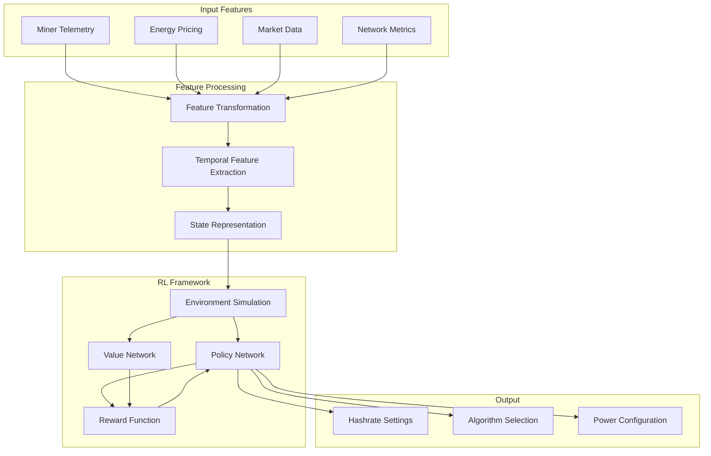
```mermaid
flowchart TD
    subgraph Input Features
        A1[Miner Telemetry]
        A2[Energy Pricing]
        A3[Market Data]
        A4[Network Metrics]
    end
    
    subgraph Feature Processing
        B1[Feature Transformation]
        B2[Temporal Feature Extraction]
        B3[State Representation]
    end
    
    subgraph RL Framework
        C1[Environment Simulation]
        C2[Policy Network]
        C3[Value Network]
        C4[Reward Function]
    end
    
    subgraph Output
        D1[Hashrate Settings]
        D2[Algorithm Selection]
        D3[Power Configuration]
    end
    
    A1 & A2 & A3 & A4 --> B1 --> B2 --> B3
    B3 --> C1 --> C2
    C1 --> C3
    C2 & C3 --> C4
    C4 --> C2
    C2 --> D1 & D2 & D3
```

**Key Components:**
1. **Environment Simulation**: Digital twin of mining operation that models how changes affect performance
2. **Policy Network**: Deep neural network that learns optimal actions for different states
3. **Value Network**: Estimates long-term value of states to guide policy learning
4. **Reward Function**: Balances profitability, efficiency, and hardware stress

**Integration with Existing Models:**
- Enhance current Power Optimization Models with RL capabilities
- Leverage existing profitability prediction models for reward function
- Extend coin switching recommendations with dynamic hashrate components

#### Intelligent Overclocking Model Architecture

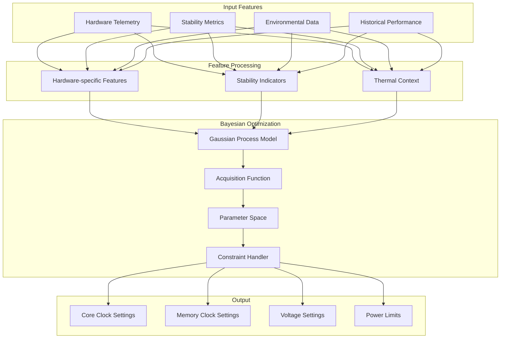
```mermaid
flowchart TD
    subgraph Input Features
        A1[Hardware Telemetry]
        A2[Stability Metrics]
        A3[Environmental Data]
        A4[Historical Performance]
    end
    
    subgraph Feature Processing
        B1[Hardware-specific Features]
        B2[Stability Indicators]
        B3[Thermal Context]
    end
    
    subgraph Bayesian Optimization
        C1[Gaussian Process Model]
        C2[Acquisition Function]
        C3[Parameter Space]
        C4[Constraint Handler]
    end
    
    subgraph Output
        D1[Core Clock Settings]
        D2[Memory Clock Settings]
        D3[Voltage Settings]
        D4[Power Limits]
    end
    
    A1 & A2 & A3 & A4 --> B1 & B2 & B3
    B1 & B2 & B3 --> C1
    C1 --> C2
    C2 --> C3
    C3 --> C4
    C4 --> D1 & D2 & D3 & D4
```

**Key Components:**
1. **Gaussian Process Model**: Learns the relationship between overclocking parameters and performance
2. **Acquisition Function**: Balances exploration of unknown settings with exploitation of known good settings
3. **Parameter Space**: Defines the range of possible overclocking parameters
4. **Constraint Handler**: Ensures recommendations stay within safe operating limits

**Integration with Existing Models:**
- Enhance current Hardware Configuration Recommendations with more sophisticated Bayesian optimization
- Integrate with Anomaly Detection Models to establish safe operating boundaries
- Connect with Hardware Lifecycle Models to adjust risk tolerance based on hardware age

#### Adaptive Cooling Management Model Architecture

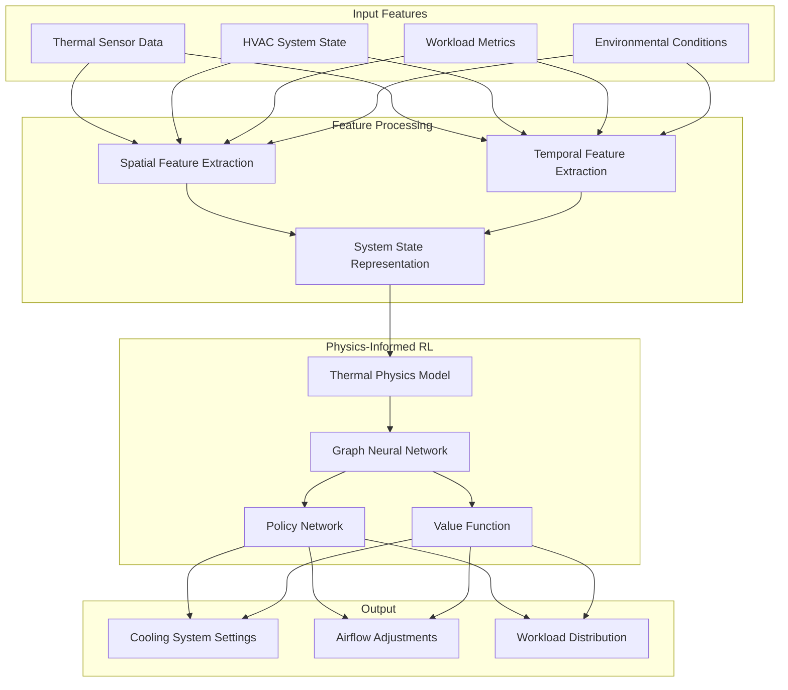
```mermaid
flowchart TD
    subgraph Input Features
        A1[Thermal Sensor Data]
        A2[HVAC System State]
        A3[Workload Metrics]
        A4[Environmental Conditions]
    end
    
    subgraph Feature Processing
        B1[Spatial Feature Extraction]
        B2[Temporal Feature Extraction]
        B3[System State Representation]
    end
    
    subgraph Physics-Informed RL
        C1[Thermal Physics Model]
        C2[Graph Neural Network]
        C3[Policy Network]
        C4[Value Function]
    end
    
    subgraph Output
        D1[Cooling System Settings]
        D2[Airflow Adjustments]
        D3[Workload Distribution]
    end
    
    A1 & A2 & A3 & A4 --> B1 & B2 --> B3
    B3 --> C1 --> C2
    C2 --> C3 & C4
    C3 & C4 --> D1 & D2 & D3
```

**Key Components:**
1. **Thermal Physics Model**: Incorporates physical laws of thermodynamics into the learning process
2. **Graph Neural Network**: Models spatial relationships between components and cooling systems
3. **Policy Network**: Learns optimal cooling strategies for different conditions
4. **Value Function**: Estimates long-term energy savings and thermal benefits

**Integration with Existing Models:**
- New capability with minimal overlap with existing models
- Can leverage Anomaly Detection Models for identifying thermal issues
- Connects with Hardware Lifecycle Models to prioritize cooling for at-risk hardware

#### Market Trend Analysis Model Architecture

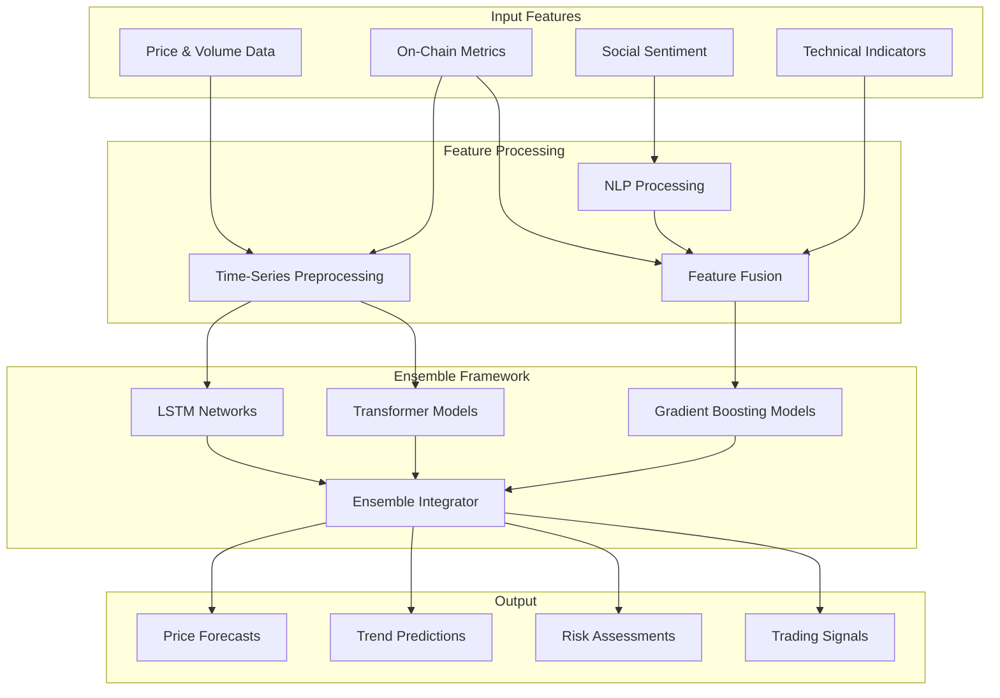
```mermaid
flowchart TD
    subgraph Input Features
        A1[Price & Volume Data]
        A2[On-Chain Metrics]
        A3[Social Sentiment]
        A4[Technical Indicators]
    end
    
    subgraph Feature Processing
        B1[Time-Series Preprocessing]
        B2[NLP Processing]
        B3[Feature Fusion]
    end
    
    subgraph Ensemble Framework
        C1[LSTM Networks]
        C2[Transformer Models]
        C3[Gradient Boosting Models]
        C4[Ensemble Integrator]
    end
    
    subgraph Output
        D1[Price Forecasts]
        D2[Trend Predictions]
        D3[Risk Assessments]
        D4[Trading Signals]
    end
    
    A1 --> B1
    A2 --> B1 & B3
    A3 --> B2 --> B3
    A4 --> B3
    B1 --> C1 & C2
    B3 --> C3
    C1 & C2 & C3 --> C4
    C4 --> D1 & D2 & D3 & D4
```

**Key Components:**
1. **LSTM Networks**: Capture temporal patterns in price and volume data
2. **Transformer Models**: Process sequential data with attention mechanisms
3. **Gradient Boosting Models**: Handle tabular data and technical indicators
4. **Ensemble Integrator**: Combines predictions from different models with appropriate weighting

**Integration with Existing Models:**
- Enhance current Profitability Prediction Models with more sophisticated forecasting
- Provide inputs to Coin Switching Recommendations with longer-term market views
- Support Risk Assessment with market-based risk factors

### 6.2 Feature Engineering Requirements

The new AI-driven optimization strategies require sophisticated feature engineering beyond our current capabilities. Here are the key feature engineering requirements for each strategy:

#### Dynamic Hashrate Tuning Features

| Feature Category | Example Features | Engineering Approach | Integration Points |
|------------------|------------------|----------------------|-------------------|
| **Efficiency Curves** | Power-hashrate response curves | Controlled testing with polynomial fitting | Power Optimization Models |
| | Algorithm-specific efficiency profiles | Comparative testing across algorithms | Coin Switching Models |
| | Dynamic efficiency thresholds | Adaptive thresholding based on market conditions | Profitability Models |
| **Market Responsiveness** | Price-action sensitivity metrics | Time-series correlation analysis | Market Data Features |
| | Profitability momentum indicators | Derivative calculations on profitability trends | Profitability Models |
| | Opportunity cost metrics | Comparative analysis across mining options | Coin Switching Models |
| **Operational State** | Hardware state representations | Dimensionality reduction on telemetry data | Hardware Configuration Models |
| | Energy price forecasts | Time-series forecasting on energy prices | Power Optimization Models |
| | Network difficulty projections | Time-series forecasting on difficulty | Profitability Models |

#### Intelligent Overclocking Features

| Feature Category | Example Features | Engineering Approach | Integration Points |
|------------------|------------------|----------------------|-------------------|
| **Hardware Response** | Core/memory clock response surfaces | Multi-dimensional interpolation from test data | Hardware Configuration Models |
| | Voltage-frequency stability boundaries | Classification boundaries from stability testing | Anomaly Detection Models |
| | Algorithm-specific optimization targets | Comparative analysis across algorithms | Coin Switching Models |
| **Stability Indicators** | Error rate predictors | Regression models on hardware parameters | Anomaly Detection Models |
| | Thermal boundary estimators | Physics-informed modeling | Hardware Lifecycle Models |
| | Stability margin metrics | Distance calculations to stability boundaries | Maintenance Recommendation Models |
| **Hardware-Specific** | Silicon quality factors | Statistical analysis of hardware performance | Hardware Configuration Models |
| | Memory timing response profiles | Controlled testing of memory parameters | Hardware Configuration Models |
| | Age-adjusted risk tolerance | Integration with hardware lifecycle data | Hardware Lifecycle Models |

#### Adaptive Cooling Management Features

| Feature Category | Example Features | Engineering Approach | Integration Points |
|------------------|------------------|----------------------|-------------------|
| **Thermal Mapping** | 3D thermal gradient tensors | Spatial interpolation from sensor data | New Feature Group |
| | Hotspot identification features | Anomaly detection on thermal maps | Anomaly Detection Models |
| | Thermal flow patterns | Vector field analysis of temperature changes | New Feature Group |
| **Cooling Efficiency** | Cooling power efficiency metrics | Energy balance calculations | Power Optimization Models |
| | HVAC response characteristics | System identification techniques | New Feature Group |
| | Cooling capacity utilization | Ratio analysis of current vs. maximum cooling | New Feature Group |
| **Predictive Features** | Thermal forecast features | Time-series forecasting of temperatures | Maintenance Recommendation Models |
| | Workload impact predictions | Causal modeling of workload on temperatures | Hardware Configuration Models |
| | Weather impact features | Correlation analysis with external conditions | New Feature Group |

#### Market Trend Analysis Features

| Feature Category | Example Features | Engineering Approach | Integration Points |
|------------------|------------------|----------------------|-------------------|
| **Technical Indicators** | Advanced pattern recognition features | Signal processing and pattern matching | Market Data Features |
| | Multi-timeframe momentum indicators | Momentum calculations across time scales | Market Data Features |
| | Volatility regime features | Statistical clustering of volatility patterns | Market Data Features |
| **On-Chain Metrics** | Network health indicators | Statistical analysis of on-chain data | New Feature Group |
| | Miner behavior metrics | Analysis of miner actions on blockchain | New Feature Group |
| | Transaction economics features | Economic modeling of transaction data | New Feature Group |
| **Sentiment Analysis** | Social sentiment scores | NLP processing of social media data | New Feature Group |
| | News impact features | Event detection and impact analysis | New Feature Group |
| | Developer activity metrics | Analysis of code repositories and updates | New Feature Group |

### 6.3 Model Training Approaches

The sophisticated AI models required for the new optimization strategies need specialized training approaches. Here are the recommended training methodologies for each strategy:

#### Reinforcement Learning for Dynamic Hashrate Tuning

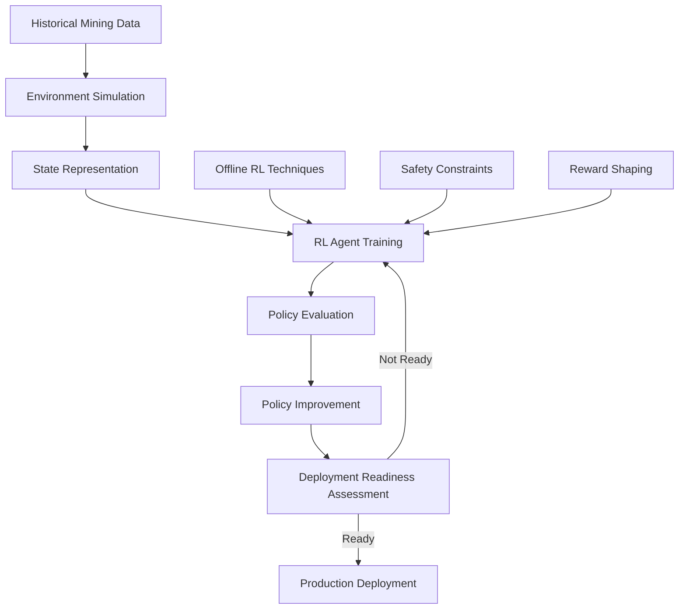
```mermaid
flowchart TD
    A[Historical Mining Data] --> B[Environment Simulation]
    B --> C[State Representation]
    C --> D[RL Agent Training]
    D --> E[Policy Evaluation]
    E --> F[Policy Improvement]
    F --> G[Deployment Readiness Assessment]
    G -- Not Ready --> D
    G -- Ready --> H[Production Deployment]
    I[Offline RL Techniques] --> D
    J[Safety Constraints] --> D
    K[Reward Shaping] --> D
```

**Training Methodology:**
1. **Environment Creation**:
   - Develop a simulation environment using historical mining data
   - Implement realistic state transitions based on action effects
   - Model stochastic elements like price movements and network difficulty

2. **Offline RL Training**:
   - Use offline RL techniques (e.g., Conservative Q-Learning, Batch-Constrained Q-learning)
   - Train on historical data before live deployment
   - Implement safety constraints to prevent harmful actions

3. **Curriculum Learning**:
   - Start with simple scenarios and gradually increase complexity
   - Progressively introduce market volatility and operational constraints
   - Scale from single miner optimization to fleet-wide coordination

4. **Evaluation and Deployment**:
   - Evaluate against baseline strategies in simulation
   - Conduct A/B testing with limited deployment
   - Gradually expand to full production with monitoring

#### Bayesian Optimization for Intelligent Overclocking

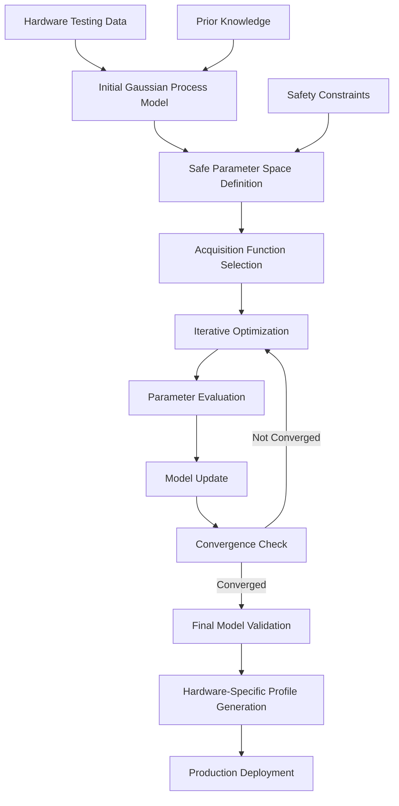
```mermaid
flowchart TD
    A[Hardware Testing Data] --> B[Initial Gaussian Process Model]
    B --> C[Safe Parameter Space Definition]
    C --> D[Acquisition Function Selection]
    D --> E[Iterative Optimization]
    E --> F[Parameter Evaluation]
    F --> G[Model Update]
    G --> H[Convergence Check]
    H -- Not Converged --> E
    H -- Converged --> I[Final Model Validation]
    I --> J[Hardware-Specific Profile Generation]
    J --> K[Production Deployment]
    L[Safety Constraints] --> C
    M[Prior Knowledge] --> B
```

**Training Methodology:**
1. **Initial Model Building**:
   - Collect controlled testing data for different hardware models
   - Build initial Gaussian Process models with hardware-specific priors
   - Define safe parameter spaces based on manufacturer specifications and testing

2. **Iterative Optimization**:
   - Use acquisition functions that balance exploration and exploitation
   - Implement batch optimization to test multiple settings efficiently
   - Update models with new observations after each iteration

3. **Hardware-Specific Tuning**:
   - Create specialized models for different hardware types and batches
   - Adjust for silicon quality variation within batches
   - Develop algorithm-specific optimization profiles

4. **Validation and Deployment**:
   - Validate final models with extensive stability testing
   - Generate hardware-specific profiles for production
   - Implement monitoring for ongoing performance and stability

#### Physics-Informed RL for Adaptive Cooling Management

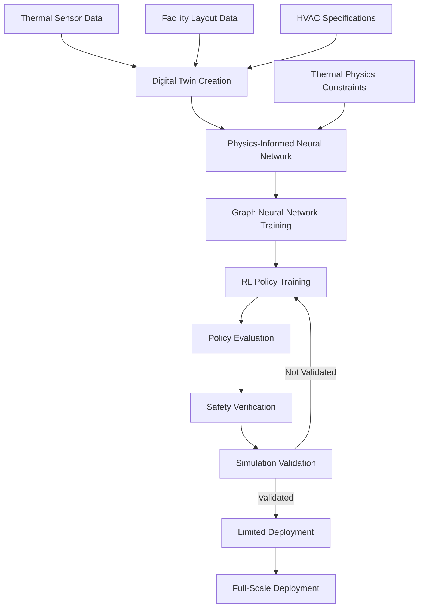
```mermaid
flowchart TD
    A[Thermal Sensor Data] --> B[Digital Twin Creation]
    B --> C[Physics-Informed Neural Network]
    C --> D[Graph Neural Network Training]
    D --> E[RL Policy Training]
    E --> F[Policy Evaluation]
    F --> G[Safety Verification]
    G --> H[Simulation Validation]
    H -- Not Validated --> E
    H -- Validated --> I[Limited Deployment]
    I --> J[Full-Scale Deployment]
    K[Thermal Physics Constraints] --> C
    L[Facility Layout Data] --> B
    M[HVAC Specifications] --> B
```

**Training Methodology:**
1. **Digital Twin Development**:
   - Create a digital twin of the mining facility using thermal and spatial data
   - Incorporate physical laws of thermodynamics into the model
   - Calibrate with real-world sensor data

2. **Physics-Informed Training**:
   - Train neural networks with physics-based loss functions
   - Use graph neural networks to capture spatial relationships
   - Incorporate domain knowledge as constraints

3. **Safe Exploration**:
   - Implement safe exploration strategies to avoid thermal risks
   - Use simulation for initial policy learning
   - Gradually transition to real-world deployment with safety bounds

4. **Deployment Strategy**:
   - Start with monitoring-only mode to validate predictions
   - Implement advisory mode with human approval
   - Transition to fully autonomous operation with safety overrides

#### Ensemble Methods for Market Trend Analysis

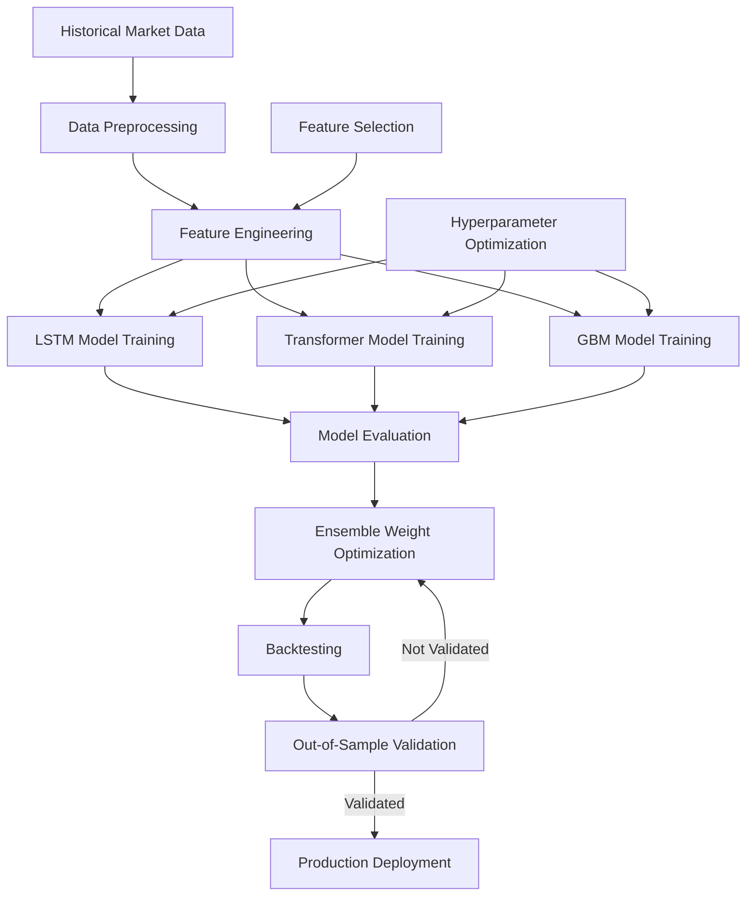
```mermaid
flowchart TD
    A[Historical Market Data] --> B[Data Preprocessing]
    B --> C[Feature Engineering]
    C --> D1[LSTM Model Training]
    C --> D2[Transformer Model Training]
    C --> D3[GBM Model Training]
    D1 & D2 & D3 --> E[Model Evaluation]
    E --> F[Ensemble Weight Optimization]
    F --> G[Backtesting]
    G --> H[Out-of-Sample Validation]
    H -- Not Validated --> F
    H -- Validated --> I[Production Deployment]
    J[Feature Selection] --> C
    K[Hyperparameter Optimization] --> D1 & D2 & D3
```

**Training Methodology:**
1. **Multi-Model Training**:
   - Train specialized models for different aspects of market prediction
   - Use LSTM networks for temporal patterns
   - Implement Transformer models for sequence modeling
   - Train gradient boosting models for tabular features

2. **Ensemble Integration**:
   - Develop stacking or blending techniques to combine model outputs
   - Optimize ensemble weights using validation data
   - Implement time-adaptive weighting based on market regimes

3. **Rigorous Validation**:
   - Use walk-forward validation to prevent lookahead bias
   - Implement out-of-sample testing on recent data
   - Conduct stress testing with historical market events

4. **Continuous Learning**:
   - Implement online learning for rapid adaptation to market changes
   - Develop concept drift detection for market regime shifts
   - Create automated retraining triggers based on performance metrics

### 6.4 Inference Pipeline Adaptations

Our existing inference pipeline needs significant adaptations to support the real-time and complex nature of the new AI-driven optimization strategies.

#### Real-time Inference Architecture

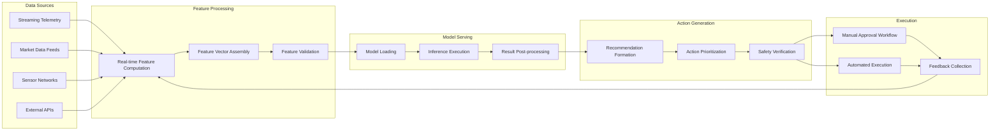
```mermaid
flowchart LR
    subgraph Data Sources
        A1[Streaming Telemetry]
        A2[Market Data Feeds]
        A3[Sensor Networks]
        A4[External APIs]
    end
    
    subgraph Feature Processing
        B1[Real-time Feature Computation]
        B2[Feature Vector Assembly]
        B3[Feature Validation]
    end
    
    subgraph Model Serving
        C1[Model Loading]
        C2[Inference Execution]
        C3[Result Post-processing]
    end
    
    subgraph Action Generation
        D1[Recommendation Formation]
        D2[Action Prioritization]
        D3[Safety Verification]
    end
    
    subgraph Execution
        E1[Manual Approval Workflow]
        E2[Automated Execution]
        E3[Feedback Collection]
    end
    
    A1 & A2 & A3 & A4 --> B1 --> B2 --> B3
    B3 --> C1 --> C2 --> C3
    C3 --> D1 --> D2 --> D3
    D3 --> E1 & E2
    E1 & E2 --> E3
    E3 --> B1
```

**Key Enhancements:**

1. **Streaming Feature Computation**:
   - Implement stream processing for real-time feature computation
   - Develop incremental update mechanisms for complex features
   - Create feature caching with appropriate invalidation strategies

2. **Low-Latency Model Serving**:
   - Optimize model loading and warm-up procedures
   - Implement batching for efficient inference
   - Use model quantization where appropriate for performance
   - Deploy specialized hardware acceleration (GPUs, TPUs) for complex models

3. **Action Safety Framework**:
   - Develop multi-level safety verification for automated actions
   - Implement gradual action limits that expand with proven reliability
   - Create override mechanisms for human intervention
   - Design fallback strategies for inference failures

4. **Feedback Integration**:
   - Implement real-time feedback loops for action outcomes
   - Develop online learning capabilities for continuous improvement
   - Create performance tracking for model accuracy and impact

#### Strategy-Specific Inference Adaptations

| Strategy | Inference Requirement | Implementation Approach | Integration Points |
|----------|----------------------|------------------------|-------------------|
| **Dynamic Hashrate Tuning** | Sub-minute response time | Optimized RL policy deployment | Power Optimization Recommendations |
| | State tracking across time | Stateful inference service | New Recommendation Type |
| | Action rate limiting | Configurable control parameters | Safety Framework |
| **Intelligent Overclocking** | Hardware-specific inference | Model selection based on hardware ID | Hardware Configuration Recommendations |
| | Progressive parameter changes | Step-wise adjustment with monitoring | Safety Framework |
| | Stability verification | Post-change monitoring period | Anomaly Detection System |
| **Adaptive Cooling Management** | Spatial-aware inference | Graph-based inference engine | New Recommendation Type |
| | System-level optimization | Holistic facility optimization | Facility Management System |
| | Weather-adaptive planning | Predictive adjustment based on forecasts | New Recommendation Type |
| **Market Trend Analysis** | Multi-horizon forecasting | Parallel inference for different time horizons | Profitability Predictions |
| | Confidence-scored predictions | Uncertainty quantification in outputs | Recommendation Confidence |
| | Scenario analysis | Multiple inference runs with different assumptions | Risk Assessment |
| **Pool Selection Optimization** | Multi-factor ranking | Weighted scoring system | New Recommendation Type |
| | Network-aware optimization | Latency-adjusted inference | Network Monitoring Integration |
| | Risk-adjusted recommendations | Personalized risk tolerance incorporation | User Preferences |
| **Risk Assessment** | Comprehensive risk scoring | Multi-model inference pipeline | Maintenance Recommendations |
| | Early warning generation | Threshold-based alerting on risk scores | Alerting System |
| | Mitigation recommendation | Action suggestion based on risk type | Multiple Recommendation Types |

## 7. Performance Metrics and Evaluation

To measure the effectiveness of the AI-driven optimization strategies, we need comprehensive performance metrics and evaluation methodologies. This section outlines the key metrics and evaluation approaches for each strategy.

### 7.1 Dynamic Hashrate Tuning Metrics

#### Efficiency Metrics

| Metric | Description | Calculation Method | Target Improvement |
|--------|-------------|-------------------|-------------------|
| Energy Efficiency Improvement | Percentage improvement in J/TH | (Baseline J/TH - Optimized J/TH) / Baseline J/TH × 100% | 10-30% |
| Profitability Increase | Percentage increase in profit margin | (Optimized Profit - Baseline Profit) / Baseline Profit × 100% | 15-40% |
| Revenue Optimization | Percentage improvement in revenue per watt | (Optimized Revenue/W - Baseline Revenue/W) / Baseline Revenue/W × 100% | 10-25% |
| Dynamic Adaptation Score | Measure of responsiveness to changing conditions | Correlation between optimal and actual settings over time | >0.85 correlation |

#### Operational Metrics

| Metric | Description | Calculation Method | Target Performance |
|--------|-------------|-------------------|-------------------|
| Response Time | Time to adjust to significant market changes | Minutes from event detection to completed adjustment | <15 minutes |
| Stability Impact | Effect on operational stability | Change in error rates and rejected shares | <5% increase |
| Decision Quality | Percentage of beneficial adjustments | Number of profitable adjustments / Total adjustments × 100% | >90% |
| Hardware Stress | Impact on hardware wear metrics | Change in temperature variance and power fluctuations | <10% increase |

#### Evaluation Methodology

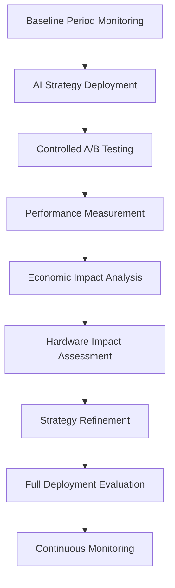
```mermaid
flowchart TD
    A[Baseline Period Monitoring] --> B[AI Strategy Deployment]
    B --> C[Controlled A/B Testing]
    C --> D[Performance Measurement]
    D --> E[Economic Impact Analysis]
    E --> F[Hardware Impact Assessment]
    F --> G[Strategy Refinement]
    G --> H[Full Deployment Evaluation]
    H --> I[Continuous Monitoring]
```

**Evaluation Approach:**
1. **Baseline Establishment**:
   - Collect performance data under standard operation for 2-4 weeks
   - Document baseline efficiency, profitability, and stability metrics
   - Analyze patterns and variability in baseline performance

2. **Controlled Testing**:
   - Implement A/B testing with matched miner groups
   - Apply dynamic tuning to test group while maintaining baseline for control
   - Ensure similar hardware and environmental conditions

3. **Comprehensive Analysis**:
   - Measure direct performance improvements (efficiency, profitability)
   - Assess operational impacts (stability, hardware stress)
   - Calculate ROI and payback period for implementation costs

4. **Long-term Validation**:
   - Monitor performance over extended periods (3+ months)
   - Evaluate performance across different market conditions
   - Assess adaptation to seasonal changes and market events

### 7.2 Intelligent Overclocking Metrics

#### Performance Metrics

| Metric | Description | Calculation Method | Target Improvement |
|--------|-------------|-------------------|-------------------|
| Hashrate Improvement | Percentage increase in hashrate | (Optimized Hashrate - Stock Hashrate) / Stock Hashrate × 100% | 5-15% |
| Efficiency Gain | Improvement in hashrate per watt | (Optimized H/W - Stock H/W) / Stock H/W × 100% | 5-20% |
| Stability Score | Measure of operational stability | 100% - (Error Rate × Weighting Factor) | >95% |
| Silicon Utilization | Percentage of theoretical performance achieved | Actual Performance / Theoretical Maximum × 100% | >85% |

#### Operational Metrics

| Metric | Description | Calculation Method | Target Performance |
|--------|-------------|-------------------|-------------------|
| Profile Success Rate | Percentage of successfully applied profiles | Successful Applications / Total Attempts × 100% | >95% |
| Hardware Variance Handling | Effectiveness across silicon quality variation | Standard Deviation of Performance Improvement | <10% |
| Thermal Optimization | Improvement in performance per degree | (Optimized H/°C - Stock H/°C) / Stock H/°C × 100% | 5-15% |
| Longevity Impact | Estimated effect on hardware lifespan | Projected Lifespan Change Based on Stress Models | <5% reduction |

#### Evaluation Methodology

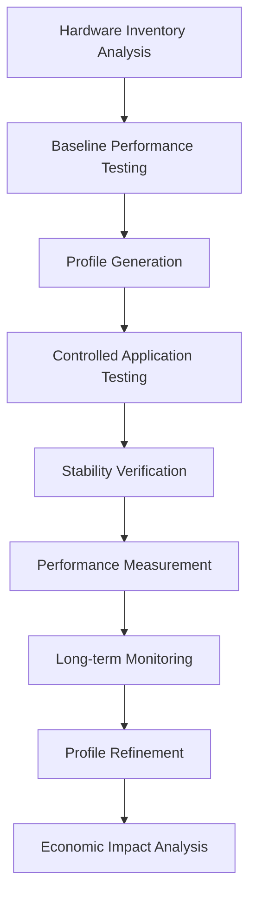
```mermaid
flowchart TD
    A[Hardware Inventory Analysis] --> B[Baseline Performance Testing]
    B --> C[Profile Generation]
    C --> D[Controlled Application Testing]
    D --> E[Stability Verification]
    E --> F[Performance Measurement]
    F --> G[Long-term Monitoring]
    G --> H[Profile Refinement]
    H --> I[Economic Impact Analysis]
```

**Evaluation Approach:**
1. **Hardware-Specific Baseline**:
   - Test stock performance across hardware inventory
   - Document silicon quality variation within same models
   - Establish baseline stability and performance metrics

2. **Controlled Profile Testing**:
   - Generate and apply hardware-specific overclocking profiles
   - Implement gradual parameter changes with stability testing
   - Document performance improvements and stability impacts

3. **Comprehensive Validation**:
   - Conduct extended stability testing (72+ hours)
   - Measure performance across different algorithms
   - Evaluate thermal impacts under various conditions

4. **Economic Analysis**:
   - Calculate value of performance improvements
   - Assess potential impact on hardware lifespan
   - Determine ROI considering both factors

### 7.3 Adaptive Cooling Management Metrics

#### Efficiency Metrics

| Metric | Description | Calculation Method | Target Improvement |
|--------|-------------|-------------------|-------------------|
| Cooling Energy Reduction | Percentage reduction in cooling energy | (Baseline Cooling Energy - Optimized Cooling Energy) / Baseline Cooling Energy × 100% | 15-25% |
| PUE Improvement | Reduction in Power Usage Effectiveness | Baseline PUE - Optimized PUE | 0.1-0.3 reduction |
| Temperature Stability | Reduction in temperature variance | (Baseline Temp Variance - Optimized Temp Variance) / Baseline Temp Variance × 100% | 20-40% |
| Cooling Capacity Utilization | Improvement in cooling efficiency | Optimized Cooling Efficiency / Baseline Cooling Efficiency × 100% | 15-30% |

#### Operational Metrics

| Metric | Description | Calculation Method | Target Performance |
|--------|-------------|-------------------|-------------------|
| Thermal Compliance | Percentage of time within optimal temperature range | Time Within Range / Total Time × 100% | >98% |
| Hotspot Reduction | Decrease in thermal hotspots | (Baseline Hotspots - Optimized Hotspots) / Baseline Hotspots × 100% | >50% |
| Thermal Prediction Accuracy | Accuracy of temperature forecasts | RMSE of Temperature Predictions | <1.5°C |
| Adaptation Response Time | Time to respond to thermal events | Minutes from event detection to cooling adjustment | <5 minutes |

#### Evaluation Methodology

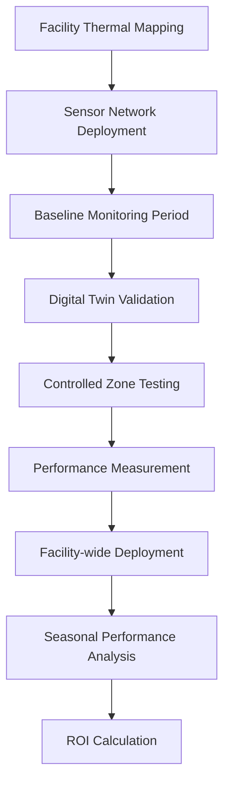
```mermaid
flowchart TD
    A[Facility Thermal Mapping] --> B[Sensor Network Deployment]
    B --> C[Baseline Monitoring Period]
    C --> D[Digital Twin Validation]
    D --> E[Controlled Zone Testing]
    E --> F[Performance Measurement]
    F --> G[Facility-wide Deployment]
    G --> H[Seasonal Performance Analysis]
    H --> I[ROI Calculation]
```

**Evaluation Approach:**
1. **Comprehensive Thermal Analysis**:
   - Create detailed thermal map of the mining facility
   - Deploy additional sensors for complete coverage
   - Establish baseline cooling performance and energy usage

2. **Digital Twin Validation**:
   - Develop and calibrate facility digital twin
   - Validate simulation accuracy against real measurements
   - Test optimization strategies in simulation

3. **Phased Implementation**:
   - Apply adaptive cooling to limited zones initially
   - Measure performance improvements in controlled areas
   - Gradually expand to entire facility

4. **Long-term Performance Analysis**:
   - Evaluate performance across different seasons
   - Measure adaptation to varying external conditions
   - Calculate energy savings and operational improvements

### 7.4 Market Trend Analysis Metrics

#### Prediction Metrics

| Metric | Description | Calculation Method | Target Performance |
|--------|-------------|-------------------|-------------------|
| Price Prediction Accuracy | Accuracy of price forecasts | MAPE (Mean Absolute Percentage Error) | <15% for 24h, <25% for 7d |
| Trend Direction Accuracy | Accuracy of trend direction predictions | Correct Direction Predictions / Total Predictions × 100% | >65% |
| Volatility Forecast Accuracy | Accuracy of volatility predictions | RMSE of Volatility Predictions | <20% |
| Profitability Forecast Accuracy | Accuracy of mining profitability predictions | RMSE of Profitability Predictions | <15% |

#### Strategic Metrics

| Metric | Description | Calculation Method | Target Performance |
|--------|-------------|-------------------|-------------------|
| Strategy ROI | Return on investment from market-informed decisions | (Strategy Returns - Baseline Returns) / Baseline Returns × 100% | >20% |
| Opportunity Capture | Percentage of profitable opportunities identified | Captured Opportunities / Total Opportunities × 100% | >70% |
| Risk-Adjusted Return | Return adjusted for volatility | Return / Volatility (Sharpe-like ratio) | >1.5 |
| Market Regime Identification | Accuracy in identifying market regimes | Correct Regime Identifications / Total Periods × 100% | >80% |

#### Evaluation Methodology

```mermaid
flowchart TD
    A[Historical Data Collection] --> B[Feature Engineering Validation]
    B --> C[Model Training and Validation]
    C --> D[Backtesting Framework]
    D --> E[Out-of-Sample Testing]
    E --> F[Paper Trading Period]
    F --> G[Limited Live Implementation]
    G --> H[Performance Comparison]
    H --> I[Full Strategy Deployment]
```

**Evaluation Approach:**
1. **Rigorous Backtesting**:
   - Implement walk-forward testing to prevent lookahead bias
   - Test across different market regimes (bull, bear, sideways)
   - Compare against benchmark strategies and market indices

2. **Out-of-Sample Validation**:
   - Validate on recent data not used in training
   - Measure prediction accuracy and strategy performance
   - Assess robustness to market shocks and events

3. **Controlled Deployment**:
   - Implement paper trading to validate in current market
   - Apply strategy to limited portion of operations
   - Compare performance against traditional approaches

4. **Comprehensive Analysis**:
   - Evaluate both prediction accuracy and economic impact
   - Assess performance across different time horizons
   - Measure adaptation to changing market conditions

### 7.5 Pool Selection Optimization Metrics

#### Performance Metrics

| Metric | Description | Calculation Method | Target Improvement |
|--------|-------------|-------------------|-------------------|
| Reward Efficiency | Improvement in rewards per hashrate | (Optimized Rewards/TH - Baseline Rewards/TH) / Baseline Rewards/TH × 100% | 5-15% |
| Fee Optimization | Reduction in effective fee percentage | Baseline Fee % - Optimized Fee % | 0.5-2% reduction |
| MEV Capture | Increase in MEV-related earnings | (Optimized MEV - Baseline MEV) / Baseline MEV × 100% | 10-30% |
| Net Profitability Improvement | Overall improvement in mining profitability | (Optimized Profit - Baseline Profit) / Baseline Profit × 100% | 5-15% |

#### Operational Metrics

| Metric | Description | Calculation Method | Target Performance |
|--------|-------------|-------------------|-------------------|
| Pool Reliability | Improvement in pool uptime experience | (Optimized Uptime % - Baseline Uptime %) | 0.5-2% improvement |
| Payment Consistency | Reduction in payment variance | (Baseline Payment Variance - Optimized Payment Variance) / Baseline Payment Variance × 100% | >20% |
| Switching Efficiency | Percentage of beneficial pool switches | Profitable Switches / Total Switches × 100% | >90% |
| Latency Optimization | Reduction in share submission latency | (Baseline Latency - Optimized Latency) / Baseline Latency × 100% | 10-30% |

#### Evaluation Methodology

```mermaid
flowchart TD
    A[Pool Performance Data Collection] --> B[Baseline Performance Establishment]
    B --> C[Pool Selection Model Training]
    C --> D[Recommendation Generation]
    D --> E[Controlled Switching Tests]
    E --> F[Performance Measurement]
    F --> G[Economic Impact Analysis]
    G --> H[Strategy Refinement]
    H --> I[Automated Optimization Deployment]
```

**Evaluation Approach:**
1. **Comprehensive Pool Analysis**:
   - Collect performance data from multiple pools
   - Establish baseline performance with current pool selection
   - Document reward mechanisms and fee structures

2. **Controlled Testing**:
   - Implement A/B testing with matched miner groups
   - Apply pool recommendations to test group
   - Measure performance differences under similar conditions

3. **Multi-factor Evaluation**:
   - Assess direct profitability improvements
   - Evaluate reliability and payment consistency
   - Measure network performance and submission efficiency

4. **Long-term Validation**:
   - Monitor performance across different market conditions
   - Evaluate adaptation to pool policy changes
   - Assess impact of network events and congestion

### 7.6 Risk Assessment Metrics

#### Prediction Metrics

| Metric | Description | Calculation Method | Target Performance |
|--------|-------------|-------------------|-------------------|
| Failure Prediction Accuracy | Accuracy of hardware failure predictions | F1 Score for Failure Predictions | >0.7 |
| Failure Prediction Lead Time | Average time between prediction and failure | Average Days Between Prediction and Actual Failure | >7 days |
| Risk Score Calibration | Correlation between risk scores and actual incidents | Correlation Coefficient | >0.8 |
| False Positive Rate | Rate of false risk alerts | False Positives / Total Alerts × 100% | <15% |

#### Operational Metrics

| Metric | Description | Calculation Method | Target Performance |
|--------|-------------|-------------------|-------------------|
| Downtime Reduction | Percentage reduction in unplanned downtime | (Baseline Downtime - Optimized Downtime) / Baseline Downtime × 100% | >30% |
| Maintenance Efficiency | Improvement in maintenance resource utilization | Optimized Maintenance Efficiency / Baseline Efficiency × 100% | >25% |
| Component Lifespan Extension | Increase in average component lifespan | (Optimized Lifespan - Baseline Lifespan) / Baseline Lifespan × 100% | 10-20% |
| Financial Risk Mitigation | Reduction in financial loss events | (Baseline Loss - Optimized Loss) / Baseline Loss × 100% | >25% |

#### Evaluation Methodology

```mermaid
flowchart TD
    A[Historical Incident Analysis] --> B[Risk Model Development]
    B --> C[Retrospective Validation]
    C --> D[Prospective Monitoring]
    D --> E[Alert System Implementation]
    E --> F[Preventive Action Tracking]
    F --> G[Incident Reduction Measurement]
    G --> H[Financial Impact Analysis]
    H --> I[Model Refinement]
```

**Evaluation Approach:**
1. **Historical Validation**:
   - Analyze historical failure data and incidents
   - Develop risk models based on historical patterns
   - Validate with retrospective testing (would the model have predicted past failures?)

2. **Prospective Evaluation**:
   - Implement risk monitoring without automated actions
   - Track predictions and actual outcomes
   - Measure prediction accuracy and lead time

3. **Intervention Effectiveness**:
   - Implement recommended preventive actions
   - Measure reduction in failure rates and downtime
   - Calculate maintenance efficiency improvements

4. **Economic Impact Assessment**:
   - Quantify savings from prevented failures
   - Measure extended hardware lifespan value
   - Calculate ROI of risk assessment system

## 8. Implementation Roadmap

Based on our analysis, we recommend a phased implementation approach for integrating the AI-driven optimization strategies into our existing system.

### 8.1 Phase 1: Foundation Enhancement (2-3 months)

```mermaid
gantt
    title Phase 1: Foundation Enhancement
    dateFormat  YYYY-MM-DD
    section Data Collection
    Enhanced Vnish API Integration    :a1, 2025-06-01, 30d
    Sensor Network Deployment         :a2, 2025-06-15, 45d
    External API Expansion            :a3, 2025-06-01, 30d
    section Data Processing
    Pipeline Capacity Upgrade         :b1, 2025-06-15, 30d
    Real-time Processing Enhancement  :b2, 2025-07-01, 30d
    Feature Engineering Framework     :b3, 2025-07-15, 30d
    section Storage & Infrastructure
    Time-Series DB Implementation     :c1, 2025-06-01, 45d
    Storage Architecture Optimization :c2, 2025-07-01, 30d
    Monitoring Framework Enhancement  :c3, 2025-07-15, 30d
    section Integration
    Abacus.AI Feature Store Extension :d1, 2025-07-15, 30d
    Model Registry Enhancement        :d2, 2025-08-01, 30d
    Testing Environment Setup         :d3, 2025-08-01, 30d
```

**Key Objectives:**
1. **Enhanced Data Collection**:
   - Upgrade Vnish firmware API integration for higher frequency and additional metrics
   - Deploy environmental sensor network throughout mining facility
   - Expand external API integration for market, energy, and weather data

2. **Data Pipeline Enhancement**:
   - Upgrade data pipeline capacity to handle increased data volume
   - Implement real-time processing capabilities for latency-sensitive data
   - Develop enhanced feature engineering framework for complex features

3. **Storage Architecture Optimization**:
   - Implement specialized time-series database for high-frequency telemetry
   - Optimize storage architecture for efficient querying and retention
   - Enhance monitoring framework for data quality and pipeline performance

4. **Integration Framework**:
   - Extend Abacus.AI feature store configuration for new data types
   - Enhance model registry to support new model types
   - Set up testing environments for AI strategy validation

**Deliverables:**
- Enhanced data collection infrastructure with 5x capacity
- Real-time data processing pipeline with <5s latency
- Optimized storage architecture with efficient querying
- Extended feature store with new feature groups
- Testing environments for AI strategy validation

### 8.2 Phase 2: Core AI Implementation (3-4 months)

```mermaid
gantt
    title Phase 2: Core AI Implementation
    dateFormat  YYYY-MM-DD
    section Dynamic Hashrate Tuning
    Environment Simulation Development :a1, 2025-09-01, 45d
    RL Model Implementation           :a2, 2025-09-15, 45d
    Safety Framework Development      :a3, 2025-10-01, 30d
    section Intelligent Overclocking
    Hardware Testing Framework        :b1, 2025-09-01, 30d
    Bayesian Optimization Implementation :b2, 2025-09-15, 45d
    Profile Generation System         :b3, 2025-10-15, 30d
    section Adaptive Cooling
    Digital Twin Development          :c1, 2025-09-01, 60d
    Physics-Informed RL Implementation :c2, 2025-10-01, 45d
    Cooling Control Integration       :c3, 2025-11-01, 30d
    section Market & Risk Analysis
    Market Analysis Models            :d1, 2025-09-15, 45d
    Pool Selection Optimization       :d2, 2025-10-15, 30d
    Risk Assessment Framework         :d3, 2025-11-01, 45d
```

**Key Objectives:**
1. **Dynamic Hashrate Tuning**:
   - Develop simulation environment for RL training
   - Implement reinforcement learning models for hashrate optimization
   - Create safety framework for controlled parameter adjustments

2. **Intelligent Overclocking**:
   - Develop hardware testing framework for response curve generation
   - Implement Bayesian optimization for overclocking parameters
   - Create profile generation and validation system

3. **Adaptive Cooling Management**:
   - Develop digital twin of mining facility
   - Implement physics-informed reinforcement learning for cooling optimization
   - Integrate with cooling control systems

4. **Market and Risk Analysis**:
   - Develop advanced market analysis models
   - Implement pool selection optimization framework
   - Create comprehensive risk assessment system

**Deliverables:**
- Functional RL-based dynamic hashrate tuning system
- Hardware-specific intelligent overclocking system
- Digital twin with physics-informed cooling optimization
- Advanced market analysis and risk assessment framework
- Initial versions of all six AI optimization strategies

### 8.3 Phase 3: Advanced Integration (2-3 months)

```mermaid
gantt
    title Phase 3: Advanced Integration
    dateFormat  YYYY-MM-DD
    section Recommendation Engine
    Strategy Integration Framework    :a1, 2025-12-01, 30d
    Recommendation Coordination System :a2, 2025-12-15, 45d
    Explanation Generation Enhancement :a3, 2025-01-01, 30d
    section User Interface
    Dashboard Enhancement             :b1, 2025-12-01, 45d
    Strategy Control Interface        :b2, 2025-12-15, 30d
    Visualization Improvements        :b3, 2025-01-15, 30d
    section Automation
    Approval Workflow Implementation  :c1, 2025-12-15, 30d
    Automated Action Framework        :c2, 2025-01-01, 45d
    Feedback Collection System        :c3, 2025-01-15, 30d
    section Evaluation
    A/B Testing Framework             :d1, 2025-12-01, 30d
    Performance Measurement System    :d2, 2025-12-15, 45d
    Economic Impact Analysis Tools    :d3, 2025-01-15, 30d
```

**Key Objectives:**
1. **Recommendation Engine Integration**:
   - Develop framework for integrating new strategies with existing recommendation engine
   - Implement coordination system to manage interactions between strategies
   - Enhance explanation generation for complex AI recommendations

2. **User Interface Enhancement**:
   - Update dashboards to display new optimization insights
   - Create strategy control interfaces for user configuration
   - Improve visualizations for complex data relationships

3. **Automation Framework**:
   - Implement approval workflows for different action types
   - Develop automated action framework with safety constraints
   - Create comprehensive feedback collection system

4. **Evaluation Framework**:
   - Implement A/B testing framework for strategy validation
   - Develop performance measurement system for all strategies
   - Create economic impact analysis tools for ROI calculation

**Deliverables:**
- Fully integrated recommendation engine with all strategies
- Enhanced user interface with strategy controls
- Automated action framework with safety constraints
- Comprehensive evaluation and testing framework
- Initial deployment of integrated system

### 8.4 Phase 4: Optimization and Scale (2-3 months)

```mermaid
gantt
    title Phase 4: Optimization and Scale
    dateFormat  YYYY-MM-DD
    section Performance Optimization
    Inference Latency Optimization    :a1, 2025-02-15, 30d
    Resource Utilization Improvement  :a2, 2025-03-01, 30d
    Scaling Framework Implementation  :a3, 2025-03-15, 30d
    section Continuous Learning
    Online Learning Implementation    :b1, 2025-02-15, 45d
    Drift Detection Enhancement       :b2, 2025-03-15, 30d
    Automated Retraining Framework    :b3, 2025-04-01, 30d
    section Advanced Features
    Multi-facility Coordination       :c1, 2025-03-01, 45d
    Advanced Personalization          :c2, 2025-03-15, 30d
    Strategy Adaptation Framework     :c3, 2025-04-01, 30d
    section Documentation & Training
    System Documentation              :d1, 2025-02-15, 45d
    User Training Materials           :d2, 2025-03-15, 30d
    Operational Procedures            :d3, 2025-04-01, 30d
```

**Key Objectives:**
1. **Performance Optimization**:
   - Optimize inference latency for real-time strategies
   - Improve resource utilization across the system
   - Implement scaling framework for growing operations

2. **Continuous Learning Enhancement**:
   - Implement online learning capabilities for rapid adaptation
   - Enhance drift detection for changing conditions
   - Develop automated retraining framework based on performance

3. **Advanced Feature Development**:
   - Implement multi-facility coordination for distributed operations
   - Develop advanced personalization based on user preferences
   - Create strategy adaptation framework for changing conditions

4. **Documentation and Training**:
   - Develop comprehensive system documentation
   - Create user training materials for new capabilities
   - Establish operational procedures for ongoing management

**Deliverables:**
- Optimized system with sub-second inference latency
- Continuous learning framework with automated adaptation
- Advanced features for multi-facility operations
- Comprehensive documentation and training materials
- Production-ready system with full operational procedures

## 9. Challenges and Mitigations

Implementing the AI-driven optimization strategies presents several challenges. This section identifies key challenges and proposes mitigation strategies.

| Challenge | Description | Mitigation Strategy |
|-----------|-------------|---------------------|
| **Data Volume and Velocity** | The increased data collection frequency and additional data sources will significantly increase data volume. | - Implement data tiering with different retention policies - Use efficient compression techniques - Apply edge processing to reduce data transmission - Optimize storage with appropriate partitioning |
| **Real-time Processing Requirements** | Several strategies require near-real-time processing and decision making. | - Implement stream processing architecture - Optimize feature computation for incremental updates - Use hardware acceleration for inference - Develop fallback mechanisms for processing delays |
| **Model Complexity and Training** | Advanced AI models like RL and physics-informed neural networks are complex to train and maintain. | - Start with simpler models and gradually increase complexity - Use transfer learning from simulation to real-world - Implement rigorous validation before deployment - Develop specialized expertise through training or hiring |
| **Integration Complexity** | Integrating multiple AI strategies with the existing system presents coordination challenges. | - Develop clear integration interfaces - Implement strategy coordination framework - Use phased implementation approach - Create comprehensive testing framework |
| **Safety and Stability Concerns** | Automated optimization could potentially cause operational issues if not properly constrained. | - Implement multi-level safety framework - Start with advisory mode before automation - Define clear operational boundaries - Create rapid rollback capabilities |
| **Hardware Variability** | Mining hardware varies in performance, quality, and behavior. | - Develop hardware-specific models and profiles - Implement adaptive approaches that learn from specific hardware - Create robust fallback settings - Continuously update hardware response models |
| **Market Unpredictability** | Cryptocurrency markets are highly volatile and unpredictable. | - Focus on short-term forecasting with uncertainty quantification - Implement adaptive strategies that respond to changing conditions - Develop scenario analysis capabilities - Create risk-adjusted optimization approaches |
| **User Adoption and Trust** | Complex AI systems may face user skepticism and adoption challenges. | - Provide clear explanations for recommendations - Demonstrate value through measured improvements - Implement gradual automation with user control - Develop comprehensive training materials |
| **Regulatory Considerations** | Energy usage and cryptocurrency mining face increasing regulatory scrutiny. | - Incorporate regulatory constraints into optimization - Develop compliance reporting capabilities - Implement adaptable frameworks for changing regulations - Focus on efficiency improvements that align with regulatory goals |
| **Resource Requirements** | Implementing these strategies requires significant computational and human resources. | - Prioritize strategies based on ROI - Use cloud resources for training and scaling - Implement efficient inference optimization - Develop phased implementation plan with clear milestones |

## 10. Conclusion

The integration of advanced AI-driven optimization strategies into our cryptocurrency mining monitoring system represents a significant opportunity to enhance mining profitability, operational efficiency, and hardware longevity. Our analysis has identified clear pathways for implementing these strategies while leveraging our existing data pipeline and ML recommendation architecture.

### Key Findings

1. **Data Requirements**: Each AI strategy requires additional data points and increased collection frequencies. Our existing data pipeline provides a solid foundation but needs significant enhancements to support real-time optimization and complex modeling.

2. **Model Architecture**: The new strategies necessitate more sophisticated modeling approaches, including reinforcement learning for dynamic optimization, physics-informed neural networks for thermal management, and ensemble methods for market analysis. These models can be integrated with our existing recommendation engine but require specialized training and inference capabilities.

3. **Integration Approach**: A phased implementation approach is recommended, starting with foundation enhancements to the data pipeline, followed by core AI implementation, advanced integration, and finally optimization and scaling. This approach minimizes risk while delivering incremental value.

4. **Performance Metrics**: Comprehensive evaluation frameworks are essential for measuring the effectiveness of each strategy. We have defined specific metrics and evaluation methodologies for each strategy to ensure rigorous validation and continuous improvement.

### Expected Benefits

The successful implementation of these AI-driven optimization strategies is expected to deliver significant benefits:

1. **Improved Profitability**: 15-40% increase in mining profitability through dynamic optimization, intelligent overclocking, and market-informed decisions.

2. **Enhanced Efficiency**: 10-30% improvement in energy efficiency through optimized hashrate tuning, power management, and cooling optimization.

3. **Extended Hardware Lifespan**: 10-20% increase in hardware longevity through optimized settings, preventive maintenance, and thermal management.

4. **Reduced Operational Risks**: 25-30% reduction in downtime and operational issues through predictive maintenance and comprehensive risk assessment.

5. **Competitive Advantage**: Significant edge over mining operations using traditional approaches, especially in volatile market conditions.

### Next Steps

To begin implementation, we recommend the following immediate next steps:

1. **Stakeholder Alignment**: Present this analysis to key stakeholders to secure buy-in and resources for implementation.

2. **Team Formation**: Assemble a dedicated team with expertise in data engineering, machine learning, and mining operations.

3. **Detailed Planning**: Develop detailed implementation plans for Phase 1, including specific tasks, responsibilities, and timelines.

4. **Pilot Selection**: Identify a subset of mining operations for initial implementation and testing.

5. **Success Metrics**: Finalize specific success metrics and evaluation methodologies for the pilot implementation.

By following this roadmap, we can successfully integrate these advanced AI-driven optimization strategies into our existing system, creating a next-generation cryptocurrency mining monitoring and optimization platform that delivers substantial value to our users.
