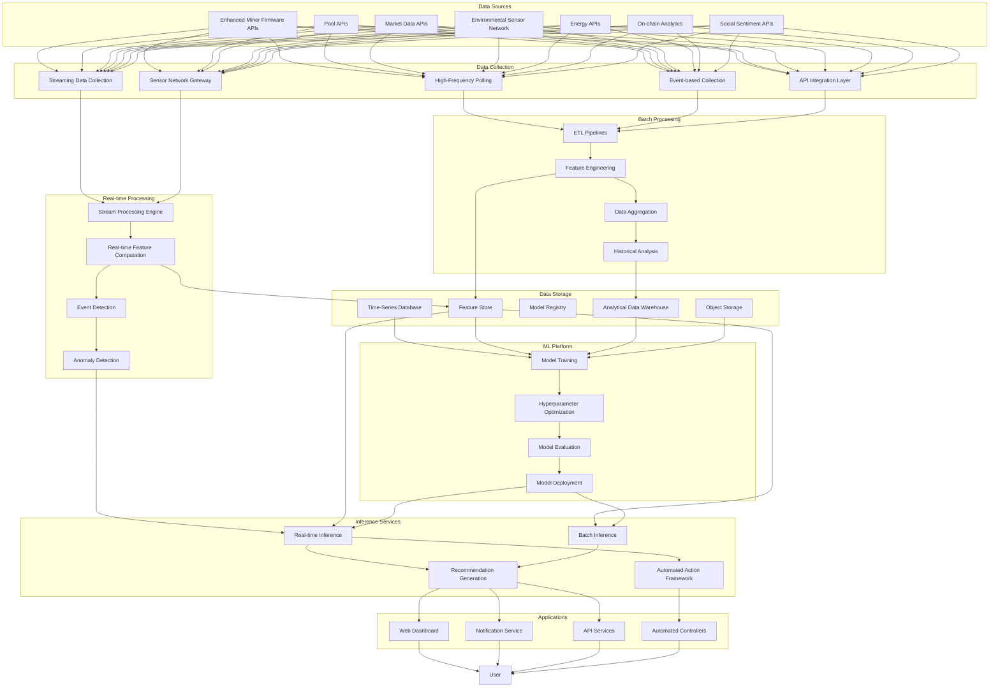
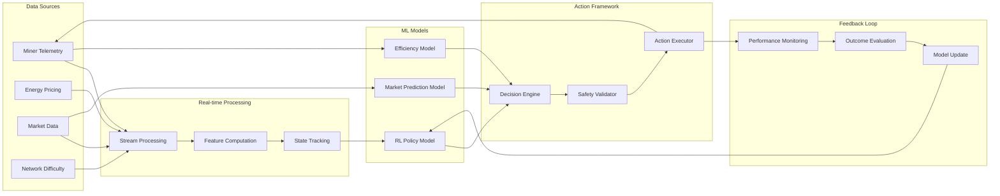
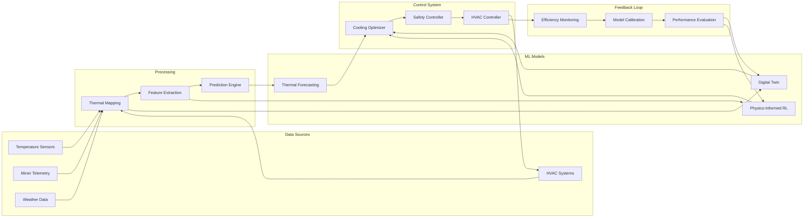

# Enhanced Machine Learning Recommendation Architecture
## Cryptocurrency Mining Monitoring System with AI-Driven Optimization

## Table of Contents
- [1. Overview](#1-overview)
  - [1.1 Purpose](#11-purpose)
  - [1.2 Goals and Objectives](#12-goals-and-objectives)
  - [1.3 System Context](#13-system-context)
  - [1.4 AI-Driven Optimization Strategies](#14-ai-driven-optimization-strategies)
- [2. Recommendation Types](#2-recommendation-types)
  - [2.1 Coin Switching Recommendations](#21-coin-switching-recommendations)
  - [2.2 Dynamic Hashrate Tuning Recommendations](#22-dynamic-hashrate-tuning-recommendations)
  - [2.3 Intelligent Overclocking Recommendations](#23-intelligent-overclocking-recommendations)
  - [2.4 Adaptive Cooling Management Recommendations](#24-adaptive-cooling-management-recommendations)
  - [2.5 Power Optimization Recommendations](#25-power-optimization-recommendations)
  - [2.6 Pool Selection Recommendations](#26-pool-selection-recommendations)
  - [2.7 Maintenance Recommendations](#27-maintenance-recommendations)
  - [2.8 Hardware Upgrade Recommendations](#28-hardware-upgrade-recommendations)
  - [2.9 Risk Mitigation Recommendations](#29-risk-mitigation-recommendations)
- [3. ML Models and Algorithms](#3-ml-models-and-algorithms)
  - [3.1 Reinforcement Learning for Dynamic Optimization](#31-reinforcement-learning-for-dynamic-optimization)
  - [3.2 Bayesian Optimization for Parameter Tuning](#32-bayesian-optimization-for-parameter-tuning)
  - [3.3 Physics-Informed Neural Networks](#33-physics-informed-neural-networks)
  - [3.4 Advanced Time-Series Forecasting](#34-advanced-time-series-forecasting)
  - [3.5 Multi-factor Market Models](#35-multi-factor-market-models)
  - [3.6 Anomaly Detection and Predictive Maintenance](#36-anomaly-detection-and-predictive-maintenance)
  - [3.7 Risk Assessment Models](#37-risk-assessment-models)
  - [3.8 Algorithm Selection Justification](#38-algorithm-selection-justification)
- [4. Feature Engineering](#4-feature-engineering)
  - [4.1 Miner Telemetry Features](#41-miner-telemetry-features)
  - [4.2 Pool Performance Features](#42-pool-performance-features)
  - [4.3 Market Data Features](#43-market-data-features)
  - [4.4 Energy and Environmental Features](#44-energy-and-environmental-features)
  - [4.5 Thermal and Cooling Features](#45-thermal-and-cooling-features)
  - [4.6 Hardware-Specific Features](#46-hardware-specific-features)
  - [4.7 Risk and Operational Features](#47-risk-and-operational-features)
  - [4.8 Derived Features](#48-derived-features)
  - [4.9 Feature Selection and Importance](#49-feature-selection-and-importance)
- [5. Data Pipeline Architecture](#5-data-pipeline-architecture)
  - [5.1 Data Collection Enhancements](#51-data-collection-enhancements)
  - [5.2 Real-time Processing Framework](#52-real-time-processing-framework)
  - [5.3 Feature Store Configuration](#53-feature-store-configuration)
  - [5.4 Data Storage Optimization](#54-data-storage-optimization)
  - [5.5 Data Flow Architecture](#55-data-flow-architecture)
- [6. Abacus.AI Integration](#6-abacusai-integration)
  - [6.1 Enhanced Feature Store Configuration](#61-enhanced-feature-store-configuration)
  - [6.2 Model Training Automation](#62-model-training-automation)
  - [6.3 Real-time Inference](#63-real-time-inference)
  - [6.4 Model Monitoring and Management](#64-model-monitoring-and-management)
- [7. Training and Inference Pipelines](#7-training-and-inference-pipelines)
  - [7.1 Data Preparation Pipeline](#71-data-preparation-pipeline)
  - [7.2 Model Training Pipeline](#72-model-training-pipeline)
  - [7.3 Real-time Inference Pipeline](#73-real-time-inference-pipeline)
  - [7.4 Batch Inference Pipeline](#74-batch-inference-pipeline)
  - [7.5 Automated Action Pipeline](#75-automated-action-pipeline)
- [8. Recommendation Evaluation](#8-recommendation-evaluation)
  - [8.1 Evaluation Metrics](#81-evaluation-metrics)
  - [8.2 A/B Testing Framework](#82-ab-testing-framework)
  - [8.3 User Feedback Collection](#83-user-feedback-collection)
  - [8.4 Performance Monitoring](#84-performance-monitoring)
  - [8.5 Economic Impact Analysis](#85-economic-impact-analysis)
- [9. Continuous Learning](#9-continuous-learning)
  - [9.1 Model Retraining Strategy](#91-model-retraining-strategy)
  - [9.2 Feedback Loop Integration](#92-feedback-loop-integration)
  - [9.3 Concept Drift Detection](#93-concept-drift-detection)
  - [9.4 Online Learning Capabilities](#94-online-learning-capabilities)
  - [9.5 Model Versioning and Rollback](#95-model-versioning-and-rollback)
- [10. Implementation Roadmap](#10-implementation-roadmap)
  - [10.1 Phase 1: Foundation Enhancement](#101-phase-1-foundation-enhancement)
  - [10.2 Phase 2: Core AI Implementation](#102-phase-2-core-ai-implementation)
  - [10.3 Phase 3: Advanced Integration](#103-phase-3-advanced-integration)
  - [10.4 Phase 4: Optimization and Scale](#104-phase-4-optimization-and-scale)
- [11. Challenges and Mitigations](#11-challenges-and-mitigations)
  - [11.1 Technical Challenges](#111-technical-challenges)
  - [11.2 Operational Challenges](#112-operational-challenges)
  - [11.3 User Adoption Challenges](#113-user-adoption-challenges)
  - [11.4 Mitigation Strategies](#114-mitigation-strategies)
- [12. Appendices](#12-appendices)
  - [12.1 Feature Definitions](#121-feature-definitions)
  - [12.2 Model Hyperparameters](#122-model-hyperparameters)
  - [12.3 Integration Code Samples](#123-integration-code-samples)
  - [12.4 AI Strategy Specifications](#124-ai-strategy-specifications)

## 1. Overview

### 1.1 Purpose

The enhanced ML recommendation engine is a core component of the cryptocurrency mining monitoring system, designed to leverage advanced AI-driven optimization strategies to maximize mining profitability, efficiency, and hardware longevity. Building upon our existing recommendation architecture, this enhanced system incorporates state-of-the-art AI techniques including reinforcement learning, physics-informed neural networks, and advanced time-series forecasting to provide more sophisticated, dynamic, and effective recommendations.

The engine processes multiple data streams at increased frequency and granularity, including enhanced miner telemetry from Vnish firmware, pool performance data from Prohashing.com, expanded market data from external APIs, environmental sensor data, energy pricing information, and detailed hardware-specific metrics. It then generates both traditional recommendations and real-time automated optimizations tailored to each user's specific mining setup, operational constraints, and financial goals.

This enhanced architecture represents a significant advancement over traditional mining optimization approaches, enabling dynamic adaptation to changing market conditions, intelligent hardware parameter tuning, adaptive cooling management, and comprehensive risk assessment.

### 1.2 Goals and Objectives

The enhanced recommendation engine aims to achieve the following objectives:

1. **Maximize Mining Profitability**: Provide dynamic optimization that increases revenue and reduces operational costs, resulting in 15-40% higher net profitability.

2. **Optimize Resource Utilization**: Implement real-time tuning to achieve the optimal balance between hashrate, power consumption, and hardware longevity, improving energy efficiency by 10-30%.

3. **Extend Hardware Lifespan**: Utilize intelligent overclocking and thermal management to extend hardware lifespan by 10-20% while maintaining optimal performance.

4. **Reduce Operational Risks**: Identify potential issues before they lead to failures, reducing downtime by 25-30% through predictive maintenance and risk assessment.

5. **Enable Dynamic Adaptation**: Help mining operations adapt in real-time to changing market conditions, network difficulties, energy prices, and environmental factors.

6. **Automate Optimization**: Provide both advisory recommendations and automated optimization capabilities with appropriate safety constraints and user controls.

7. **Personalize Strategies**: Tailor optimization strategies based on each user's specific hardware, operational constraints, risk tolerance, and financial goals.

8. **Provide Continuous Improvement**: Implement online learning and continuous adaptation to improve optimization effectiveness over time.

9. **Deliver Measurable ROI**: Generate clear economic impact metrics to demonstrate the value of AI-driven optimization strategies.

### 1.3 System Context

The enhanced recommendation engine operates within the broader cryptocurrency mining monitoring system, with significant extensions to support advanced AI capabilities:

1. **Enhanced Data Collection Layer**: Gathers high-frequency telemetry from miners, expanded pool and market data, environmental sensor readings, energy pricing information, and detailed hardware metrics.

2. **Real-time Processing Pipeline**: Transforms, normalizes, and enriches raw data into structured formats suitable for both batch analysis and real-time optimization.

3. **Advanced Feature Store**: Maintains an expanded repository of features with support for real-time feature computation and serving.

4. **Sophisticated ML Models**: Implements reinforcement learning, physics-informed neural networks, Bayesian optimization, and other advanced techniques to enable dynamic optimization.

5. **Automated Action Framework**: Provides capabilities for both advisory recommendations and direct automated actions with appropriate safety constraints.

6. **Enhanced Web Application**: Presents recommendations and optimization insights through intuitive dashboards with expanded visualization and control capabilities.

7. **Comprehensive Feedback System**: Captures user actions, automated optimization outcomes, and system performance metrics to drive continuous improvement.

The enhanced recommendation engine interacts with these components to deliver value through both traditional recommendations and automated optimizations, while continuously improving through sophisticated feedback loops and adaptive learning.

### 1.4 AI-Driven Optimization Strategies

The enhanced architecture incorporates six key AI-driven optimization strategies that represent significant advancements over traditional mining optimization approaches:

#### 1.4.1 Dynamic Hashrate Tuning

Dynamic hashrate tuning uses reinforcement learning and adaptive control systems to optimize mining hardware performance in real-time based on network conditions, energy prices, and market data. Key capabilities include:

- Real-time adaptive control that continuously monitors and adjusts mining parameters
- Multi-factor optimization that processes variables like network difficulty, energy prices, and market conditions
- Predictive hashrate management that forecasts network difficulty changes and price movements

**Benefits**: Up to 30% reduction in operational costs through compute optimization, improved energy efficiency, and maximized profitability across changing market conditions.

#### 1.4.2 Intelligent Overclocking

Intelligent overclocking uses Bayesian optimization and hardware-specific modeling to optimize GPU and ASIC performance settings while balancing hashrate, power consumption, and hardware longevity. Key approaches include:

- Hardware-specific optimization models trained on performance data from thousands of identical cards
- Adaptive overclocking techniques that adjust to changing conditions
- Efficiency-focused approaches that find the optimal point on the power-hashrate curve

**Benefits**: Increased hashrate without proportional power increase, extended hardware lifespan through optimized settings, and algorithm-specific optimization for maximum efficiency.

#### 1.4.3 Adaptive Cooling Management

Adaptive cooling management uses physics-informed reinforcement learning to optimize cooling systems in mining operations, reducing energy consumption while maintaining safe operating temperatures. Key techniques include:

- Physics-informed reinforcement learning frameworks that model complex thermal dynamics
- Digital twins of mining facilities that simulate airflow and thermal patterns
- Thermal prediction and proactive management to anticipate and prevent thermal issues

**Benefits**: 14-21% energy savings for cooling systems, reduced thermal throttling, extended hardware lifespan, and optimized cooling resource allocation.

#### 1.4.4 Market Trend Analysis

AI-driven market trend analysis uses advanced time-series forecasting and multi-factor market models to help mining operations adapt to changing cryptocurrency markets and maximize profitability. Key approaches include:

- Advanced time-series forecasting using LSTM and Transformer models
- Multi-factor market models incorporating on-chain metrics, social sentiment, and technical indicators
- Adaptive mining strategies that translate market insights into actionable mining decisions

**Benefits**: Improved coin switching decisions, optimal entry and exit points, risk-adjusted mining strategies, and better long-term planning.

#### 1.4.5 Pool Selection Optimization

AI-driven pool selection optimization uses comprehensive performance analysis and dynamic switching strategies to help miners choose the most profitable and reliable mining pools. Key capabilities include:

- Comprehensive pool performance analysis across reward mechanisms, fees, and stability
- Dynamic pool switching strategies based on real-time profitability comparison
- Risk-reward optimization balancing profitability with centralization and security risks

**Benefits**: Increased mining rewards, reduced fees, improved stability, and optimized MEV (Miner Extractable Value) opportunities.

#### 1.4.6 Risk Assessment

AI-driven risk assessment uses anomaly detection, survival analysis, and financial modeling to help mining operations identify and mitigate various risks, from hardware failures to market volatility. Key approaches include:

- Hardware failure prediction using anomaly detection and survival analysis
- Operational risk management for power supply, network connectivity, and environmental factors
- Financial risk assessment including profitability thresholds and break-even analysis

**Benefits**: Reduced downtime, preventive maintenance optimization, improved operational stability, and better financial planning.

## 2. Recommendation Types

The enhanced recommendation engine will generate several types of recommendations, including improved versions of existing recommendation types and new recommendation types enabled by the advanced AI strategies.

### 2.1 Coin Switching Recommendations

These recommendations suggest optimal cryptocurrencies to mine based on enhanced profitability analysis, considering the user's hardware capabilities, merge mining opportunities, and market forecasts.

**Key Enhancements:**
- **Real-time Market-Responsive Switching**: Continuously evaluate profitability with advanced time-series forecasting to identify optimal switching points.
- **Multi-horizon Profitability Analysis**: Evaluate short-term (hours), medium-term (days), and long-term (weeks) profitability to avoid excessive switching.
- **Risk-Adjusted Recommendations**: Consider market volatility and prediction confidence in switching decisions.
- **MEV-Aware Optimization**: Incorporate Miner Extractable Value opportunities in profitability calculations.
- **Network Difficulty Forecasting**: Predict difficulty adjustments to anticipate profitability changes.

**Example Recommendation:**
```
Switch from mining Bitcoin to Litecoin + Dogecoin (merge mining) for the next 48 hours.
Expected profitability increase: 12.3%
Confidence: High (85%)
Reasoning: Recent Dogecoin price surge combined with stable Litecoin difficulty. 
Our market model predicts continued Dogecoin momentum for 36-72 hours with 82% confidence.
Risk level: Medium (volatility may affect actual returns)
```

### 2.2 Dynamic Hashrate Tuning Recommendations

These new recommendations provide real-time hashrate optimization based on market conditions, energy prices, and network difficulty, enabled by reinforcement learning models.

**Key Features:**
- **Time-of-Day Optimization**: Adjust hashrate based on electricity pricing variations throughout the day.
- **Market-Responsive Tuning**: Increase hashrate during high-profitability periods and reduce during low-profitability periods.
- **Network-Aware Adjustment**: Optimize hashrate based on network difficulty and transaction fee markets.
- **Energy Price Adaptation**: Dynamically adjust mining intensity based on real-time or forecasted energy prices.
- **Automated Implementation**: Offer both advisory recommendations and automated implementation with user-defined constraints.

**Example Recommendation:**
```
Reduce hashrate to 85% from 2 PM to 6 PM today during peak electricity pricing.
Expected savings: $12.40 (8.2% of daily electricity cost)
Projected profit impact: +$9.15 (3.8% increase in daily profit)
Confidence: High (90%)
Automation: Enabled (will automatically adjust based on your settings)
```

### 2.3 Intelligent Overclocking Recommendations

These new recommendations provide hardware-specific overclocking profiles optimized for different mining algorithms, balancing performance, efficiency, and hardware longevity.

**Key Features:**
- **Hardware-Specific Profiles**: Generate custom overclocking settings based on specific hardware model, batch, and silicon quality.
- **Algorithm-Optimized Settings**: Provide different profiles optimized for specific mining algorithms.
- **Adaptive Adjustment**: Recommend profile changes based on environmental conditions and hardware age.
- **Stability-Focused Tuning**: Balance performance gains with stability and hardware stress.
- **Efficiency-Optimized Modes**: Offer profiles focused on maximum efficiency rather than raw performance.

**Example Recommendation:**
```
Apply "Efficiency-Optimized" overclocking profile to Antminer S19j Pro #001-#008.
Core clock: 1350 MHz (stock: 1300 MHz)
Voltage: 0.92V (stock: 0.98V)
Expected hashrate increase: +4.2%
Expected power reduction: -8.5%
Net efficiency improvement: +13.9%
Stability confidence: Very High (98%)
Hardware stress impact: Minimal
```

### 2.4 Adaptive Cooling Management Recommendations

These new recommendations optimize cooling systems and thermal management to reduce energy consumption while maintaining safe operating temperatures.

**Key Features:**
- **Facility-Wide Thermal Optimization**: Recommend optimal HVAC settings based on comprehensive thermal analysis.
- **Airflow Optimization**: Suggest adjustments to airflow patterns to eliminate hotspots and improve cooling efficiency.
- **Proactive Thermal Management**: Recommend preventive actions based on thermal forecasts and workload predictions.
- **Weather-Adaptive Cooling**: Adjust cooling strategies based on external weather conditions and forecasts.
- **Energy-Efficient Cooling**: Balance thermal safety with energy consumption to minimize cooling costs.

**Example Recommendation:**
```
Adjust cooling configuration for Mining Room A:
- Increase intake fan speed to 75% (currently 60%)
- Reduce exhaust fan speed to 65% (currently 80%)
- Reposition miners #012-#018 to improve airflow distribution
Expected temperature reduction at hotspots: 4.2°C
Expected cooling energy savings: 12.8%
Implementation priority: Medium
Recommended implementation time: During next maintenance window
```

### 2.5 Power Optimization Recommendations

These enhanced recommendations suggest optimal power settings to maximize mining efficiency based on electricity costs, hardware capabilities, and market conditions.

**Key Enhancements:**
- **Dynamic Power Profiles**: Recommend time-varying power settings based on electricity pricing and market conditions.
- **Hardware-Specific Optimization**: Provide power settings tailored to specific hardware models and their efficiency curves.
- **Market-Responsive Power Management**: Adjust power recommendations based on cryptocurrency price movements and profitability thresholds.
- **Undervolting Guidance**: Provide more sophisticated undervolting recommendations with hardware-specific safety margins.
- **Efficiency-Focused Optimization**: Prioritize J/TH efficiency over raw hashrate when economically advantageous.

**Example Recommendation:**
```
Implement dynamic power management for Antminer S19 fleet:
- Standard hours (10 PM - 2 PM): 3200W (95% of rated power)
- Peak pricing hours (2 PM - 10 PM): 2800W (82% of rated power)
Expected daily savings: $18.75 (14.2% of power costs)
Expected hashrate impact: -4.8% during peak hours, -1.2% overall
Net profitability impact: +7.8% daily
Confidence: High (88%)
```

### 2.6 Pool Selection Recommendations

These new recommendations suggest optimal mining pools based on comprehensive performance analysis, reward mechanisms, and reliability metrics.

**Key Features:**
- **Reward Mechanism Optimization**: Recommend pools based on optimal reward mechanisms for user's specific mining operation.
- **Fee Structure Analysis**: Analyze complex fee structures to identify the most cost-effective pools.
- **Reliability and Performance Metrics**: Evaluate pools based on uptime, payment consistency, and share acceptance rates.
- **MEV Optimization**: Identify pools with favorable MEV (Miner Extractable Value) distribution policies.
- **Geographic Optimization**: Recommend pools based on network latency and geographic redundancy.

**Example Recommendation:**
```
Switch Bitcoin mining from current pool to PoolX:
Expected fee savings: 0.8% of mining revenue
Projected MEV additional earnings: +1.2%
Estimated latency improvement: 18ms (12% reduction)
Historical reliability: 99.98% uptime (last 90 days)
Payment consistency score: 9.8/10
Overall projected benefit: +2.3% increased revenue
Implementation complexity: Low
```

### 2.7 Maintenance Recommendations

These enhanced recommendations suggest preventive maintenance actions based on advanced anomaly detection, component-level diagnostics, and predictive failure analysis.

**Key Enhancements:**
- **Component-Level Diagnostics**: Identify specific components showing early signs of failure.
- **Predictive Maintenance Scheduling**: Recommend optimal timing for maintenance based on failure probability models.
- **Root Cause Analysis**: Provide more detailed analysis of underlying issues causing performance degradation.
- **Prioritized Action Plans**: Rank maintenance actions based on urgency, impact, and resource requirements.
- **Thermal-Aware Maintenance**: Identify maintenance needs related to thermal issues and cooling efficiency.

**Example Recommendation:**
```
Schedule maintenance for Antminer S19 #007 within the next 48 hours.
Warning signs:
- Hashboard 2 showing 8% higher temperature variance than baseline
- Fan #2 RPM fluctuation increased by 15% over past 72 hours
- Power efficiency degraded by 6.2% in past week
Failure probability: 68% within 10 days if not addressed
Recommended actions:
1. Clean dust from heat sinks (priority: high)
2. Replace fan #2 (priority: medium)
3. Check power connections (priority: medium)
Estimated maintenance time: 45 minutes
Expected performance recovery: +5.8% hashrate, +6.5% efficiency
```

### 2.8 Hardware Upgrade Recommendations

These enhanced recommendations suggest hardware upgrades or replacements based on more sophisticated ROI analysis, considering current hardware efficiency, market forecasts, and new equipment options.

**Key Enhancements:**
- **Advanced ROI Modeling**: Incorporate market forecasts, difficulty projections, and energy price trends in ROI calculations.
- **Hardware Lifecycle Optimization**: Recommend optimal timing for upgrades based on hardware depreciation and performance degradation.
- **Risk-Adjusted Analysis**: Include volatility and uncertainty in ROI projections with confidence intervals.
- **Strategic Upgrade Paths**: Suggest phased upgrade approaches to optimize capital allocation.
- **Market Timing Guidance**: Recommend optimal timing for purchases based on hardware market conditions.

**Example Recommendation:**
```
Recommended upgrade: Replace Antminer S17 units (10 units) with S19j Pro models.
Financial analysis:
- Estimated initial investment: $38,500
- Current resale value of S17 units: ~$12,800 total
- Net investment required: $25,700
- Projected monthly profit increase: +$3,850 (based on current market)
- Estimated ROI period: 6.7 months (80% confidence interval: 5.2-8.9 months)
- 3-year projected ROI: 412%
Risk assessment: Medium (sensitive to Bitcoin price volatility)
Market timing: Favorable (hardware prices down 12% in past 60 days)
Recommended action: Proceed with phased replacement (5 units now, 5 units in 60 days)
```

### 2.9 Risk Mitigation Recommendations

These new recommendations identify and address various operational, financial, and security risks in mining operations.

**Key Features:**
- **Operational Risk Assessment**: Identify risks related to power supply, network connectivity, and environmental factors.
- **Financial Risk Analysis**: Evaluate profitability thresholds, break-even points, and cash flow risks.
- **Security Risk Evaluation**: Assess physical and cybersecurity vulnerabilities in mining operations.
- **Diversification Strategies**: Recommend approaches to mitigate concentration risks in mining operations.
- **Contingency Planning**: Suggest backup plans and failover strategies for critical systems.

**Example Recommendation:**
```
Critical risk identified: Power supply vulnerability
Risk details:
- Single power source for 85% of mining operation
- No backup generator capacity for main mining room
- Historical grid reliability: 98.2% (average 15.8 hours downtime/year)
Potential impact: $4,200-$7,500 lost revenue per 24h outage
Recommended mitigation:
1. Install 200kW backup generator system (~$28,000)
2. Implement automated power failover (~$3,500)
3. Configure staged shutdown for controlled outages
Risk reduction: 92% of potential revenue loss mitigated
ROI on mitigation: 1.8 years (based on historical outage patterns)
Implementation priority: High
```

## 3. ML Models and Algorithms

The enhanced recommendation engine employs a variety of sophisticated ML models and algorithms, including both improved versions of existing models and new models to support advanced AI strategies.

### 3.1 Reinforcement Learning for Dynamic Optimization

Reinforcement learning (RL) models enable dynamic, real-time optimization of mining parameters in response to changing conditions. These models learn optimal policies through interaction with the environment and continuous feedback.

#### 3.1.1 Dynamic Hashrate Tuning RL Model

**Purpose**: Optimize hashrate and power settings in real-time based on market conditions, energy prices, and network metrics.

**Architecture**:
- **State Representation**: Multi-dimensional state incorporating market prices, energy costs, network difficulty, hardware metrics, and temporal features.
- **Action Space**: Continuous action space for hashrate adjustment, power limits, and algorithm selection.
- **Reward Function**: Composite reward balancing profitability, energy efficiency, and hardware stress.
- **Policy Network**: Deep neural network with multiple hidden layers optimized for continuous control.
- **Value Network**: Separate network estimating long-term value of states to guide policy learning.

**Training Approach**:
- Initial training in simulation environment using historical data
- Offline reinforcement learning to learn from historical operational data
- Gradual transition to online learning with safety constraints
- Curriculum learning starting with simple scenarios and progressing to complex market conditions

**Key Advantages**:
- Adapts in real-time to changing conditions without explicit programming
- Balances multiple competing objectives (profit, efficiency, hardware longevity)
- Learns from experience to continuously improve optimization strategies
- Can discover non-intuitive optimization strategies beyond human expertise

#### 3.1.2 Adaptive Cooling Management RL Model

**Purpose**: Optimize cooling system parameters to minimize energy consumption while maintaining safe operating temperatures.

**Architecture**:
- **State Representation**: Spatial-temporal representation of thermal conditions, cooling system states, and environmental factors.
- **Action Space**: Multi-dimensional control of HVAC settings, fan speeds, and workload distribution.
- **Reward Function**: Energy efficiency reward with temperature constraint penalties.
- **Graph Neural Network**: Captures spatial relationships between components and cooling systems.
- **Physics-Informed Policy**: Incorporates thermodynamic principles into the learning process.

**Training Approach**:
- Digital twin simulation for initial policy learning
- Physics-informed loss functions to incorporate domain knowledge
- Safe exploration strategies to avoid thermal risks
- Gradual deployment from advisory mode to automated control

**Key Advantages**:
- Optimizes complex, interconnected cooling systems beyond rule-based approaches
- Incorporates physical laws for more efficient and realistic optimization
- Adapts to changing environmental conditions and workloads
- Provides proactive cooling adjustments based on predicted thermal patterns

### 3.2 Bayesian Optimization for Parameter Tuning

Bayesian optimization provides an efficient approach for optimizing complex parameter spaces where evaluations are expensive or time-consuming, making it ideal for hardware parameter tuning.

#### 3.2.1 Intelligent Overclocking Model

**Purpose**: Find optimal overclocking parameters for mining hardware that maximize performance while maintaining stability and longevity.

**Architecture**:
- **Gaussian Process Model**: Probabilistic model of the relationship between overclocking parameters and performance metrics.
- **Acquisition Function**: Balances exploration of unknown parameter regions with exploitation of known good regions.
- **Parameter Space**: Multi-dimensional space including core clock, memory clock, voltage, and power limit.
- **Constraint Handling**: Enforces safety constraints to prevent hardware damage.
- **Hardware-Specific Priors**: Incorporates prior knowledge about specific hardware models.

**Training Approach**:
- Initial model building with controlled testing data
- Iterative refinement through targeted parameter exploration
- Batch optimization to test multiple settings efficiently
- Hardware-specific model specialization

**Key Advantages**:
- Efficiently explores large parameter spaces with minimal testing
- Provides uncertainty estimates for risk-aware optimization
- Adapts to different hardware characteristics and silicon quality
- Balances performance gains with stability and longevity

#### 3.2.2 Power Optimization Model

**Purpose**: Determine optimal power settings that maximize efficiency (hashrate per watt) while considering electricity costs and hardware constraints.

**Architecture**:
- **Gaussian Process Regression**: Models the relationship between power settings and mining performance.
- **Multi-objective Acquisition**: Optimizes for efficiency, profitability, and hardware stress simultaneously.
- **Temporal Optimization**: Finds optimal power schedules based on time-varying electricity prices.
- **Hardware-Specific Models**: Specialized models for different hardware types and batches.

**Training Approach**:
- Controlled testing to map efficiency curves for different hardware
- Incremental refinement with production data
- Cross-validation to ensure generalization
- Periodic retraining to adapt to hardware aging

**Key Advantages**:
- Discovers optimal points on the power-hashrate curve for each device
- Adapts to time-of-day electricity pricing for dynamic optimization
- Provides hardware-specific optimization beyond generic recommendations
- Balances immediate efficiency with long-term hardware health

### 3.3 Physics-Informed Neural Networks

Physics-informed neural networks (PINNs) incorporate physical laws and domain knowledge into the learning process, making them ideal for modeling complex physical systems like thermal dynamics.

#### 3.3.1 Thermal Modeling and Prediction

**Purpose**: Model and predict thermal behavior in mining facilities to enable proactive cooling management and thermal optimization.

**Architecture**:
- **Neural Network Backbone**: Deep neural network architecture for feature extraction and representation learning.
- **Physics-Informed Layers**: Special layers that enforce physical constraints like heat transfer equations.
- **Spatial-Temporal Modeling**: Captures both spatial relationships and temporal dynamics of thermal systems.
- **Multi-resolution Architecture**: Processes data at different spatial and temporal scales.
- **Uncertainty Quantification**: Provides confidence intervals for thermal predictions.

**Training Approach**:
- Combined loss function incorporating data fit and physics compliance
- Training with both sensor data and simulation results
- Transfer learning from general thermal models to facility-specific models
- Active learning to identify informative regions for additional sensors

**Key Advantages**:
- More accurate thermal predictions by incorporating physical laws
- Requires less training data than pure data-driven approaches
- Provides physically plausible predictions even in data-sparse regions
- Enables what-if analysis for facility modifications and cooling strategies

#### 3.3.2 Hardware Thermal Response Model

**Purpose**: Model the thermal response of mining hardware to different workloads, environmental conditions, and cooling configurations.

**Architecture**:
- **Component-Level Modeling**: Separate models for different hardware components (chips, memory, power delivery).
- **Thermal Circuit Representation**: Neural network structure inspired by thermal circuit models.
- **Multi-input Architecture**: Processes workload metrics, environmental conditions, and cooling parameters.
- **Long-term Memory Components**: Captures thermal inertia and long-term effects.

**Training Approach**:
- Controlled thermal testing for initial model development
- Fine-tuning with production data
- Hardware-specific specialization
- Validation against thermal camera measurements

**Key Advantages**:
- Accurate prediction of thermal response to workload changes
- Enables proactive thermal management before issues occur
- Identifies optimal cooling configurations for specific hardware
- Supports thermal-aware workload scheduling

### 3.4 Advanced Time-Series Forecasting

Advanced time-series forecasting models enable prediction of market trends, network difficulty, energy prices, and other time-varying factors critical for mining optimization.

#### 3.4.1 Cryptocurrency Price and Profitability Forecasting

**Purpose**: Predict short and medium-term price movements and mining profitability to inform coin switching and hashrate optimization decisions.

**Architecture**:
- **LSTM Networks**: Long Short-Term Memory networks to capture temporal dependencies in price data.
- **Transformer Models**: Attention-based architecture for capturing complex patterns and relationships.
- **Multi-horizon Outputs**: Simultaneous forecasting at different time horizons (hours, days, weeks).
- **Uncertainty Quantification**: Probabilistic forecasts with confidence intervals.
- **Ensemble Integration**: Combination of multiple forecasting models for improved robustness.

**Training Approach**:
- Training on extensive historical market data
- Walk-forward validation to prevent lookahead bias
- Regularization techniques to prevent overfitting
- Continuous online updating with recent data

**Key Advantages**:
- Captures complex temporal patterns in cryptocurrency markets
- Provides probabilistic forecasts with uncertainty estimates
- Adapts to changing market regimes and volatility
- Enables risk-aware decision making with confidence intervals

#### 3.4.2 Network Difficulty and Energy Price Forecasting

**Purpose**: Predict changes in mining difficulty and energy prices to optimize mining operations and power management.

**Architecture**:
- **Hybrid Models**: Combination of statistical methods and neural networks.
- **External Factor Integration**: Incorporates macroeconomic indicators, seasonal patterns, and network metrics.
- **Hierarchical Forecasting**: Models relationships between global trends and local variations.
- **Regime-Switching Components**: Adapts to different market and network states.

**Training Approach**:
- Separate models for different cryptocurrencies and energy markets
- Feature selection to identify most predictive indicators
- Regularization to handle limited data for some networks
- Periodic retraining to adapt to changing network dynamics

**Key Advantages**:
- Anticipates difficulty adjustments before they occur
- Enables proactive optimization for changing network conditions
- Improves power management with energy price forecasts
- Supports strategic planning for mining operations

### 3.5 Multi-factor Market Models

Multi-factor market models analyze diverse data sources to provide comprehensive market insights beyond simple price prediction, enabling more sophisticated mining strategies.

#### 3.5.1 On-chain Analytics Model

**Purpose**: Analyze blockchain data to identify network trends, miner behavior, and on-chain indicators relevant to mining profitability.

**Architecture**:
- **Graph Neural Networks**: Process blockchain transaction graphs to identify patterns.
- **Temporal Convolutional Networks**: Analyze time-series on-chain metrics.
- **Feature Extraction Layers**: Extract meaningful indicators from raw blockchain data.
- **Multi-output Heads**: Generate various on-chain health and activity metrics.

**Training Approach**:
- Unsupervised learning for pattern discovery
- Supervised learning for specific indicator prediction
- Transfer learning across different blockchains
- Continuous updating with new blockchain data

**Key Advantages**:
- Identifies network trends not visible in price data alone
- Provides early indicators of network health and adoption
- Detects changes in miner behavior and competition
- Enables blockchain-aware mining strategies

#### 3.5.2 Sentiment and News Analysis Model

**Purpose**: Analyze social media, news, and developer activity to gauge market sentiment and identify potential market-moving events.

**Architecture**:
- **NLP Processing Pipeline**: Text preprocessing, tokenization, and feature extraction.
- **BERT-based Sentiment Analysis**: Fine-tuned transformer models for crypto-specific sentiment.
- **Topic Modeling**: Identifies key themes and topics in crypto discussions.
- **Event Detection**: Identifies potential market-moving events and announcements.
- **Cross-platform Correlation**: Analyzes relationships between sentiment across different platforms.

**Training Approach**:
- Pre-training on general financial text corpus
- Fine-tuning on cryptocurrency-specific content
- Supervised learning with labeled sentiment data
- Semi-supervised learning for topic discovery

**Key Advantages**:
- Captures market sentiment beyond price movements
- Identifies emerging trends and narratives
- Provides early warning of potential market shifts
- Enables sentiment-aware mining strategies

### 3.6 Anomaly Detection and Predictive Maintenance

Enhanced anomaly detection and predictive maintenance models identify potential hardware issues and operational problems before they lead to failures or significant performance degradation.

#### 3.6.1 Enhanced Anomaly Detection Model

**Purpose**: Identify abnormal behavior in mining operations that may indicate hardware issues, configuration problems, or security concerns.

**Architecture**:
- **Hierarchical Anomaly Detection**: Detects anomalies at component, device, and system levels.
- **Multivariate Isolation Forest**: Efficiently detects outliers in high-dimensional telemetry data.
- **Autoencoder Neural Networks**: Learns normal operating patterns and detects subtle deviations.
- **Temporal Convolutional Networks**: Identifies anomalous sequences in time-series data.
- **Contextual Anomaly Detection**: Considers environmental and operational context when identifying anomalies.

**Training Approach**:
- Unsupervised learning on normal operation data
- Semi-supervised fine-tuning with labeled anomalies
- Continuous adaptation to evolving normal patterns
- Transfer learning across similar hardware types

**Key Advantages**:
- Detects subtle anomalies before they become critical issues
- Reduces false positives by considering operational context
- Identifies complex anomaly patterns across multiple metrics
- Adapts to changing hardware behavior over time

#### 3.6.2 Component Failure Prediction Model

**Purpose**: Predict specific component failures and estimate remaining useful life of mining hardware components.

**Architecture**:
- **Survival Analysis Models**: Cox Proportional Hazards and accelerated failure time models.
- **Sequence-to-Sequence Prediction**: LSTM-based architecture for time-to-failure prediction.
- **Component-Specific Models**: Specialized models for fans, power supplies, hashboards, and other critical components.
- **Ensemble Approach**: Combines multiple prediction methods for improved accuracy.

**Training Approach**:
- Training on historical failure data and maintenance records
- Synthetic data generation for rare failure modes
- Transfer learning from similar components
- Continuous updating with new failure data

**Key Advantages**:
- Provides specific time-to-failure estimates for components
- Enables just-in-time maintenance before failures occur
- Prioritizes maintenance actions based on failure probability
- Reduces downtime through preventive maintenance

### 3.7 Risk Assessment Models

Risk assessment models identify, quantify, and prioritize various risks in mining operations, enabling proactive risk management and mitigation.

#### 3.7.1 Operational Risk Model

**Purpose**: Identify and quantify risks related to hardware, infrastructure, and operations that could impact mining performance and reliability.

**Architecture**:
- **Bayesian Network**: Models causal relationships between risk factors and outcomes.
- **Risk Factor Analysis**: Quantifies contribution of different factors to overall risk.
- **Monte Carlo Simulation**: Generates risk distributions and scenarios.
- **Decision Tree Models**: Identifies critical decision points for risk mitigation.

**Training Approach**:
- Expert knowledge incorporation for initial structure
- Parameter learning from historical incident data
- Scenario-based validation with domain experts
- Continuous updating with new operational data

**Key Advantages**:
- Provides comprehensive view of operational risks
- Quantifies probability and impact of different risk scenarios
- Identifies critical risk factors for targeted mitigation
- Enables risk-informed decision making for operations

#### 3.7.2 Financial Risk Model

**Purpose**: Assess financial risks related to mining operations, including profitability thresholds, break-even analysis, and market exposure.

**Architecture**:
- **Stochastic Modeling**: Simulates financial outcomes under different market scenarios.
- **Sensitivity Analysis**: Identifies key factors affecting financial performance.
- **Value-at-Risk Calculation**: Quantifies potential financial losses.
- **Scenario Analysis**: Evaluates performance under different market conditions.

**Training Approach**:
- Calibration with historical financial data
- Validation against actual mining operation outcomes
- Stress testing with extreme market scenarios
- Regular recalibration with updated market data

**Key Advantages**:
- Quantifies financial risks in mining operations
- Identifies profitability thresholds and break-even points
- Enables risk-adjusted decision making
- Supports strategic planning and investment decisions

### 3.8 Algorithm Selection Justification

The selection of algorithms for the enhanced recommendation engine is based on the following considerations:

#### 3.8.1 Reinforcement Learning for Dynamic Optimization

**Justification**:
- **Complex Decision Spaces**: RL excels at sequential decision-making in complex environments with many variables.
- **Continuous Adaptation**: RL agents can adapt to changing conditions without explicit reprogramming.
- **Multi-objective Optimization**: RL can balance competing objectives like profitability, efficiency, and hardware longevity.
- **Discovers Optimal Strategies**: RL can discover non-intuitive strategies that outperform human-designed rules.

**Alternatives Considered**:
- Rule-based systems: Too rigid for dynamic optimization in changing conditions
- Supervised learning: Requires labeled examples of optimal decisions, which are often unavailable
- Classical optimization: Struggles with the complexity and stochasticity of mining environments

#### 3.8.2 Bayesian Optimization for Parameter Tuning

**Justification**:
- **Efficient Exploration**: Bayesian optimization efficiently explores parameter spaces with minimal evaluations.
- **Uncertainty Quantification**: Provides confidence estimates for optimization decisions.
- **Prior Knowledge Integration**: Can incorporate domain knowledge through priors.
- **Handles Noisy Evaluations**: Robust to noise in performance measurements.

**Alternatives Considered**:
- Grid search: Computationally prohibitive for high-dimensional parameter spaces
- Random search: Less efficient than Bayesian optimization
- Gradient-based methods: Require differentiable objective functions, which are often unavailable

#### 3.8.3 Physics-Informed Neural Networks for Thermal Modeling

**Justification**:
- **Physical Consistency**: Ensures predictions obey physical laws like thermodynamics.
- **Data Efficiency**: Requires less training data by incorporating domain knowledge.
- **Generalization**: Better extrapolation to unseen conditions.
- **Interpretability**: More interpretable than pure black-box models.

**Alternatives Considered**:
- Pure data-driven neural networks: Require more data and may violate physical laws
- Computational fluid dynamics: Computationally expensive for real-time applications
- Statistical models: Less accurate for complex thermal systems

#### 3.8.4 Advanced Time-Series Models for Forecasting

**Justification**:
- **Temporal Pattern Recognition**: LSTM and Transformer models excel at capturing complex temporal patterns.
- **Multi-horizon Capability**: Can predict across different time horizons simultaneously.
- **Uncertainty Quantification**: Provide confidence intervals for forecasts.
- **Adaptability**: Can adapt to changing market regimes and volatility.

**Alternatives Considered**:
- ARIMA models: Less effective for non-linear and non-stationary data
- Prophet: Less flexible for cryptocurrency-specific patterns
- Simple regression: Insufficient for complex market dynamics

#### 3.8.5 Ensemble Methods for Robust Prediction

**Justification**:
- **Improved Accuracy**: Combining multiple models typically outperforms any single model.
- **Reduced Overfitting**: Ensemble methods are less prone to overfitting.
- **Uncertainty Estimation**: Provides natural way to estimate prediction uncertainty.
- **Robustness**: More robust to different market conditions and data anomalies.

**Alternatives Considered**:
- Single model approaches: Less robust and accurate
- Model selection: Discards valuable information from non-selected models
- Simple averaging: Less effective than weighted ensembles

## 4. Feature Engineering

Effective feature engineering is critical to the performance of the enhanced recommendation engine. This section outlines the expanded set of features required to support the advanced AI strategies.

### 4.1 Miner Telemetry Features

Enhanced features derived from Vnish firmware API data, capturing the operational state and performance of mining hardware at higher frequency and granularity.

**Raw Features**:
- Hashrate (overall and per hashboard) at increased frequency (1-minute intervals)
- Detailed temperature readings (chip-level temperatures, temperature gradients)
- Power consumption, voltage, and current at component level
- Enhanced fan metrics (RPM stability, acoustic signatures)
- Expanded error codes and frequencies with component-level detail
- Accepted/rejected share counts with timing information
- Detailed clock frequencies and voltage readings
- Memory timing and error statistics

**Derived Features**:
1. **Enhanced Efficiency Metrics**:
   - Dynamic efficiency curves across power ranges
   - Algorithm-specific efficiency profiles
   - Temperature-adjusted efficiency metrics
   - Temporal efficiency patterns (hourly, daily, weekly)

2. **Advanced Stability Indicators**:
   - Multi-scale hashrate variance (minutes, hours, days)
   - Temperature stability indices with thermal gradient analysis
   - Error pattern recognition features
   - Share acceptance ratio with timing analysis

3. **Component-Level Health Indicators**:
   - Individual chip performance metrics
   - Fan health indicators based on RPM stability and acoustic signatures
   - Power delivery quality metrics
   - Memory performance and error metrics

4. **Temporal Pattern Features**:
   - Fourier transform features for cyclic pattern detection
   - Change point detection features for performance shifts
   - Trend decomposition features (trend, seasonality, residual)
   - Recovery pattern analysis after interventions

### 4.2 Pool Performance Features

Enhanced features derived from Prohashing.com API data and other pool APIs, capturing more detailed mining pool performance and rewards metrics.

**Raw Features**:
- Worker hashrate (reported and effective) at increased frequency
- Detailed share submission statistics including timing and propagation
- Expanded earnings data with transaction fee components
- Coins mined (primary and merge-mined) with difficulty information
- Pool difficulty and status with historical stability metrics
- MEV (Miner Extractable Value) statistics and distribution
- Pool server performance and connectivity metrics
- Detailed reward mechanism parameters

**Derived Features**:
1. **Enhanced Reward Efficiency Metrics**:
   - Time-of-day profitability patterns with statistical significance
   - Difficulty-adjusted reward efficiency
   - MEV-adjusted profitability metrics
   - Reward variance with risk-adjusted returns

2. **Advanced Pool Comparison Metrics**:
   - Comprehensive pool efficiency scoring
   - Latency-adjusted profitability metrics
   - Reliability scoring with weighted historical performance
   - Fee impact analysis across reward types

3. **Expanded Coin-specific Metrics**:
   - Difficulty cycle position indicators
   - Block reward halving impact projections
   - Transaction fee market analysis
   - Merge mining optimization scores

4. **Network Performance Metrics**:
   - Share submission latency analysis
   - Stale share probability features
   - Network congestion indicators
   - Geographic performance variation

### 4.3 Market Data Features

Significantly expanded features derived from cryptocurrency market APIs, on-chain data, and social sentiment analysis.

**Raw Features**:
- High-frequency price data (minute-level for major coins)
- Expanded market metrics (order book depth, bid-ask spreads)
- On-chain metrics (active addresses, transaction volume, fees)
- Network metrics (hashrate, difficulty) with historical context
- Social sentiment data from multiple platforms
- News and announcement monitoring
- Developer activity metrics from code repositories
- Regulatory development tracking

**Derived Features**:
1. **Advanced Price Dynamics**:
   - Multi-timeframe momentum indicators
   - Volatility regime classification features
   - Market microstructure metrics
   - Relative strength indicators across coins

2. **Enhanced Market Sentiment**:
   - NLP-derived sentiment scores from social media
   - News impact assessment features
   - Topic modeling and narrative tracking
   - Sentiment divergence from price action

3. **On-chain Analytics**:
   - Miner behavior metrics (accumulation/distribution)
   - Network health indicators
   - UTXO age distribution features
   - Fee market dynamics

4. **Advanced Predictive Indicators**:
   - Multi-horizon price movement probabilities
   - Market regime classification features
   - Correlation regime features
   - Market cycle position indicators

### 4.4 Energy and Environmental Features

New feature category capturing energy pricing, grid conditions, and environmental factors relevant to mining optimization.

**Raw Features**:
- Time-of-day electricity pricing data
- Grid load and stability metrics
- Renewable energy availability
- Carbon intensity of electricity supply
- Weather conditions and forecasts
- Seasonal energy pricing patterns
- Demand response program data
- Grid frequency and quality metrics

**Derived Features**:
1. **Energy Optimization Features**:
   - Electricity price forecasts (hourly, daily, weekly)
   - Price volatility and pattern recognition
   - Grid stress prediction features
   - Optimal mining time window identification

2. **Environmental Efficiency Metrics**:
   - Carbon efficiency (hashrate per carbon emission)
   - Renewable energy utilization metrics
   - Environmental impact scores
   - Regulatory compliance indicators

3. **Grid Interaction Features**:
   - Demand response opportunity scoring
   - Grid stability contribution metrics
   - Load shifting potential indicators
   - Energy storage utilization features

4. **Weather Impact Features**:
   - Temperature impact on cooling efficiency
   - Humidity effect on cooling performance
   - Seasonal adjustment factors
   - Extreme weather risk indicators

### 4.5 Thermal and Cooling Features

New feature category focused on thermal conditions, cooling system performance, and thermal optimization opportunities.

**Raw Features**:
- Spatial temperature distribution from sensor network
- HVAC system performance metrics
- Airflow measurements and patterns
- Intake and exhaust air properties
- Cooling system power consumption
- Humidity and air quality metrics
- Thermal camera imaging data
- Facility layout and thermal characteristics

**Derived Features**:
1. **Thermal Mapping Features**:
   - 3D thermal gradient tensors
   - Hotspot identification and characterization
   - Thermal flow pattern analysis
   - Spatial clustering of thermal conditions

2. **Cooling Efficiency Metrics**:
   - Cooling power per heat dissipated
   - Temperature reduction per energy input
   - Cooling capacity utilization metrics
   - Efficiency comparison across cooling zones

3. **Predictive Thermal Features**:
   - Temperature forecast features (hours ahead)
   - Thermal response prediction to workload changes
   - Cooling system response characteristics
   - Thermal anomaly early indicators

4. **Optimization Opportunity Features**:
   - Airflow optimization potential scores
   - Cooling reconfiguration benefit estimates
   - Hardware placement optimization metrics
   - Energy saving opportunity identification

### 4.6 Hardware-Specific Features

New feature category capturing detailed hardware characteristics, performance profiles, and optimization parameters.

**Raw Features**:
- Detailed hardware specifications and capabilities
- Firmware version and feature support
- Silicon quality and batch information
- Historical performance and stability data
- Overclocking response characteristics
- Power-performance curves
- Component-level specifications
- Warranty and age information

**Derived Features**:
1. **Hardware Optimization Features**:
   - Silicon quality scoring
   - Algorithm affinity metrics
   - Overclocking headroom estimates
   - Efficiency optimization potential

2. **Hardware Response Curves**:
   - Voltage-frequency response models
   - Power-hashrate response curves
   - Temperature-performance relationships
   - Memory timing sensitivity metrics

3. **Hardware Lifecycle Features**:
   - Age-adjusted performance expectations
   - Wear level indicators
   - Remaining useful life estimates
   - Upgrade timing optimization metrics

4. **Hardware Compatibility Features**:
   - Algorithm compatibility scoring
   - Firmware optimization potential
   - Feature utilization metrics
   - Upgrade path identification

### 4.7 Risk and Operational Features

New feature category focused on risk assessment, operational stability, and vulnerability identification.

**Raw Features**:
- Component failure history and patterns
- Operational incident records
- Power quality and reliability metrics
- Network connectivity and stability data
- Physical security and environmental hazards
- Financial and market risk indicators
- Maintenance history and effectiveness
- Backup and redundancy system status

**Derived Features**:
1. **Hardware Risk Features**:
   - Component failure probability estimates
   - Mean time between failure predictions
   - Stress accumulation metrics
   - Vulnerability identification scores

2. **Operational Risk Metrics**:
   - Operational stability scoring
   - Single points of failure identification
   - Redundancy effectiveness metrics
   - Incident probability estimates

3. **Financial Risk Indicators**:
   - Profitability threshold metrics
   - Break-even analysis features
   - Cash flow risk assessment
   - Market exposure quantification

4. **Mitigation Opportunity Features**:
   - Risk reduction potential scores
   - Mitigation cost-effectiveness metrics
   - Priority ranking for risk mitigation
   - Resilience improvement indicators

### 4.8 Derived Features

Complex features created by combining data across multiple sources to capture relationships and patterns relevant to the advanced AI strategies.

1. **Cross-Domain Efficiency Metrics**:
   - Market-adjusted power optimization targets
   - Weather-responsive cooling efficiency metrics
   - Risk-adjusted profitability indicators
   - Hardware-specific algorithm selection scores

2. **Temporal-Spatial Features**:
   - Spatial-temporal thermal patterns
   - Geographic performance variation over time
   - Facility-wide efficiency heat maps
   - Temporal propagation of anomalies

3. **Multi-factor Optimization Metrics**:
   - Composite optimization opportunity scores
   - Multi-objective optimization targets
   - Trade-off quantification metrics
   - Pareto efficiency indicators

4. **Strategic Decision Features**:
   - Long-term ROI projection features
   - Strategic timing indicators
   - Scenario analysis metrics
   - Decision impact quantification

### 4.9 Feature Selection and Importance

Feature selection for the enhanced recommendation engine will be performed using a combination of domain knowledge and advanced data-driven approaches:

1. **Strategy-Specific Feature Selection**:
   - Identify critical features for each AI strategy
   - Create specialized feature subsets for different model types
   - Develop feature importance ranking for each strategy
   - Implement strategy-specific feature engineering pipelines

2. **Advanced Feature Selection Techniques**:
   - Recursive Feature Elimination with Cross-Validation (RFECV)
   - Permutation importance analysis
   - SHAP (SHapley Additive exPlanations) value analysis
   - Mutual information and correlation analysis

3. **Temporal Relevance Assessment**:
   - Evaluate feature importance across different time horizons
   - Identify leading indicators for predictive models
   - Assess feature stability over time
   - Implement time-decay weighting for historical features

4. **Computational Efficiency Optimization**:
   - Balance feature richness with computational requirements
   - Identify redundant features for dimensionality reduction
   - Create efficient feature computation pipelines
   - Implement feature caching strategies for real-time inference

The feature engineering process will be iterative and continuous, with new features being developed and tested based on model performance, user feedback, and emerging patterns in the data. All features will be documented in a central feature registry within the Abacus.AI feature store to ensure consistency, reusability, and proper governance.

## 5. Data Pipeline Architecture

The enhanced recommendation engine requires significant extensions to the data pipeline to support the advanced AI strategies. This section outlines the key enhancements to the data collection, processing, storage, and flow architecture.

### 5.1 Data Collection Enhancements

The data collection layer will be enhanced to support higher frequency data collection, additional data sources, and more detailed metrics.

#### 5.1.1 Enhanced Miner Telemetry Collection

**Key Enhancements**:
- Increase polling frequency from 5 minutes to 1-2 minutes for critical metrics
- Implement streaming collection for real-time optimization
- Expand API access to retrieve component-level diagnostics
- Add support for firmware-specific extended metrics
- Implement efficient batch collection to minimize API load
- Develop robust error handling and retry mechanisms
- Create adaptive polling based on operational state

**Implementation Approach**:
```python
# Pseudocode for enhanced telemetry collection
class EnhancedTelemetryCollector:
    def __init__(self, config):
        self.base_interval = config.get('base_interval', 60)  # 1 minute default
        self.critical_metrics = config.get('critical_metrics', [])
        self.extended_metrics = config.get('extended_metrics', [])
        self.streaming_enabled = config.get('streaming_enabled', False)
        self.adaptive_polling = config.get('adaptive_polling', True)
        
    def collect_telemetry(self, miner_id):
        # Get miner firmware version and capabilities
        capabilities = self.get_miner_capabilities(miner_id)
        
        # Determine collection strategy based on capabilities
        if self.streaming_enabled and capabilities.supports_streaming:
            return self.setup_streaming_collection(miner_id)
        else:
            return self.setup_polling_collection(miner_id)
    
    def setup_polling_collection(self, miner_id):
        # Set up polling intervals based on metric importance
        polling_schedule = {}
        for metric in self.critical_metrics:
            polling_schedule[metric] = self.base_interval
        
        for metric in self.extended_metrics:
            polling_schedule[metric] = self.base_interval * 3
        
        # Adjust based on miner state if adaptive polling enabled
        if self.adaptive_polling:
            miner_state = self.get_miner_state(miner_id)
            polling_schedule = self.adjust_polling_schedule(
                polling_schedule, miner_state
            )
        
        return polling_schedule
    
    def setup_streaming_collection(self, miner_id):
        # Configure streaming API connection
        streaming_config = {
            'miner_id': miner_id,
            'metrics': self.critical_metrics + self.extended_metrics,
            'buffer_size': 1000,
            'batch_interval': 10,  # seconds
            'compression': True
        }
        
        return self.start_streaming_collection(streaming_config)
```

#### 5.1.2 Environmental Sensor Network

**Key Components**:
- Temperature sensor grid throughout the facility
- Humidity and air quality sensors
- Airflow sensors at key points
- Power monitoring equipment
- Acoustic and vibration sensors for mechanical health monitoring
- Weather station for external conditions
- HVAC system integration for cooling metrics

**Implementation Approach**:
```python
# Pseudocode for sensor network configuration
class SensorNetworkManager:
    def __init__(self, facility_config):
        self.facility_layout = facility_config.get('layout')
        self.sensor_types = facility_config.get('sensor_types')
        self.collection_intervals = facility_config.get('collection_intervals')
        self.data_retention = facility_config.get('data_retention')
        
    def deploy_sensor_network(self):
        # Generate optimal sensor placement
        sensor_placement = self.calculate_optimal_placement(
            self.facility_layout, self.sensor_types
        )
        
        # Configure each sensor
        sensor_configs = []
        for placement in sensor_placement:
            sensor_config = {
                'id': f"sensor_{placement['type']}_{placement['location_id']}",
                'type': placement['type'],
                'location': placement['coordinates'],
                'interval': self.collection_intervals[placement['type']],
                'retention': self.data_retention[placement['type']],
                'protocol': self.determine_protocol(placement)
            }
            sensor_configs.append(sensor_config)
        
        # Deploy and register sensors
        deployed_sensors = self.deploy_sensors(sensor_configs)
        self.register_sensors_in_monitoring(deployed_sensors)
        
        return deployed_sensors
    
    def calculate_optimal_placement(self, layout, sensor_types):
        # Algorithm to determine optimal sensor placement
        # based on facility layout and sensor types
        # ...
        
    def determine_protocol(self, placement):
        # Select appropriate communication protocol
        # based on sensor type and location
        # ...
```

#### 5.1.3 External API Integration

**Key Enhancements**:
- Expand market data sources with higher frequency data
- Add on-chain analytics API integration
- Implement social sentiment and news API connections
- Integrate energy pricing and grid status APIs
- Add weather data API for environmental context
- Develop pool performance API integrations across multiple pools

**Implementation Approach**:
```python
# Pseudocode for external API integration
class ExternalAPIManager:
    def __init__(self, api_config):
        self.api_endpoints = api_config.get('endpoints', {})
        self.api_keys = self.load_api_keys(api_config.get('key_storage'))
        self.rate_limits = api_config.get('rate_limits', {})
        self.fallback_sources = api_config.get('fallbacks', {})
        
    def setup_api_clients(self):
        # Initialize API clients for each endpoint
        self.clients = {}
        for api_name, endpoint_config in self.api_endpoints.items():
            client_config = {
                'base_url': endpoint_config['url'],
                'api_key': self.api_keys.get(api_name),
                'rate_limit': self.rate_limits.get(api_name),
                'timeout': endpoint_config.get('timeout', 30),
                'retry_policy': endpoint_config.get('retry_policy', 'exponential'),
                'fallback': self.fallback_sources.get(api_name)
            }
            self.clients[api_name] = self.create_api_client(api_name, client_config)
        
        return self.clients
    
    def create_data_collection_jobs(self):
        # Create scheduled jobs for data collection
        collection_jobs = []
        for api_name, endpoint_config in self.api_endpoints.items():
            for data_type, data_config in endpoint_config.get('data_types', {}).items():
                job_config = {
                    'api_name': api_name,
                    'data_type': data_type,
                    'interval': data_config.get('interval'),
                    'params': data_config.get('params', {}),
                    'transform': data_config.get('transform'),
                    'destination': data_config.get('destination')
                }
                collection_jobs.append(self.create_collection_job(job_config))
        
        return collection_jobs
```

### 5.2 Real-time Processing Framework

A new real-time processing framework will be implemented to support the low-latency requirements of dynamic optimization strategies.

#### 5.2.1 Stream Processing Architecture

**Key Components**:
- Real-time data ingestion from multiple sources
- Stream processing for immediate feature computation
- In-memory processing for latency-sensitive operations
- Stateful processing for temporal feature extraction
- Windowed operations for time-based aggregations
- Event-driven architecture for responsive optimization

**Implementation Approach**:
```python
# Pseudocode for stream processing framework
class StreamProcessingFramework:
    def __init__(self, stream_config):
        self.input_streams = stream_config.get('input_streams', [])
        self.processing_operators = stream_config.get('operators', [])
        self.output_sinks = stream_config.get('output_sinks', [])
        self.window_definitions = stream_config.get('windows', {})
        self.state_config = stream_config.get('state_config', {})
        
    def build_processing_topology(self):
        # Create processing topology from configuration
        topology = StreamTopology()
        
        # Add input sources
        for stream in self.input_streams:
            source = self.create_source(stream)
            topology.add_source(source)
        
        # Add processing operators
        for operator_config in self.processing_operators:
            operator = self.create_operator(operator_config)
            topology.add_operator(operator)
        
        # Add output sinks
        for sink_config in self.output_sinks:
            sink = self.create_sink(sink_config)
            topology.add_sink(sink)
        
        # Connect components
        topology.build_connections()
        
        return topology
    
    def create_operator(self, operator_config):
        # Create appropriate operator based on type
        op_type = operator_config.get('type')
        
        if op_type == 'stateless_transform':
            return StatelessTransformOperator(operator_config)
        elif op_type == 'stateful_transform':
            return StatefulTransformOperator(operator_config, self.state_config)
        elif op_type == 'window_aggregate':
            window_def = self.window_definitions[operator_config.get('window')]
            return WindowAggregateOperator(operator_config, window_def)
        elif op_type == 'join':
            return StreamJoinOperator(operator_config)
        elif op_type == 'filter':
            return FilterOperator(operator_config)
        else:
            raise ValueError(f"Unknown operator type: {op_type}")
```

#### 5.2.2 Real-time Feature Computation

**Key Capabilities**:
- Incremental feature computation for efficiency
- Feature freshness tracking and management
- Prioritized computation for critical features
- Caching strategies for frequently used features
- Approximate computing for resource-intensive features
- Feature dependency management for computation ordering
- Adaptive computation based on resource availability

**Implementation Approach**:
```python
# Pseudocode for real-time feature computation
class RealTimeFeatureComputer:
    def __init__(self, feature_config):
        self.feature_definitions = feature_config.get('features', {})
        self.dependencies = self.build_dependency_graph()
        self.computation_priorities = feature_config.get('priorities', {})
        self.cache_config = feature_config.get('cache_config', {})
        self.feature_cache = self.initialize_cache()
        
    def build_dependency_graph(self):
        # Build graph of feature dependencies
        dependency_graph = {}
        for feature_name, feature_def in self.feature_definitions.items():
            dependencies = feature_def.get('dependencies', [])
            dependency_graph[feature_name] = dependencies
        
        # Validate no circular dependencies
        self.validate_dependencies(dependency_graph)
        
        return dependency_graph
    
    def compute_features(self, raw_data, requested_features):
        # Determine all required features including dependencies
        required_features = self.expand_dependencies(requested_features)
        
        # Sort by computation order
        computation_order = self.topological_sort(required_features)
        
        # Prioritize computation
        computation_order = self.prioritize_computation(computation_order)
        
        # Compute features in order
        computed_features = {}
        for feature_name in computation_order:
            # Check if in cache
            if self.is_cached(feature_name, raw_data['timestamp']):
                computed_features[feature_name] = self.get_from_cache(feature_name)
                continue
                
            # Get feature definition
            feature_def = self.feature_definitions[feature_name]
            
            # Get dependencies
            feature_deps = {
                dep: computed_features[dep] 
                for dep in self.dependencies[feature_name]
                if dep in computed_features
            }
            
            # Compute feature
            feature_value = self.compute_single_feature(
                feature_name, feature_def, raw_data, feature_deps
            )
            
            # Store in result and cache
            computed_features[feature_name] = feature_value
            self.update_cache(feature_name, feature_value, raw_data['timestamp'])
        
        # Return only requested features
        return {f: computed_features[f] for f in requested_features}
```

### 5.3 Feature Store Configuration

The feature store will be enhanced to support the expanded feature set, real-time feature serving, and advanced feature management capabilities.

#### 5.3.1 Enhanced Feature Groups

**New and Enhanced Feature Groups**:
- **Miner Telemetry Features** (enhanced with higher frequency and detail)
- **Pool Performance Features** (enhanced with additional metrics)
- **Market Data Features** (enhanced with on-chain and sentiment data)
- **Energy and Environmental Features** (new feature group)
- **Thermal and Cooling Features** (new feature group)
- **Hardware-Specific Features** (new feature group)
- **Risk and Operational Features** (new feature group)
- **Cross-Domain Derived Features** (new feature group)

**Implementation Approach**:
```python
# Pseudocode for feature group configuration
def configure_feature_groups(client):
    # Configure enhanced miner telemetry feature group
    miner_telemetry_fg = client.create_feature_group(
        name="enhanced_miner_telemetry_features",
        description="Enhanced telemetry data from cryptocurrency miners",
        feature_definitions=[
            {"name": "miner_id", "dataType": "STRING", "tags": ["entity_id"]},
            {"name": "timestamp", "dataType": "TIMESTAMP", "tags": ["timestamp"]},
            # Basic metrics at higher frequency
            {"name": "hashrate_th_s", "dataType": "FLOAT"},
            {"name": "power_consumption_w", "dataType": "FLOAT"},
            # New component-level metrics
            {"name": "hashboard_1_hashrate_th_s", "dataType": "FLOAT"},
            {"name": "hashboard_2_hashrate_th_s", "dataType": "FLOAT"},
            {"name": "hashboard_3_hashrate_th_s", "dataType": "FLOAT"},
            {"name": "chip_temp_array", "dataType": "ARRAY<FLOAT>"},
            {"name": "voltage_v", "dataType": "FLOAT"},
            {"name": "current_a", "dataType": "FLOAT"},
            # Enhanced stability metrics
            {"name": "hashrate_stability_1min", "dataType": "FLOAT"},
            {"name": "hashrate_stability_10min", "dataType": "FLOAT"},
            {"name": "hashrate_stability_1hour", "dataType": "FLOAT"},
            # Additional metrics
            {"name": "memory_errors", "dataType": "INTEGER"},
            {"name": "core_clock_mhz", "dataType": "FLOAT"},
            {"name": "memory_clock_mhz", "dataType": "FLOAT"},
            # ... many more features
        ],
        primary_key="miner_id",
        timestamp_key="timestamp"
    )
    
    # Configure new thermal and cooling feature group
    thermal_cooling_fg = client.create_feature_group(
        name="thermal_cooling_features",
        description="Thermal and cooling data from mining facility",
        feature_definitions=[
            {"name": "location_id", "dataType": "STRING", "tags": ["entity_id"]},
            {"name": "timestamp", "dataType": "TIMESTAMP", "tags": ["timestamp"]},
            # Spatial temperature data
            {"name": "temperature_c", "dataType": "FLOAT"},
            {"name": "temperature_gradient_c_m", "dataType": "FLOAT"},
            {"name": "humidity_percent", "dataType": "FLOAT"},
            # Airflow metrics
            {"name": "airflow_velocity_m_s", "dataType": "FLOAT"},
            {"name": "airflow_direction_deg", "dataType": "FLOAT"},
            # Cooling system metrics
            {"name": "cooling_power_w", "dataType": "FLOAT"},
            {"name": "cooling_efficiency_w_c", "dataType": "FLOAT"},
            {"name": "intake_temp_c", "dataType": "FLOAT"},
            {"name": "exhaust_temp_c", "dataType": "FLOAT"},
            # Derived thermal features
            {"name": "thermal_map_encoding", "dataType": "ARRAY<FLOAT>"},
            {"name": "hotspot_score", "dataType": "FLOAT"},
            {"name": "cooling_optimization_score", "dataType": "FLOAT"},
            # ... many more features
        ],
        primary_key="location_id",
        timestamp_key="timestamp"
    )
    
    # Configure additional feature groups...
    
    return {
        "miner_telemetry": miner_telemetry_fg.id,
        "thermal_cooling": thermal_cooling_fg.id,
        # Other feature groups...
    }
```

#### 5.3.2 Real-time Feature Serving

**Key Capabilities**:
- Low-latency feature retrieval for real-time optimization
- Feature vector assembly for model inference
- Feature freshness guarantees for critical features
- Caching strategies for frequently accessed features
- Fallback mechanisms for missing or delayed features
- Batch and streaming feature serving interfaces
- Feature consistency guarantees across serving instances

**Implementation Approach**:
```python
# Pseudocode for real-time feature serving
class RealTimeFeatureServer:
    def __init__(self, feature_store_config):
        self.feature_store_client = create_feature_store_client(feature_store_config)
        self.feature_groups = feature_store_config.get('feature_groups', {})
        self.freshness_requirements = feature_store_config.get('freshness', {})
        self.cache_config = feature_store_config.get('cache', {})
        self.feature_cache = self.initialize_cache()
        
    def get_features_for_entity(self, entity_type, entity_id, feature_list, timestamp=None):
        # Use current timestamp if not provided
        if timestamp is None:
            timestamp = current_timestamp()
        
        # Check cache for features
        cached_features = self.get_cached_features(
            entity_type, entity_id, feature_list, timestamp
        )
        
        # Determine which features need to be fetched
        features_to_fetch = [f for f in feature_list if f not in cached_features]
        
        if not features_to_fetch:
            return cached_features
        
        # Get feature group for entity type
        feature_group_id = self.feature_groups.get(entity_type)
        if not feature_group_id:
            raise ValueError(f"Unknown entity type: {entity_type}")
        
        # Fetch features from feature store
        fetched_features = self.feature_store_client.get_features(
            feature_group_id=feature_group_id,
            entity_id=entity_id,
            feature_names=features_to_fetch,
            timestamp=timestamp
        )
        
        # Check freshness requirements
        self.validate_freshness(fetched_features, entity_type)
        
        # Update cache
        self.update_cache(entity_type, entity_id, fetched_features, timestamp)
        
        # Combine cached and fetched features
        all_features = {**cached_features, **fetched_features}
        
        return all_features
    
    def get_features_for_inference(self, model_id, entity_ids, timestamp=None):
        # Get model metadata to determine required features
        model_metadata = self.get_model_metadata(model_id)
        required_features = model_metadata.get('features', [])
        entity_type = model_metadata.get('entity_type')
        
        # Get features for each entity
        entity_features = {}
        for entity_id in entity_ids:
            features = self.get_features_for_entity(
                entity_type, entity_id, required_features, timestamp
            )
            entity_features[entity_id] = features
        
        # Assemble feature vectors in required format for model
        feature_vectors = self.assemble_feature_vectors(
            entity_features, model_metadata.get('feature_vector_format')
        )
        
        return feature_vectors
```

### 5.4 Data Storage Optimization

The data storage architecture will be enhanced to handle the increased data volume, velocity, and variety required for the advanced AI strategies.

#### 5.4.1 Multi-tier Storage Architecture

**Key Components**:
- **Hot Storage Tier**: High-performance storage for recent and frequently accessed data
- **Warm Storage Tier**: Standard performance storage for medium-term data
- **Cold Storage Tier**: Cost-effective storage for historical and archival data
- **Automated Tiering**: Policy-based data migration between tiers
- **Data Lifecycle Management**: Automated retention, archiving, and purging

**Implementation Approach**:
```python
# Pseudocode for multi-tier storage configuration
class DataStorageManager:
    def __init__(self, storage_config):
        self.storage_tiers = storage_config.get('tiers', {})
        self.data_categories = storage_config.get('data_categories', {})
        self.retention_policies = storage_config.get('retention', {})
        self.migration_policies = storage_config.get('migration', {})
        
    def configure_storage_tiers(self):
        # Configure each storage tier
        for tier_name, tier_config in self.storage_tiers.items():
            self.configure_tier(tier_name, tier_config)
        
        # Set up data lifecycle policies
        for category, policy in self.retention_policies.items():
            self.configure_retention_policy(category, policy)
        
        # Set up data migration policies
        for category, policy in self.migration_policies.items():
            self.configure_migration_policy(category, policy)
    
    def configure_tier(self, tier_name, tier_config):
        # Configure storage tier based on type
        tier_type = tier_config.get('type')
        
        if tier_type == 'time_series_db':
            return self.configure_time_series_db(tier_name, tier_config)
        elif tier_type == 'object_storage':
            return self.configure_object_storage(tier_name, tier_config)
        elif tier_type == 'relational_db':
            return self.configure_relational_db(tier_name, tier_config)
        elif tier_type == 'feature_store':
            return self.configure_feature_store(tier_name, tier_config)
        else:
            raise ValueError(f"Unknown storage tier type: {tier_type}")
    
    def configure_retention_policy(self, category, policy):
        # Configure retention policy for data category
        retention_config = {
            'category': category,
            'hot_retention': policy.get('hot_retention'),
            'warm_retention': policy.get('warm_retention'),
            'cold_retention': policy.get('cold_retention'),
            'purge_after': policy.get('purge_after'),
            'importance': policy.get('importance', 'standard')
        }
        
        return self.apply_retention_policy(retention_config)
    
    def configure_migration_policy(self, category, policy):
        # Configure migration policy for data category
        migration_config = {
            'category': category,
            'hot_to_warm_condition': policy.get('hot_to_warm'),
            'warm_to_cold_condition': policy.get('warm_to_cold'),
            'access_pattern_based': policy.get('access_pattern_based', False),
            'migration_schedule': policy.get('schedule'),
            'priority': policy.get('priority', 'normal')
        }
        
        return self.apply_migration_policy(migration_config)
```

#### 5.4.2 Time-Series Database Optimization

**Key Optimizations**:
- Specialized time-series database for high-frequency telemetry data
- Optimized data models for time-series queries
- Efficient compression algorithms for time-series data
- Automated downsampling for historical data
- Partitioning strategies for optimal query performance
- Indexing optimizations for time-range and entity-based queries
- Retention policies based on data importance and access patterns

**Implementation Approach**:
```python
# Pseudocode for time-series database optimization
class TimeSeriesDBOptimizer:
    def __init__(self, tsdb_config):
        self.connection = create_tsdb_connection(tsdb_config)
        self.hypertables = tsdb_config.get('hypertables', {})
        self.compression_config = tsdb_config.get('compression', {})
        self.downsampling_config = tsdb_config.get('downsampling', {})
        self.retention_config = tsdb_config.get('retention', {})
        
    def optimize_database(self):
        # Configure hypertables
        for table_name, table_config in self.hypertables.items():
            self.configure_hypertable(table_name, table_config)
        
        # Configure compression
        for table_name, compression in self.compression_config.items():
            self.configure_compression(table_name, compression)
        
        # Configure downsampling
        for table_name, downsampling in self.downsampling_config.items():
            self.configure_downsampling(table_name, downsampling)
        
        # Configure retention
        for table_name, retention in self.retention_config.items():
            self.configure_retention(table_name, retention)
    
    def configure_hypertable(self, table_name, config):
        # Configure hypertable with appropriate chunking
        chunk_time_interval = config.get('chunk_time_interval')
        partitioning_column = config.get('partitioning_column')
        
        query = f"""
        SELECT create_hypertable(
            '{table_name}', 
            '{config['time_column']}',
            partitioning_column => {'NULL' if not partitioning_column else f"'{partitioning_column}'"},
            chunk_time_interval => interval '{chunk_time_interval}'
        );
        """
        
        self.connection.execute(query)
        
        # Create appropriate indexes
        for index_config in config.get('indexes', []):
            self.create_index(table_name, index_config)
    
    def configure_compression(self, table_name, config):
        # Configure compression policy
        compression_settings = ", ".join([
            f"{k} => {v}" for k, v in config.get('settings', {}).items()
        ])
        
        query = f"""
        ALTER TABLE {table_name} SET (
            timescaledb.compress, 
            timescaledb.compress_orderby => '{config['orderby']}',
            timescaledb.compress_segmentby => '{config.get('segmentby', '')}'
        );
        
        SELECT add_compression_policy(
            '{table_name}', 
            interval '{config['older_than']}',
            {compression_settings}
        );
        """
        
        self.connection.execute(query)
```

### 5.5 Data Flow Architecture

The overall data flow architecture will be enhanced to support the advanced AI strategies, with particular focus on real-time processing and automated optimization.

#### 5.5.1 Enhanced Data Flow Diagram



#### 5.5.2 Strategy-Specific Data Flows

**Dynamic Hashrate Tuning Data Flow**:



**Adaptive Cooling Management Data Flow**:



## 6. Abacus.AI Integration

The enhanced recommendation engine will leverage Abacus.AI's machine learning platform capabilities to streamline development, deployment, and management of the advanced AI models. This section outlines the enhanced integration approach with Abacus.AI's feature store, training pipelines, and inference services.

### 6.1 Enhanced Feature Store Configuration

Abacus.AI's feature store will be extended to support the expanded feature set, real-time feature computation, and advanced feature management required for the AI-driven optimization strategies.

#### 6.1.1 Enhanced Feature Groups

**Enhanced and New Feature Groups**:

1. **Enhanced Miner Telemetry Features**
   - **Entity ID**: `miner_id`
   - **Timestamp Column**: `timestamp`
   - **Features**: Expanded set of telemetry metrics at higher frequency
   - **Update Frequency**: 1-2 minutes (real-time stream)

2. **Enhanced Pool Performance Features**
   - **Entity ID**: `worker_id`
   - **Timestamp Column**: `timestamp`
   - **Features**: Expanded pool metrics, MEV data, detailed reward information
   - **Update Frequency**: 5-15 minutes (real-time stream)

3. **Enhanced Market Data Features**
   - **Entity ID**: `coin_id`
   - **Timestamp Column**: `timestamp`
   - **Features**: Price data, on-chain metrics, sentiment scores, technical indicators
   - **Update Frequency**: 1-15 minutes (real-time stream)

4. **Energy and Environmental Features** (New)
   - **Entity ID**: `facility_id`
   - **Timestamp Column**: `timestamp`
   - **Features**: Energy pricing, grid metrics, weather data, environmental conditions
   - **Update Frequency**: 5-15 minutes (real-time stream)

5. **Thermal and Cooling Features** (New)
   - **Entity ID**: `location_id`
   - **Timestamp Column**: `timestamp`
   - **Features**: Spatial temperature data, airflow metrics, cooling system performance
   - **Update Frequency**: 1-5 minutes (real-time stream)

6. **Hardware-Specific Features** (New)
   - **Entity ID**: `hardware_id`
   - **Timestamp Column**: `timestamp`
   - **Features**: Hardware specifications, performance profiles, optimization parameters
   - **Update Frequency**: 1 hour - 1 day (batch updates)

7. **Risk and Operational Features** (New)
   - **Entity ID**: `entity_id` (polymorphic)
   - **Timestamp Column**: `timestamp`
   - **Features**: Risk scores, operational metrics, vulnerability indicators
   - **Update Frequency**: 15-60 minutes (mixed stream and batch)

8. **Cross-Domain Derived Features** (New)
   - **Entity ID**: `entity_id` (polymorphic)
   - **Timestamp Column**: `timestamp`
   - **Features**: Complex derived features spanning multiple domains
   - **Update Frequency**: 15-60 minutes (computed)

#### 6.1.2 Real-time Feature Serving Configuration

**Feature Serving Enhancements**:

1. **Low-latency Feature Retrieval**:
   - Configure online feature serving with sub-second latency
   - Implement feature caching with appropriate invalidation strategies
   - Set up dedicated serving endpoints for critical features

2. **Feature Freshness Management**:
   - Define freshness requirements for different feature categories
   - Implement monitoring for feature freshness violations
   - Create fallback strategies for stale or missing features

3. **Feature Vector Assembly**:
   - Configure feature vector assembly for different model types
   - Implement feature transformation during serving
   - Create model-specific feature selection

4. **Streaming Feature Updates**:
   - Configure streaming updates for real-time features
   - Implement push-based feature notifications for critical updates
   - Create event-driven feature computation triggers

**Implementation Approach**:

```python
# Pseudocode for enhanced feature store configuration
def configure_enhanced_feature_store(client):
    # Configure feature freshness policies
    freshness_policies = {
        "critical_real_time": {
            "max_age_seconds": 60,
            "feature_groups": ["enhanced_miner_telemetry", "thermal_cooling"],
            "features": ["hashrate_th_s", "power_consumption_w", "temperature_c"]
        },
        "standard_real_time": {
            "max_age_seconds": 300,
            "feature_groups": ["enhanced_pool_performance", "enhanced_market_data"],
            "features": ["earnings_per_th_usd", "price_usd"]
        },
        "batch_features": {
            "max_age_seconds": 3600,
            "feature_groups": ["hardware_specific", "risk_operational"],
            "features": ["silicon_quality_score", "failure_probability"]
        }
    }
    
    # Configure feature serving endpoints
    serving_endpoints = {
        "dynamic_hashrate_endpoint": {
            "feature_groups": ["enhanced_miner_telemetry", "enhanced_market_data", "energy_environmental"],
            "latency_target_ms": 100,
            "caching_policy": "aggressive",
            "scaling_config": {
                "min_instances": 3,
                "max_instances": 10,
                "scaling_metric": "requests_per_second"
            }
        },
        "thermal_management_endpoint": {
            "feature_groups": ["thermal_cooling", "enhanced_miner_telemetry"],
            "latency_target_ms": 200,
            "caching_policy": "standard",
            "scaling_config": {
                "min_instances": 2,
                "max_instances": 8,
                "scaling_metric": "cpu_utilization"
            }
        },
        # Additional endpoints...
    }
    
    # Apply configurations
    for policy_name, policy in freshness_policies.items():
        client.create_freshness_policy(policy_name, policy)
    
    for endpoint_name, config in serving_endpoints.items():
        client.create_serving_endpoint(endpoint_name, config)
    
    return {
        "freshness_policies": list(freshness_policies.keys()),
        "serving_endpoints": list(serving_endpoints.keys())
    }
```

### 6.2 Model Training Automation

Abacus.AI's training pipelines will be enhanced to support the advanced AI models required for the optimization strategies, including reinforcement learning, physics-informed neural networks, and other sophisticated approaches.

#### 6.2.1 Enhanced Training Pipeline Configuration

**Training Pipeline Enhancements**:

1. **Reinforcement Learning Pipelines**:
   - Configure simulation environments for RL training
   - Set up offline RL training with historical data
   - Implement curriculum learning for progressive difficulty
   - Create safety-constrained RL training

2. **Physics-Informed Neural Network Pipelines**:
   - Configure physics-based loss functions
   - Set up combined data-driven and physics-based training
   - Implement transfer learning from simulation to real-world
   - Create validation against physical laws

3. **Advanced Time-Series Model Pipelines**:
   - Configure multi-horizon forecasting training
   - Set up proper time-series cross-validation
   - Implement ensemble model training
   - Create uncertainty quantification training

4. **Bayesian Optimization Pipelines**:
   - Configure Gaussian process model training
   - Set up acquisition function optimization
   - Implement batch optimization training
   - Create hardware-specific model specialization

**Implementation Approach**:

```python
# Pseudocode for enhanced training pipeline configuration
def configure_training_pipelines(client):
    # Configure RL training pipeline
    rl_pipeline = client.create_training_pipeline(
        name="dynamic_hashrate_rl_pipeline",
        description="Pipeline for training reinforcement learning models for dynamic hashrate tuning",
        config={
            "algorithm": "PPO",
            "environment": {
                "type": "mining_simulator",
                "config": {
                    "historical_data_source": "miner_telemetry_dataset",
                    "market_data_source": "market_data_dataset",
                    "energy_data_source": "energy_pricing_dataset",
                    "simulation_timestep": "5min",
                    "reward_function": "profit_efficiency_balanced"
                }
            },
            "model_architecture": {
                "policy_network": {
                    "type": "mlp",
                    "hidden_layers": [256, 128, 64],
                    "activation": "relu"
                },
                "value_network": {
                    "type": "mlp",
                    "hidden_layers": [256, 128, 64],
                    "activation": "relu"
                }
            },
            "training_config": {
                "total_timesteps": 10000000,
                "learning_rate": 3e-4,
                "batch_size": 64,
                "n_steps": 2048,
                "gamma": 0.99,
                "gae_lambda": 0.95,
                "clip_range": 0.2,
                "ent_coef": 0.01,
                "vf_coef": 0.5,
                "max_grad_norm": 0.5
            },
            "curriculum_learning": {
                "enabled": True,
                "stages": [
                    {"difficulty": "easy", "timesteps": 2000000},
                    {"difficulty": "medium", "timesteps": 3000000},
                    {"difficulty": "hard", "timesteps": 5000000}
                ]
            },
            "safety_constraints": {
                "enabled": True,
                "constraints": [
                    {"type": "temperature", "max_value": 80},
                    {"type": "power_change_rate", "max_value": 0.2}
                ]
            }
        }
    )
    
    # Configure physics-informed neural network pipeline
    pinn_pipeline = client.create_training_pipeline(
        name="thermal_modeling_pinn_pipeline",
        description="Pipeline for training physics-informed neural networks for thermal modeling",
        config={
            "algorithm": "PINN",
            "data_sources": {
                "sensor_data": "thermal_sensor_dataset",
                "simulation_data": "thermal_simulation_dataset"
            },
            "model_architecture": {
                "backbone": {
                    "type": "resnet",
                    "layers": [64, 128, 256, 128, 64],
                    "activation": "tanh"
                },
                "physics_constraints": {
                    "heat_equation": True,
                    "conservation_energy": True,
                    "boundary_conditions": True
                }
            },
            "training_config": {
                "epochs": 1000,
                "batch_size": 32,
                "learning_rate": 1e-3,
                "scheduler": "cosine_annealing",
                "data_loss_weight": 1.0,
                "physics_loss_weight": 0.5,
                "boundary_loss_weight": 0.5
            },
            "transfer_learning": {
                "enabled": True,
                "source_model": "simulation_thermal_model",
                "freeze_layers": ["backbone.0", "backbone.1"]
            },
            "validation": {
                "physics_validation": True,
                "data_validation": True,
                "validation_split": 0.2
            }
        }
    )
    
    # Configure additional pipelines...
    
    return {
        "rl_pipeline": rl_pipeline.id,
        "pinn_pipeline": pinn_pipeline.id,
        # Additional pipelines...
    }
```

#### 6.2.2 Model Types and Training Configurations

**Enhanced Model Types and Configurations**:

1. **Dynamic Hashrate Tuning Models**:
   - **Training frequency**: Daily updates with continuous learning
   - **Training data**: Historical telemetry, market data, energy pricing
   - **Validation strategy**: Simulation-based evaluation, A/B testing
   - **Key metrics**: Profit improvement, energy efficiency, stability impact

2. **Intelligent Overclocking Models**:
   - **Training frequency**: Weekly with hardware-specific updates
   - **Training data**: Hardware testing data, performance profiles
   - **Validation strategy**: Controlled testing, stability verification
   - **Key metrics**: Performance gain, efficiency improvement, stability score

3. **Adaptive Cooling Management Models**:
   - **Training frequency**: Weekly with seasonal retraining
   - **Training data**: Thermal sensor data, HVAC performance, weather patterns
   - **Validation strategy**: Digital twin validation, zone-based testing
   - **Key metrics**: Energy savings, temperature stability, cooling efficiency

4. **Market Trend Analysis Models**:
   - **Training frequency**: Daily with continuous adaptation
   - **Training data**: Market prices, on-chain data, sentiment, technical indicators
   - **Validation strategy**: Time-based cross-validation, backtesting
   - **Key metrics**: Prediction accuracy, directional accuracy, profitability impact

5. **Pool Selection Models**:
   - **Training frequency**: Daily updates
   - **Training data**: Pool performance, reward mechanisms, reliability metrics
   - **Validation strategy**: A/B testing, historical performance analysis
   - **Key metrics**: Reward improvement, fee reduction, stability improvement

6. **Risk Assessment Models**:
   - **Training frequency**: Weekly with event-triggered updates
   - **Training data**: Hardware telemetry, failure history, operational incidents
   - **Validation strategy**: Historical incident prediction, prospective monitoring
   - **Key metrics**: Failure prediction accuracy, lead time, false positive rate

### 6.3 Real-time Inference

Abacus.AI's real-time inference capabilities will be enhanced to support the low-latency requirements of dynamic optimization strategies and automated actions.

#### 6.3.1 Enhanced Inference Service Configuration

**Inference Service Enhancements**:

1. **Low-latency Inference Endpoints**:
   - Configure dedicated endpoints for real-time optimization strategies
   - Implement optimized model serving with hardware acceleration
   - Set up model quantization for performance improvement
   - Create batching strategies for efficient inference

2. **Stateful Inference Services**:
   - Configure stateful inference for reinforcement learning models
   - Implement state tracking across inference requests
   - Set up session management for continuous optimization
   - Create context persistence for temporal models

3. **Multi-model Inference Pipelines**:
   - Configure model ensembles and pipelines for complex strategies
   - Implement parallel inference for independent models
   - Set up sequential inference for dependent models
   - Create decision fusion for multiple model outputs

4. **Automated Action Framework**:
   - Configure action generation from model outputs
   - Implement safety validation for automated actions
   - Set up action rate limiting and gradual application
   - Create feedback collection for action outcomes

**Implementation Approach**:

```python
# Pseudocode for enhanced inference service configuration
def configure_inference_services(client):
    # Configure dynamic hashrate tuning inference service
    hashrate_inference = client.create_inference_service(
        name="dynamic_hashrate_optimization",
        description="Real-time inference service for dynamic hashrate tuning",
        model_id="hashrate_rl_model",
        config={
            "performance": {
                "latency_target_ms": 100,
                "throughput_target_qps": 1000,
                "optimization_level": "performance_optimized",
                "quantization": "int8",
                "batching_strategy": "adaptive"
            },
            "scaling": {
                "min_replicas": 3,
                "max_replicas": 10,
                "target_utilization": 0.7,
                "scale_down_delay": "5m"
            },
            "stateful_config": {
                "enabled": True,
                "state_ttl": "1h",
                "state_storage": "in_memory",
                "session_management": "entity_based"
            },
            "action_framework": {
                "enabled": True,
                "safety_checks": [
                    {"type": "rate_limiting", "max_change": 0.1, "window": "5m"},
                    {"type": "boundary_check", "min": 0.5, "max": 1.0},
                    {"type": "stability_check", "min_stable_period": "10m"}
                ],
                "action_application": {
                    "mode": "gradual",
                    "step_size": 0.05,
                    "step_interval": "1m"
                },
                "feedback_collection": {
                    "metrics": ["hashrate", "power", "temperature", "efficiency"],
                    "collection_interval": "1m",
                    "history_length": "1h"
                }
            }
        }
    )
    
    # Configure thermal management inference service
    thermal_inference = client.create_inference_service(
        name="thermal_management_optimization",
        description="Real-time inference service for adaptive cooling management",
        model_id="thermal_pinn_model",
        config={
            "performance": {
                "latency_target_ms": 200,
                "throughput_target_qps": 500,
                "optimization_level": "balanced",
                "quantization": "float16",
                "batching_strategy": "fixed"
            },
            "scaling": {
                "min_replicas": 2,
                "max_replicas": 8,
                "target_utilization": 0.6,
                "scale_down_delay": "10m"
            },
            "multi_model_pipeline": {
                "enabled": True,
                "models": [
                    {"id": "thermal_mapping_model", "stage": "preprocessing"},
                    {"id": "thermal_prediction_model", "stage": "prediction"},
                    {"id": "cooling_optimization_model", "stage": "optimization"}
                ],
                "execution_mode": "sequential"
            },
            "action_framework": {
                "enabled": True,
                "safety_checks": [
                    {"type": "temperature_boundary", "max": 85},
                    {"type": "gradient_check", "max_gradient": 5},
                    {"type": "stability_check", "min_stable_period": "15m"}
                ],
                "action_application": {
                    "mode": "gradual",
                    "step_size": 0.1,
                    "step_interval": "5m"
                },
                "feedback_collection": {
                    "metrics": ["temperature", "cooling_power", "efficiency"],
                    "collection_interval": "5m",
                    "history_length": "6h"
                }
            }
        }
    )
    
    # Configure additional inference services...
    
    return {
        "hashrate_inference": hashrate_inference.id,
        "thermal_inference": thermal_inference.id,
        # Additional services...
    }
```

#### 6.3.2 Real-time Recommendation Workflow

**Enhanced Recommendation Workflow**:

1. **Context Gathering**:
   - Retrieve latest features from feature store
   - Collect user preferences and constraints
   - Determine operational state and context
   - Identify applicable optimization strategies

2. **Multi-strategy Coordination**:
   - Determine strategy priorities and conflicts
   - Resolve conflicting recommendations
   - Coordinate complementary strategies
   - Sequence strategy application

3. **Recommendation Generation**:
   - Generate strategy-specific recommendations
   - Provide detailed explanations and justifications
   - Include confidence scores and risk assessments
   - Offer implementation options (manual vs. automated)

4. **Automated Implementation**:
   - Apply safety-validated automated actions
   - Implement gradual parameter changes
   - Monitor outcomes and adjust as needed
   - Collect feedback for continuous improvement

**Implementation Approach**:

```python
# Pseudocode for real-time recommendation workflow
class EnhancedRecommendationEngine:
    def __init__(self, config):
        self.feature_store_client = create_feature_store_client(config)
        self.inference_clients = self.create_inference_clients(config)
        self.strategy_config = config.get('strategies', {})
        self.user_preference_client = create_user_preference_client(config)
        self.action_framework = create_action_framework(config)
        
    def generate_recommendations(self, user_id, context=None):
        # Get user preferences and constraints
        user_preferences = self.user_preference_client.get_preferences(user_id)
        
        # Get user's mining setup
        mining_setup = self.get_mining_setup(user_id)
        
        # Determine applicable strategies
        applicable_strategies = self.determine_applicable_strategies(
            mining_setup, user_preferences, context
        )
        
        # Generate recommendations for each strategy
        strategy_recommendations = {}
        for strategy in applicable_strategies:
            # Get strategy-specific features
            features = self.get_strategy_features(strategy, mining_setup, user_id)
            
            # Generate recommendations using strategy model
            inference_client = self.inference_clients.get(strategy)
            raw_recommendations = inference_client.predict(features)
            
            # Process and enhance recommendations
            processed_recommendations = self.process_recommendations(
                strategy, raw_recommendations, user_preferences
            )
            
            strategy_recommendations[strategy] = processed_recommendations
        
        # Coordinate across strategies
        coordinated_recommendations = self.coordinate_strategies(
            strategy_recommendations, user_preferences
        )
        
        # Determine automation eligibility
        automation_eligible = self.determine_automation_eligibility(
            coordinated_recommendations, user_preferences
        )
        
        # Apply automated actions if appropriate
        if automation_eligible:
            automated_actions = self.action_framework.apply_actions(
                coordinated_recommendations, user_id, mining_setup
            )
            
            # Update recommendations with automation status
            self.update_automation_status(
                coordinated_recommendations, automated_actions
            )
        
        # Format final recommendations
        final_recommendations = self.format_recommendations(
            coordinated_recommendations, user_preferences
        )
        
        # Log recommendations for feedback collection
        self.log_recommendations(user_id, final_recommendations)
        
        return final_recommendations
```

### 6.4 Model Monitoring and Management

Abacus.AI's model monitoring capabilities will be enhanced to support the continuous evaluation and improvement of the advanced AI models.

#### 6.4.1 Enhanced Monitoring Configuration

**Monitoring Enhancements**:

1. **Real-time Performance Monitoring**:
   - Configure real-time metrics for dynamic optimization models
   - Implement outcome tracking for automated actions
   - Set up comparative monitoring against baselines
   - Create alerting for performance degradation

2. **Advanced Drift Detection**:
   - Configure multi-dimensional feature drift detection
   - Implement concept drift detection for changing patterns
   - Set up performance-based drift detection
   - Create adaptive thresholds for different model types

3. **Feedback Integration**:
   - Configure automated feedback collection from actions
   - Implement user feedback processing
   - Set up outcome-based performance evaluation
   - Create continuous learning triggers

4. **Model Lifecycle Management**:
   - Configure automated retraining based on performance
   - Implement champion-challenger testing
   - Set up gradual model rollout procedures
   - Create automated rollback capabilities

**Implementation Approach**:

```python
# Pseudocode for enhanced monitoring configuration
def configure_enhanced_monitoring(client):
    # Configure real-time performance monitoring
    performance_monitoring = client.create_monitoring_configuration(
        name="real_time_performance_monitoring",
        description="Real-time monitoring of optimization model performance",
        config={
            "metrics": {
                "profitability_improvement": {
                    "type": "percentage",
                    "baseline": "pre_optimization",
                    "aggregation": "rolling_window",
                    "window": "1h",
                    "alert_threshold": -5.0
                },
                "energy_efficiency": {
                    "type": "percentage",
                    "baseline": "pre_optimization",
                    "aggregation": "rolling_window",
                    "window": "1h",
                    "alert_threshold": -3.0
                },
                "stability_impact": {
                    "type": "absolute",
                    "max_threshold": 0.05,
                    "aggregation": "rolling_window",
                    "window": "15m",
                    "alert_threshold": 0.1
                }
            },
            "sampling": {
                "frequency": "1m",
                "aggregation_interval": "5m"
            },
            "visualization": {
                "dashboard": True,
                "real_time_charts": True,
                "historical_comparison": True
            },
            "alerting": {
                "channels": ["email", "slack", "dashboard"],
                "throttling": "15m",
                "severity_levels": ["warning", "critical"]
            }
        }
    )
    
    # Configure drift detection
    drift_detection = client.create_monitoring_configuration(
        name="advanced_drift_detection",
        description="Advanced drift detection for optimization models",
        config={
            "feature_drift": {
                "enabled": True,
                "methods": ["ks_test", "js_divergence", "psi"],
                "reference_window": "7d",
                "current_window": "1h",
                "threshold_strategy": "adaptive",
                "feature_importance_weighting": True
            },
            "concept_drift": {
                "enabled": True,
                "methods": ["performance_based", "prediction_distribution"],
                "detection_window": "1d",
                "sensitivity": "medium",
                "model_specific_thresholds": {
                    "rl_models": {"performance_drop": 0.1},
                    "forecasting_models": {"accuracy_drop": 0.15}
                }
            },
            "data_quality": {
                "enabled": True,
                "checks": ["missing_values", "range_violations", "pattern_changes"],
                "severity_classification": True
            },
            "actions": {
                "notification": True,
                "model_retraining_trigger": True,
                "fallback_activation": True
            }
        }
    )
    
    # Configure feedback integration
    feedback_integration = client.create_monitoring_configuration(
        name="feedback_integration",
        description="Integration of feedback for continuous improvement",
        config={
            "feedback_sources": {
                "automated_actions": {
                    "enabled": True,
                    "metrics": ["outcome", "efficiency", "stability"],
                    "collection_frequency": "action_based"
                },
                "user_feedback": {
                    "enabled": True,
                    "types": ["explicit", "implicit"],
                    "collection_methods": ["ui", "api"]
                },
                "outcome_measurement": {
                    "enabled": True,
                    "metrics": ["profitability", "efficiency", "stability"],
                    "measurement_window": "24h"
                }
            },
            "feedback_processing": {
                "aggregation_methods": ["weighted_average", "time_decay"],
                "outlier_filtering": True,
                "confidence_scoring": True
            },
            "learning_triggers": {
                "performance_threshold": {
                    "metric": "recommendation_acceptance",
                    "threshold": 0.7,
                    "window": "7d"
                },
                "feedback_volume": {
                    "min_samples": 100,
                    "window": "7d"
                },
                "negative_feedback": {
                    "threshold": 0.2,
                    "window": "3d"
                }
            }
        }
    )
    
    # Configure model lifecycle management
    lifecycle_management = client.create_monitoring_configuration(
        name="model_lifecycle_management",
        description="Management of model lifecycle for optimization models",
        config={
            "retraining": {
                "triggers": {
                    "schedule_based": {
                        "enabled": True,
                        "frequency": {
                            "rl_models": "1d",
                            "forecasting_models": "1d",
                            "optimization_models": "7d"
                        }
                    },
                    "performance_based": {
                        "enabled": True,
                        "metrics": {
                            "accuracy": {"threshold": -0.1, "window": "1d"},
                            "efficiency": {"threshold": -0.05, "window": "1d"}
                        }
                    },
                    "drift_based": {
                        "enabled": True,
                        "threshold": 0.15
                    }
                },
                "prioritization": {
                    "impact_based": True,
                    "resource_aware": True
                }
            },
            "deployment": {
                "strategies": {
                    "champion_challenger": {
                        "enabled": True,
                        "traffic_allocation": {
                            "initial": 0.1,
                            "increment": 0.1,
                            "evaluation_period": "1d"
                        },
                        "success_criteria": {
                            "min_improvement": 0.05,
                            "statistical_significance": 0.95
                        }
                    },
                    "gradual_rollout": {
                        "enabled": True,
                        "stages": [
                            {"traffic": 0.1, "duration": "1d"},
                            {"traffic": 0.3, "duration": "1d"},
                            {"traffic": 0.5, "duration": "1d"},
                            {"traffic": 1.0, "duration": "1d"}
                        ],
                        "auto_promotion": True,
                        "promotion_criteria": {
                            "no_critical_issues": True,
                            "performance_maintained": True
                        }
                    }
                },
                "rollback": {
                    "automatic": {
                        "enabled": True,
                        "triggers": {
                            "critical_performance_drop": {
                                "threshold": 0.2,
                                "window": "1h"
                            },
                            "stability_issues": {
                                "error_rate_threshold": 0.05,
                                "window": "30m"
                            }
                        }
                    },
                    "manual": {
                        "enabled": True,
                        "approval_workflow": True
                    }
                }
            }
        }
    )
    
    return {
        "performance_monitoring": performance_monitoring.id,
        "drift_detection": drift_detection.id,
        "feedback_integration": feedback_integration.id,
        "lifecycle_management": lifecycle_management.id
    }
```

#### 6.4.2 Model Management Workflow

**Enhanced Model Management Workflow**:

1. **Continuous Evaluation**:
   - Monitor real-time performance metrics
   - Track automated action outcomes
   - Analyze user feedback patterns
   - Evaluate economic impact metrics

2. **Adaptive Retraining**:
   - Trigger retraining based on performance metrics
   - Incorporate feedback data in training
   - Adjust model architecture based on performance
   - Optimize hyperparameters for improved results

3. **Controlled Deployment**:
   - Implement champion-challenger testing
   - Gradually roll out model updates
   - Monitor performance during rollout
   - Automatically promote or rollback based on results

4. **Lifecycle Optimization**:
   - Manage model versions and artifacts
   - Archive and document model history
   - Optimize resource allocation across models
   - Balance model complexity and performance

## 7. Training and Inference Pipelines

This section details the enhanced end-to-end pipelines for data preparation, model training, and recommendation generation, ensuring a systematic approach to developing and deploying the advanced AI strategies.

### 7.1 Data Preparation Pipeline

The data preparation pipeline transforms raw data from various sources into feature sets suitable for training the advanced AI models.

#### 7.1.1 Enhanced Data Preparation Pipeline

**Pipeline Enhancements**:

1. **Multi-source Data Integration**:
   - Integrate data from expanded set of sources
   - Align data with different collection frequencies
   - Handle missing or delayed data sources
   - Maintain data lineage across transformations

2. **Advanced Feature Engineering**:
   - Implement real-time feature computation
   - Create complex derived features across domains
   - Generate temporal and spatial features
   - Develop strategy-specific feature sets

3. **Data Quality Management**:
   - Enhance validation rules for expanded data
   - Implement anomaly detection for data quality
   - Create data quality scoring and monitoring
   - Develop recovery strategies for quality issues

4. **Training Dataset Creation**:
   - Generate specialized datasets for different model types
   - Create simulation datasets for reinforcement learning
   - Develop physics-informed datasets with constraints
   - Build time-series datasets with proper validation splits

**Implementation**:

```python
# Pseudocode for enhanced data preparation pipeline
class EnhancedDataPreparationPipeline:
    def __init__(self, config):
        self.data_sources = config.get('data_sources', {})
        self.feature_engineering = config.get('feature_engineering', {})
        self.quality_rules = config.get('quality_rules', {})
        self.dataset_configs = config.get('dataset_configs', {})
        
    def prepare_data_for_training(self, model_type, start_date, end_date):
        # 1. Collect raw data from multiple sources
        raw_data = self.collect_raw_data(model_type, start_date, end_date)
        
        # 2. Validate and clean data
        validated_data = self.validate_and_clean(raw_data)
        
        # 3. Perform feature engineering
        features = self.engineer_features(validated_data, model_type)
        
        # 4. Create appropriate dataset based on model type
        if model_type == "reinforcement_learning":
            dataset = self.create_rl_dataset(features)
        elif model_type == "physics_informed":
            dataset = self.create_pinn_dataset(features)
        elif model_type == "time_series":
            dataset = self.create_time_series_dataset(features)
        elif model_type == "bayesian_optimization":
            dataset = self.create_bayesian_opt_dataset(features)
        else:
            dataset = self.create_standard_dataset(features)
        
        # 5. Split dataset appropriately
        train, val, test = self.split_dataset(dataset, model_type)
        
        # 6. Perform final validation
        self.validate_dataset_splits(train, val, test, model_type)
        
        return train, val, test
    
    def collect_raw_data(self, model_type, start_date, end_date):
        # Determine required data sources for model type
        required_sources = self.get_required_sources(model_type)
        
        # Collect data from each source
        raw_data = {}
        for source_name in required_sources:
            source_config = self.data_sources.get(source_name)
            collector = self.create_collector(source_name, source_config)
            raw_data[source_name] = collector.collect(start_date, end_date)
        
        # Align data with different frequencies
        aligned_data = self.align_multi_frequency_data(raw_data)
        
        return aligned_data
    
    def engineer_features(self, validated_data, model_type):
        # Get feature engineering config for model type
        feature_config = self.feature_engineering.get(model_type, {})
        
        # Apply basic transformations
        transformed_data = self.apply_transformations(validated_data, feature_config)
        
        # Generate derived features
        derived_features = self.generate_derived_features(transformed_data, feature_config)
        
        # Create temporal features if needed
        if "temporal_features" in feature_config:
            temporal_features = self.generate_temporal_features(
                derived_features, feature_config["temporal_features"]
            )
            derived_features.update(temporal_features)
        
        # Create spatial features if needed
        if "spatial_features" in feature_config:
            spatial_features = self.generate_spatial_features(
                derived_features, feature_config["spatial_features"]
            )
            derived_features.update(spatial_features)
        
        # Select final feature set
        final_features = self.select_features(
            derived_features, feature_config.get("feature_selection")
        )
        
        return final_features
    
    def create_rl_dataset(self, features):
        # Create environment configuration
        env_config = {
            "state_features": features["state_features"],
            "action_space": features["action_space"],
            "reward_function": features["reward_function"],
            "transition_dynamics": features["transition_dynamics"],
            "initial_state_distribution": features["initial_states"]
        }
        
        # Create dataset with episodes
        episodes = self.generate_episodes(features["trajectories"])
        
        return {
            "env_config": env_config,
            "episodes": episodes,
            "metadata": {
                "state_dim": len(features["state_features"][0]),
                "action_dim": len(features["action_space"]),
                "episode_count": len(episodes),
                "total_transitions": sum(len(ep) for ep in episodes)
            }
        }
```

#### 7.1.2 Strategy-Specific Data Preparation

**Dynamic Hashrate Tuning Data Preparation**:

```python
# Pseudocode for dynamic hashrate tuning data preparation
def prepare_hashrate_tuning_data(start_date, end_date):
    # Collect required data
    miner_data = fetch_enhanced_miner_telemetry(start_date, end_date)
    market_data = fetch_enhanced_market_data(start_date, end_date)
    energy_data = fetch_energy_pricing_data(start_date, end_date)
    network_data = fetch_network_metrics(start_date, end_date)
    
    # Clean and validate data
    miner_data = clean_miner_data(miner_data)
    market_data = clean_market_data(market_data)
    energy_data = clean_energy_data(energy_data)
    network_data = clean_network_data(network_data)
    
    # Align data to common timestamps
    aligned_data = align_time_series_data(
        [miner_data, market_data, energy_data, network_data],
        frequency="5min"
    )
    
    # Create state features
    state_features = create_state_features(aligned_data)
    
    # Define action space
    action_space = define_action_space()
    
    # Create reward function
    reward_function = create_reward_function(
        profitability_weight=0.7,
        efficiency_weight=0.2,
        stability_weight=0.1
    )
    
    # Generate transition dynamics
    transition_dynamics = learn_transition_dynamics(aligned_data)
    
    # Create initial state distribution
    initial_states = create_initial_state_distribution(aligned_data)
    
    # Generate historical trajectories
    trajectories = generate_historical_trajectories(aligned_data)
    
    # Create RL dataset
    rl_dataset = {
        "state_features": state_features,
        "action_space": action_space,
        "reward_function": reward_function,
        "transition_dynamics": transition_dynamics,
        "initial_states": initial_states,
        "trajectories": trajectories
    }
    
    return rl_dataset
```

**Adaptive Cooling Management Data Preparation**:

```python
# Pseudocode for adaptive cooling management data preparation
def prepare_cooling_management_data(start_date, end_date):
    # Collect required data
    thermal_data = fetch_thermal_sensor_data(start_date, end_date)
    hvac_data = fetch_hvac_system_data(start_date, end_date)
    miner_data = fetch_miner_thermal_data(start_date, end_date)
    weather_data = fetch_weather_data(start_date, end_date)
    
    # Clean and validate data
    thermal_data = clean_thermal_data(thermal_data)
    hvac_data = clean_hvac_data(hvac_data)
    miner_data = clean_miner_thermal_data(miner_data)
    weather_data = clean_weather_data(weather_data)
    
    # Create spatial thermal mapping
    thermal_mapping = create_spatial_thermal_mapping(thermal_data)
    
    # Generate thermal gradients
    thermal_gradients = calculate_thermal_gradients(thermal_mapping)
    
    # Create airflow features
    airflow_features = create_airflow_features(thermal_data, hvac_data)
    
    # Generate cooling efficiency metrics
    cooling_efficiency = calculate_cooling_efficiency(thermal_data, hvac_data)
    
    # Create physics-informed features
    physics_features = create_physics_informed_features(
        thermal_data, hvac_data, miner_data
    )
    
    # Generate weather impact features
    weather_features = create_weather_impact_features(weather_data, thermal_data)
    
    # Create digital twin calibration dataset
    digital_twin_data = create_digital_twin_dataset(
        thermal_mapping, airflow_features, hvac_data
    )
    
    # Generate RL environment configuration
    rl_env_config = create_cooling_rl_environment(
        thermal_mapping, hvac_data, physics_features
    )
    
    # Create PINN dataset
    pinn_dataset = {
        "thermal_mapping": thermal_mapping,
        "thermal_gradients": thermal_gradients,
        "airflow_features": airflow_features,
        "cooling_efficiency": cooling_efficiency,
        "physics_features": physics_features,
        "weather_features": weather_features,
        "digital_twin_data": digital_twin_data,
        "rl_env_config": rl_env_config
    }
    
    return pinn_dataset
```

### 7.2 Model Training Pipeline

The model training pipeline handles the process of training, evaluating, and registering the advanced AI models for different optimization strategies.

#### 7.2.1 Enhanced Model Training Pipeline

**Pipeline Enhancements**:

1. **Advanced Training Methodologies**:
   - Implement reinforcement learning training
   - Create physics-informed training with constraints
   - Develop curriculum learning for progressive difficulty
   - Build ensemble training for multiple models

2. **Sophisticated Evaluation**:
   - Implement simulation-based evaluation
   - Create economic impact assessment
   - Develop safety and stability evaluation
   - Build multi-metric evaluation frameworks

3. **Enhanced Model Explanation**:
   - Generate more detailed feature importance analysis
   - Create visual explanations of model behavior
   - Develop counterfactual explanations
   - Build strategy-specific explanation methods

4. **Comprehensive Registration**:
   - Store expanded model metadata
   - Create model lineage tracking
   - Develop model performance benchmarks
   - Build model compatibility documentation

**Implementation**:

```python
# Pseudocode for enhanced model training pipeline
class EnhancedModelTrainingPipeline:
    def __init__(self, config):
        self.training_configs = config.get('training_configs', {})
        self.evaluation_configs = config.get('evaluation_configs', {})
        self.explanation_configs = config.get('explanation_configs', {})
        self.registration_configs = config.get('registration_configs', {})
        
    def train_model(self, model_type, train_data, val_data, test_data):
        # 1. Get training configuration
        training_config = self.training_configs.get(model_type, {})
        
        # 2. Initialize appropriate trainer
        trainer = self.create_trainer(model_type, training_config)
        
        # 3. Train model
        if model_type == "reinforcement_learning":
            model, training_info = self.train_rl_model(trainer, train_data, val_data)
        elif model_type == "physics_informed":
            model, training_info = self.train_pinn_model(trainer, train_data, val_data)
        elif model_type == "time_series":
            model, training_info = self.train_time_series_model(trainer, train_data, val_data)
        elif model_type == "bayesian_optimization":
            model, training_info = self.train_bayesian_opt_model(trainer, train_data, val_data)
        else:
            model, training_info = self.train_standard_model(trainer, train_data, val_data)
        
        # 4. Evaluate model
        evaluation_results = self.evaluate_model(
            model, test_data, model_type, self.evaluation_configs.get(model_type, {})
        )
        
        # 5. Generate explanations
        explanations = self.explain_model(
            model, test_data, model_type, self.explanation_configs.get(model_type, {})
        )
        
        # 6. Register model
        model_id = self.register_model(
            model, model_type, training_info, evaluation_results, explanations,
            self.registration_configs.get(model_type, {})
        )
        
        return model_id, evaluation_results
    
    def train_rl_model(self, trainer, train_data, val_data):
        # Configure environment
        env = trainer.create_environment(train_data["env_config"])
        
        # Configure agent
        agent = trainer.create_agent(env)
        
        # Set up curriculum learning if enabled
        if trainer.config.get("curriculum_learning", {}).get("enabled", False):
            curriculum = trainer.create_curriculum(
                trainer.config["curriculum_learning"]
            )
            training_info = trainer.train_with_curriculum(agent, env, curriculum)
        else:
            # Standard training
            training_info = trainer.train(agent, env)
        
        # Extract policy from agent
        model = agent.get_policy()
        
        return model, training_info
    
    def train_pinn_model(self, trainer, train_data, val_data):
        # Configure physics-informed neural network
        pinn = trainer.create_pinn(train_data["physics_config"])
        
        # Set up combined loss function
        loss_fn = trainer.create_physics_loss(
            data_loss_weight=trainer.config.get("data_loss_weight", 1.0),
            physics_loss_weight=trainer.config.get("physics_loss_weight", 1.0)
        )
        
        # Train with physics constraints
        training_info = trainer.train_with_physics_constraints(
            pinn, train_data, val_data, loss_fn
        )
        
        return pinn, training_info
```

#### 7.2.2 Strategy-Specific Training Approaches

**Dynamic Hashrate Tuning Training**:

```python
# Pseudocode for dynamic hashrate tuning model training
def train_hashrate_tuning_model(train_data, val_data, config):
    # Create simulation environment
    env = create_mining_simulation_env(
        state_features=train_data["state_features"],
        action_space=train_data["action_space"],
        reward_function=train_data["reward_function"],
        transition_dynamics=train_data["transition_dynamics"]
    )
    
    # Configure PPO agent
    agent = create_ppo_agent(
        state_dim=env.observation_space.shape[0],
        action_dim=env.action_space.shape[0],
        hidden_layers=config.get("hidden_layers", [256, 128, 64]),
        learning_rate=config.get("learning_rate", 3e-4),
        clip_range=config.get("clip_range", 0.2),
        value_coef=config.get("value_coef", 0.5),
        entropy_coef=config.get("entropy_coef", 0.01)
    )
    
    # Set up curriculum learning
    if config.get("curriculum_learning", {}).get("enabled", True):
        curriculum = create_curriculum(
            stages=config["curriculum_learning"]["stages"],
            difficulty_fn=adjust_mining_difficulty
        )
        
        # Train with curriculum
        training_info = train_with_curriculum(
            agent=agent,
            env=env,
            curriculum=curriculum,
            total_timesteps=config.get("total_timesteps", 10000000),
            eval_env=create_mining_simulation_env(val_data),
            eval_freq=config.get("eval_freq", 100000)
        )
    else:
        # Standard training
        training_info = train_agent(
            agent=agent,
            env=env,
            total_timesteps=config.get("total_timesteps", 10000000),
            eval_env=create_mining_simulation_env(val_data),
            eval_freq=config.get("eval_freq", 100000)
        )
    
    # Extract policy
    policy = agent.get_policy()
    
    # Create safety wrapper
    safe_policy = create_safety_wrapper(
        policy=policy,
        safety_constraints=config.get("safety_constraints", {})
    )
    
    # Evaluate final policy
    evaluation_results = evaluate_policy(
        policy=safe_policy,
        env=create_mining_simulation_env(val_data),
        n_eval_episodes=config.get("n_eval_episodes", 100)
    )
    
    return safe_policy, training_info, evaluation_results
```

**Adaptive Cooling Management Training**:

```python
# Pseudocode for adaptive cooling management model training
def train_cooling_management_model(train_data, val_data, config):
    # Create digital twin model
    digital_twin = create_digital_twin(
        facility_layout=train_data["facility_layout"],
        thermal_mapping=train_data["thermal_mapping"],
        airflow_features=train_data["airflow_features"]
    )
    
    # Train digital twin
    digital_twin_info = train_digital_twin(
        model=digital_twin,
        train_data=train_data["digital_twin_data"],
        val_data=val_data["digital_twin_data"],
        epochs=config.get("digital_twin_epochs", 500),
        batch_size=config.get("batch_size", 32),
        learning_rate=config.get("learning_rate", 1e-3)
    )
    
    # Create physics-informed neural network
    pinn = create_thermal_pinn(
        input_dim=train_data["physics_features"].shape[1],
        hidden_layers=config.get("pinn_hidden_layers", [128, 256, 128]),
        physics_constraints=config.get("physics_constraints", {})
    )
    
    # Train PINN
    pinn_info = train_pinn(
        model=pinn,
        train_data=train_data,
        val_data=val_data,
        data_loss_weight=config.get("data_loss_weight", 1.0),
        physics_loss_weight=config.get("physics_loss_weight", 0.5),
        epochs=config.get("pinn_epochs", 1000),
        batch_size=config.get("batch_size", 32)
    )
    
    # Create RL environment using digital twin and PINN
    env = create_cooling_rl_env(
        digital_twin=digital_twin,
        thermal_model=pinn,
        action_space=train_data["rl_env_config"]["action_space"],
        reward_function=train_data["rl_env_config"]["reward_function"]
    )
    
    # Configure RL agent
    agent = create_sac_agent(
        state_dim=env.observation_space.shape[0],
        action_dim=env.action_space.shape[0],
        hidden_layers=config.get("rl_hidden_layers", [256, 256]),
        learning_rate=config.get("rl_learning_rate", 3e-4),
        gamma=config.get("gamma", 0.99),
        tau=config.get("tau", 0.005)
    )
    
    # Train RL agent
    rl_info = train_agent(
        agent=agent,
        env=env,
        total_timesteps=config.get("total_timesteps", 5000000),
        eval_env=create_cooling_rl_env(digital_twin, pinn, val_data),
        eval_freq=config.get("eval_freq", 50000)
    )
    
    # Create integrated cooling management model
    cooling_model = create_integrated_cooling_model(
        digital_twin=digital_twin,
        thermal_model=pinn,
        control_policy=agent.get_policy()
    )
    
    # Evaluate integrated model
    evaluation_results = evaluate_cooling_model(
        model=cooling_model,
        test_data=val_data,
        metrics=config.get("evaluation_metrics", ["energy_savings", "temperature_stability"])
    )
    
    return cooling_model, {
        "digital_twin_info": digital_twin_info,
        "pinn_info": pinn_info,
        "rl_info": rl_info
    }, evaluation_results
```

### 7.3 Real-time Inference Pipeline

The real-time inference pipeline generates recommendations and automated actions on demand based on the latest data and user context.

#### 7.3.1 Enhanced Real-time Inference Pipeline

**Pipeline Enhancements**:

1. **Low-latency Processing**:
   - Implement streaming data processing
   - Create optimized feature computation
   - Develop efficient model loading and inference
   - Build batched processing for multiple entities

2. **Stateful Inference**:
   - Implement state tracking across requests
   - Create context persistence mechanisms
   - Develop session management for continuous optimization
   - Build temporal pattern recognition in real-time

3. **Multi-model Orchestration**:
   - Implement model ensemble inference
   - Create model pipeline execution
   - Develop model output fusion
   - Build adaptive model selection

4. **Safety-constrained Actions**:
   - Implement real-time safety validation
   - Create gradual parameter adjustment
   - Develop conflict resolution between strategies
   - Build automated rollback capabilities

**Implementation**:

```python
# Pseudocode for enhanced real-time inference pipeline
class EnhancedRealTimeInferencePipeline:
    def __init__(self, config):
        self.feature_store_client = create_feature_store_client(config)
        self.model_registry_client = create_model_registry_client(config)
        self.state_manager = create_state_manager(config)
        self.safety_validator = create_safety_validator(config)
        self.action_executor = create_action_executor(config)
        self.model_cache = {}
        
    def generate_real_time_inference(self, request):
        # 1. Parse request
        entity_id = request.get("entity_id")
        strategy = request.get("strategy")
        context = request.get("context", {})
        
        # 2. Get latest features
        features = self.get_latest_features(entity_id, strategy)
        
        # 3. Retrieve state if needed
        if self.is_stateful_strategy(strategy):
            state = self.state_manager.get_state(entity_id, strategy)
            features = self.augment_with_state(features, state)
        
        # 4. Load appropriate models
        models = self.load_models(strategy)
        
        # 5. Generate inference
        if self.is_model_pipeline(strategy):
            inference_result = self.execute_model_pipeline(models, features, context)
        elif self.is_model_ensemble(strategy):
            inference_result = self.execute_model_ensemble(models, features, context)
        else:
            inference_result = self.execute_single_model(models[0], features, context)
        
        # 6. Update state if needed
        if self.is_stateful_strategy(strategy):
            self.state_manager.update_state(entity_id, strategy, inference_result)
        
        # 7. Validate safety constraints
        safe_result = self.safety_validator.validate(
            entity_id, strategy, inference_result, context
        )
        
        # 8. Execute actions if automated
        if request.get("automated", False) and safe_result["is_safe"]:
            action_result = self.action_executor.execute(
                entity_id, strategy, safe_result["safe_actions"], context
            )
            safe_result["action_result"] = action_result
        
        # 9. Format response
        response = self.format_inference_response(
            entity_id, strategy, safe_result, context
        )
        
        # 10. Log inference for feedback
        self.log_inference(entity_id, strategy, response, context)
        
        return response
    
    def get_latest_features(self, entity_id, strategy):
        # Determine required features for strategy
        required_features = self.get_required_features(strategy)
        
        # Get entity type for strategy
        entity_type = self.get_entity_type(strategy)
        
        # Fetch features from feature store
        features = self.feature_store_client.get_latest_features(
            entity_type=entity_type,
            entity_id=entity_id,
            features=required_features
        )
        
        # Validate feature freshness
        self.validate_feature_freshness(features, strategy)
        
        # Compute any missing features
        features = self.compute_missing_features(features, strategy)
        
        return features
    
    def execute_model_pipeline(self, models, features, context):
        # Initialize pipeline state
        pipeline_state = {"features": features, "context": context}
        
        # Execute each model in sequence
        for stage, model in enumerate(models):
            # Prepare input for this stage
            stage_input = self.prepare_pipeline_stage_input(
                pipeline_state, stage, model
            )
            
            # Execute model
            stage_output = model.predict(stage_input)
            
            # Update pipeline state
            pipeline_state = self.update_pipeline_state(
                pipeline_state, stage_output, stage, model
            )
        
        # Extract final result
        result = self.extract_pipeline_result(pipeline_state)
        
        return result
```

#### 7.3.2 Strategy-Specific Inference Pipelines

**Dynamic Hashrate Tuning Inference**:

```python
# Pseudocode for dynamic hashrate tuning inference
def generate_hashrate_tuning_inference(entity_id, context):
    # Get miner state
    miner_features = get_latest_miner_features(entity_id)
    
    # Get market state
    market_features = get_latest_market_features()
    
    # Get energy pricing
    energy_features = get_latest_energy_features(context.get("facility_id"))
    
    # Get network state
    network_features = get_latest_network_features()
    
    # Retrieve historical state if available
    state_history = get_state_history(entity_id, "hashrate_tuning", max_history=12)
    
    # Prepare state representation
    state = prepare_hashrate_state(
        miner_features, market_features, energy_features, 
        network_features, state_history
    )
    
    # Load RL policy
    policy = load_hashrate_policy(context.get("hardware_type"))
    
    # Generate action from policy
    raw_action = policy.predict(state)
    
    # Apply safety constraints
    safe_action = apply_safety_constraints(
        raw_action, miner_features, context.get("safety_limits", {})
    )
    
    # Calculate expected outcomes
    expected_outcomes = calculate_hashrate_outcomes(
        safe_action, miner_features, market_features, energy_features
    )
    
    # Determine if action should be automated
    automation_eligible = check_automation_eligibility(
        safe_action, context.get("automation_settings", {})
    )
    
    # Format recommendation
    recommendation = format_hashrate_recommendation(
        entity_id, safe_action, expected_outcomes, automation_eligible
    )
    
    # Update state history
    update_state_history(entity_id, "hashrate_tuning", state, safe_action)
    
    # Execute automated action if eligible
    if automation_eligible and context.get("automation_enabled", False):
        action_result = execute_hashrate_action(entity_id, safe_action)
        recommendation["action_result"] = action_result
    
    return recommendation
```

**Adaptive Cooling Management Inference**:

```python
# Pseudocode for adaptive cooling management inference
def generate_cooling_management_inference(facility_id, context):
    # Get thermal sensor data
    thermal_data = get_latest_thermal_data(facility_id)
    
    # Get HVAC system state
    hvac_data = get_latest_hvac_data(facility_id)
    
    # Get miner thermal data
    miner_thermal_data = get_latest_miner_thermal_data(facility_id)
    
    # Get weather data
    weather_data = get_latest_weather_data(facility_id)
    
    # Generate thermal mapping
    thermal_mapping = generate_thermal_mapping(thermal_data)
    
    # Identify hotspots
    hotspots = identify_hotspots(thermal_mapping)
    
    # Load digital twin model
    digital_twin = load_digital_twin(facility_id)
    
    # Predict thermal evolution
    thermal_forecast = digital_twin.predict_thermal_evolution(
        thermal_mapping, hvac_data, miner_thermal_data, weather_data
    )
    
    # Load cooling optimization policy
    cooling_policy = load_cooling_policy(facility_id)
    
    # Generate cooling actions
    cooling_actions = cooling_policy.predict(
        thermal_mapping, hvac_data, thermal_forecast, weather_data
    )
    
    # Apply safety constraints
    safe_actions = apply_cooling_safety_constraints(
        cooling_actions, thermal_mapping, context.get("safety_limits", {})
    )
    
    # Calculate expected outcomes
    expected_outcomes = calculate_cooling_outcomes(
        safe_actions, thermal_mapping, hvac_data, digital_twin
    )
    
    # Determine if action should be automated
    automation_eligible = check_cooling_automation_eligibility(
        safe_actions, context.get("automation_settings", {})
    )
    
    # Format recommendation
    recommendation = format_cooling_recommendation(
        facility_id, safe_actions, expected_outcomes, hotspots, automation_eligible
    )
    
    # Execute automated action if eligible
    if automation_eligible and context.get("automation_enabled", False):
        action_result = execute_cooling_action(facility_id, safe_actions)
        recommendation["action_result"] = action_result
    
    return recommendation
```

### 7.4 Batch Inference Pipeline

The batch inference pipeline generates recommendations periodically for all users, enabling scheduled updates and notifications.

#### 7.4.1 Enhanced Batch Inference Pipeline

**Pipeline Enhancements**:

1. **Efficient Batch Processing**:
   - Implement parallel processing for multiple entities
   - Create optimized feature retrieval for batch operations
   - Develop efficient model serving for batch inference
   - Build prioritized processing for critical entities

2. **Comprehensive Analysis**:
   - Implement cross-entity pattern detection
   - Create comparative analysis across mining operations
   - Develop facility-wide optimization recommendations
   - Build trend analysis across time periods

3. **Intelligent Notification**:
   - Implement recommendation prioritization
   - Create personalized notification content
   - Develop multi-channel notification delivery
   - Build notification timing optimization

4. **Scheduled Optimization**:
   - Implement time-based optimization scheduling
   - Create event-triggered batch optimization
   - Develop coordinated optimization across entities
   - Build optimization verification and reporting

**Implementation**:

```python
# Pseudocode for enhanced batch inference pipeline
class EnhancedBatchInferencePipeline:
    def __init__(self, config):
        self.feature_store_client = create_feature_store_client(config)
        self.model_registry_client = create_model_registry_client(config)
        self.user_preference_client = create_user_preference_client(config)
        self.notification_client = create_notification_client(config)
        self.batch_size = config.get("batch_size", 100)
        self.parallel_workers = config.get("parallel_workers", 10)
        
    def generate_batch_recommendations(self, strategy=None):
        # 1. Get all active entities
        if strategy:
            entities = self.get_entities_for_strategy(strategy)
        else:
            entities = self.get_all_active_entities()
        
        # 2. Group entities for efficient processing
        entity_groups = self.group_entities(entities)
        
        # 3. Process each group in parallel
        all_recommendations = {}
        for group in entity_groups:
            group_recommendations = self.process_entity_group(group, strategy)
            all_recommendations.update(group_recommendations)
        
        # 4. Perform cross-entity analysis
        cross_entity_insights = self.analyze_cross_entity_patterns(all_recommendations)
        
        # 5. Prioritize recommendations
        prioritized_recommendations = self.prioritize_recommendations(
            all_recommendations, cross_entity_insights
        )
        
        # 6. Store recommendations
        self.store_batch_recommendations(prioritized_recommendations)
        
        # 7. Generate notifications
        notifications = self.generate_notifications(prioritized_recommendations)
        
        # 8. Send notifications
        self.send_notifications(notifications)
        
        # 9. Schedule automated actions
        scheduled_actions = self.schedule_automated_actions(prioritized_recommendations)
        
        # 10. Generate batch report
        batch_report = self.generate_batch_report(
            prioritized_recommendations, cross_entity_insights, notifications, scheduled_actions
        )
        
        return batch_report
    
    def process_entity_group(self, entity_group, strategy=None):
        # Prepare batch feature retrieval
        entity_ids = [entity["id"] for entity in entity_group]
        entity_types = set(entity["type"] for entity in entity_group)
        
        # Get features for all entities in group
        batch_features = {}
        for entity_type in entity_types:
            type_entities = [e["id"] for e in entity_group if e["type"] == entity_type]
            type_features = self.feature_store_client.get_batch_features(
                entity_type=entity_type,
                entity_ids=type_entities,
                features=self.get_required_features(strategy or "all")
            )
            batch_features.update(type_features)
        
        # Get user preferences for all entities
        user_ids = set(entity["user_id"] for entity in entity_group)
        user_preferences = self.user_preference_client.get_batch_preferences(user_ids)
        
        # Generate recommendations in parallel
        recommendations = {}
        with ThreadPoolExecutor(max_workers=self.parallel_workers) as executor:
            future_to_entity = {
                executor.submit(
                    self.generate_entity_recommendations,
                    entity["id"],
                    batch_features[entity["id"]],
                    user_preferences[entity["user_id"]],
                    strategy
                ): entity["id"]
                for entity in entity_group
            }
            
            for future in as_completed(future_to_entity):
                entity_id = future_to_entity[future]
                try:
                    entity_recommendations = future.result()
                    recommendations[entity_id] = entity_recommendations
                except Exception as e:
                    self.log_error(f"Error processing entity {entity_id}: {str(e)}")
        
        return recommendations
```

#### 7.4.2 Strategy-Specific Batch Processing

**Batch Hardware Optimization**:

```python
# Pseudocode for batch hardware optimization
def batch_hardware_optimization():
    # Get all active miners
    miners = get_all_active_miners()
    
    # Group by hardware type
    hardware_groups = group_by_hardware_type(miners)
    
    # Process each hardware group
    all_recommendations = {}
    for hardware_type, group_miners in hardware_groups.items():
        # Get hardware-specific model
        overclocking_model = load_overclocking_model(hardware_type)
        
        # Get batch features
        miner_features = get_batch_miner_features(group_miners)
        
        # Generate batch recommendations
        group_recommendations = generate_batch_overclocking_recommendations(
            overclocking_model, hardware_type, miner_features
        )
        
        # Apply user preferences
        user_preferences = get_batch_user_preferences(group_miners)
        personalized_recommendations = personalize_recommendations(
            group_recommendations, user_preferences
        )
        
        all_recommendations.update(personalized_recommendations)
    
    # Identify global patterns
    global_insights = analyze_hardware_patterns(all_recommendations)
    
    # Prioritize recommendations
    prioritized_recommendations = prioritize_hardware_recommendations(
        all_recommendations, global_insights
    )
    
    # Store recommendations
    store_hardware_recommendations(prioritized_recommendations)
    
    # Generate notifications for high-priority recommendations
    notifications = generate_hardware_notifications(prioritized_recommendations)
    
    # Send notifications
    send_notifications(notifications)
    
    return {
        "processed_miners": len(miners),
        "recommendation_count": len(all_recommendations),
        "notification_count": len(notifications),
        "global_insights": global_insights
    }
```

**Batch Risk Assessment**:

```python
# Pseudocode for batch risk assessment
def batch_risk_assessment():
    # Get all entities to assess
    miners = get_all_active_miners()
    facilities = get_all_active_facilities()
    
    # Process miner hardware risks
    hardware_risks = process_hardware_risks(miners)
    
    # Process operational risks
    operational_risks = process_operational_risks(miners, facilities)
    
    # Process financial risks
    financial_risks = process_financial_risks(miners, facilities)
    
    # Combine all risks
    combined_risks = combine_risk_assessments(
        hardware_risks, operational_risks, financial_risks
    )
    
    # Identify critical risks
    critical_risks = identify_critical_risks(combined_risks)
    
    # Generate risk mitigation recommendations
    risk_recommendations = generate_risk_mitigation_recommendations(
        combined_risks, critical_risks
    )
    
    # Apply user preferences
    user_preferences = get_batch_user_preferences(
        list(set([m["user_id"] for m in miners] + [f["user_id"] for f in facilities]))
    )
    personalized_recommendations = personalize_risk_recommendations(
        risk_recommendations, user_preferences
    )
    
    # Store risk assessments
    store_risk_assessments(combined_risks)
    
    # Store recommendations
    store_risk_recommendations(personalized_recommendations)
    
    # Generate urgent notifications for critical risks
    urgent_notifications = generate_urgent_risk_notifications(critical_risks)
    
    # Generate standard notifications for other risks
    standard_notifications = generate_standard_risk_notifications(
        personalized_recommendations
    )
    
    # Send notifications
    send_notifications(urgent_notifications, priority="high")
    send_notifications(standard_notifications, priority="normal")
    
    return {
        "assessed_miners": len(miners),
        "assessed_facilities": len(facilities),
        "critical_risk_count": len(critical_risks),
        "recommendation_count": len(personalized_recommendations),
        "urgent_notification_count": len(urgent_notifications),
        "standard_notification_count": len(standard_notifications)
    }
```

### 7.5 Automated Action Pipeline

The automated action pipeline implements and monitors actions generated by the AI models, ensuring safe and effective optimization.

#### 7.5.1 Automated Action Framework

**Framework Components**:

1. **Action Generation**:
   - Convert model outputs to concrete actions
   - Format actions for different systems
   - Validate action parameters
   - Prioritize actions for execution

2. **Safety Validation**:
   - Check actions against safety constraints
   - Verify hardware and operational limits
   - Resolve conflicts between actions
   - Implement gradual parameter changes

3. **Action Execution**:
   - Apply actions to target systems
   - Monitor execution status
   - Handle execution failures
   - Implement rollback procedures

4. **Outcome Monitoring**:
   - Track action outcomes
   - Measure performance impact
   - Detect unexpected consequences
   - Provide feedback for learning

**Implementation**:

```python
# Pseudocode for automated action framework
class AutomatedActionFramework:
    def __init__(self, config):
        self.safety_constraints = config.get("safety_constraints", {})
        self.execution_clients = self.create_execution_clients(config)
        self.monitoring_client = create_monitoring_client(config)
        self.feedback_client = create_feedback_client(config)
        self.max_change_rates = config.get("max_change_rates", {})
        self.gradual_change = config.get("gradual_change", True)
        
    def process_action(self, entity_id, strategy, action, context):
        # 1. Format action for execution
        formatted_action = self.format_action(entity_id, strategy, action)
        
        # 2. Validate safety constraints
        safety_result = self.validate_safety(
            entity_id, strategy, formatted_action, context
        )
        
        if not safety_result["is_safe"]:
            return {
                "status": "rejected",
                "reason": safety_result["reason"],
                "constraints_violated": safety_result["violations"]
            }
        
        # 3. Get current state for comparison
        current_state = self.get_current_state(entity_id, strategy)
        
        # 4. Calculate change magnitude
        change_magnitude = self.calculate_change_magnitude(
            current_state, safety_result["safe_action"]
        )
        
        # 5. Apply gradual change if needed
        if self.gradual_change and self.exceeds_max_change_rate(
            strategy, change_magnitude
        ):
            gradual_action = self.calculate_gradual_action(
                current_state, safety_result["safe_action"], strategy
            )
        else:
            gradual_action = safety_result["safe_action"]
        
        # 6. Execute action
        execution_result = self.execute_action(
            entity_id, strategy, gradual_action, context
        )
        
        if execution_result["status"] != "success":
            return {
                "status": "execution_failed",
                "reason": execution_result["reason"],
                "details": execution_result["details"]
            }
        
        # 7. Set up outcome monitoring
        monitoring_id = self.setup_outcome_monitoring(
            entity_id, strategy, gradual_action, current_state, context
        )
        
        # 8. Record action for feedback
        feedback_id = self.record_action_for_feedback(
            entity_id, strategy, gradual_action, current_state, context
        )
        
        return {
            "status": "success",
            "action_applied": gradual_action,
            "execution_details": execution_result["details"],
            "monitoring_id": monitoring_id,
            "feedback_id": feedback_id,
            "is_gradual": gradual_action != safety_result["safe_action"]
        }
    
    def validate_safety(self, entity_id, strategy, action, context):
        # Get strategy-specific constraints
        strategy_constraints = self.safety_constraints.get(strategy, {})
        
        # Get entity-specific constraints
        entity_constraints = self.get_entity_constraints(entity_id, strategy)
        
        # Get context-specific constraints
        context_constraints = context.get("constraints", {})
        
        # Combine constraints with priority
        combined_constraints = self.combine_constraints(
            strategy_constraints, entity_constraints, context_constraints
        )
        
        # Check action against constraints
        violations = []
        for constraint_name, constraint in combined_constraints.items():
            if not self.check_constraint(action, constraint):
                violations.append({
                    "constraint": constraint_name,
                    "details": constraint,
                    "value": self.get_constraint_value(action, constraint)
                })
        
        if violations:
            return {
                "is_safe": False,
                "reason": "safety_constraints_violated",
                "violations": violations
            }
        
        # Check for conflicts with other actions
        conflicts = self.check_action_conflicts(entity_id, strategy, action)
        if conflicts:
            return {
                "is_safe": False,
                "reason": "action_conflicts",
                "violations": conflicts
            }
        
        return {
            "is_safe": True,
            "safe_action": action
        }
```

#### 7.5.2 Strategy-Specific Action Execution

**Dynamic Hashrate Tuning Actions**:

```python
# Pseudocode for hashrate tuning action execution
def execute_hashrate_tuning_action(miner_id, action, context):
    # Get miner details
    miner = get_miner_details(miner_id)
    
    # Get current settings
    current_settings = get_current_miner_settings(miner_id)
    
    # Format action for miner API
    api_action = format_hashrate_action_for_api(
        action, miner["firmware_type"], miner["hardware_type"]
    )
    
    # Calculate change magnitude
    change_magnitude = calculate_hashrate_change_magnitude(
        current_settings, api_action
    )
    
    # Apply gradual change if needed
    if change_magnitude > context.get("max_change_rate", 0.1):
        gradual_action = calculate_gradual_hashrate_action(
            current_settings, api_action, context.get("max_change_rate", 0.1)
        )
        is_gradual = True
    else:
        gradual_action = api_action
        is_gradual = False
    
    # Execute action via miner API
    try:
        api_result = miner_api_client.apply_settings(miner_id, gradual_action)
        
        # Verify settings were applied
        new_settings = get_current_miner_settings(miner_id)
        settings_verified = verify_settings_applied(gradual_action, new_settings)
        
        if not settings_verified:
            return {
                "status": "partial_success",
                "applied_settings": new_settings,
                "target_settings": gradual_action,
                "is_gradual": is_gradual
            }
        
        # Set up monitoring
        monitoring_id = setup_hashrate_monitoring(
            miner_id, current_settings, new_settings, context
        )
        
        # Schedule next change if gradual
        if is_gradual:
            next_change = schedule_next_hashrate_change(
                miner_id, new_settings, api_action, context
            )
        else:
            next_change = None
        
        return {
            "status": "success",
            "applied_settings": new_settings,
            "is_gradual": is_gradual,
            "next_change": next_change,
            "monitoring_id": monitoring_id
        }
        
    except Exception as e:
        return {
            "status": "failed",
            "reason": str(e),
            "action": gradual_action
        }
```

**Adaptive Cooling Management Actions**:

```python
# Pseudocode for cooling management action execution
def execute_cooling_action(facility_id, action, context):
    # Get facility details
    facility = get_facility_details(facility_id)
    
    # Get current HVAC settings
    current_settings = get_current_hvac_settings(facility_id)
    
    # Format action for HVAC API
    api_action = format_cooling_action_for_api(
        action, facility["hvac_system_type"]
    )
    
    # Calculate change magnitude
    change_magnitude = calculate_cooling_change_magnitude(
        current_settings, api_action
    )
    
    # Apply gradual change if needed
    if change_magnitude > context.get("max_change_rate", 0.15):
        gradual_action = calculate_gradual_cooling_action(
            current_settings, api_action, context.get("max_change_rate", 0.15)
        )
        is_gradual = True
    else:
        gradual_action = api_action
        is_gradual = False
    
    # Execute action via HVAC API
    try:
        # Group actions by zone for efficient execution
        zone_actions = group_cooling_actions_by_zone(gradual_action)
        
        # Execute actions for each zone
        zone_results = {}
        for zone, zone_action in zone_actions.items():
            zone_result = hvac_api_client.apply_settings(
                facility_id, zone, zone_action
            )
            zone_results[zone] = zone_result
        
        # Verify settings were applied
        new_settings = get_current_hvac_settings(facility_id)
        settings_verified = verify_cooling_settings_applied(
            gradual_action, new_settings
        )
        
        if not all(settings_verified.values()):
            return {
                "status": "partial_success",
                "applied_settings": new_settings,
                "target_settings": gradual_action,
                "verification_results": settings_verified,
                "is_gradual": is_gradual
            }
        
        # Set up monitoring
        monitoring_id = setup_cooling_monitoring(
            facility_id, current_settings, new_settings, context
        )
        
        # Schedule next change if gradual
        if is_gradual:
            next_change = schedule_next_cooling_change(
                facility_id, new_settings, api_action, context
            )
        else:
            next_change = None
        
        return {
            "status": "success",
            "applied_settings": new_settings,
            "zone_results": zone_results,
            "is_gradual": is_gradual,
            "next_change": next_change,
            "monitoring_id": monitoring_id
        }
        
    except Exception as e:
        return {
            "status": "failed",
            "reason": str(e),
            "action": gradual_action
        }
```

## 8. Recommendation Evaluation

Evaluating the quality and impact of recommendations is essential for continuous improvement of the enhanced recommendation engine. This section outlines the expanded evaluation framework, metrics, and feedback mechanisms.

### 8.1 Evaluation Metrics

Different types of recommendations require different evaluation metrics to assess their effectiveness. This section defines metrics for the new and enhanced recommendation types.

#### 8.1.1 Dynamic Hashrate Tuning Metrics

**Efficiency Metrics**:
- **Energy Efficiency Improvement**: Percentage improvement in J/TH (target: 10-30%)
- **Profitability Increase**: Percentage increase in profit margin (target: 15-40%)
- **Revenue Optimization**: Percentage improvement in revenue per watt (target: 10-25%)
- **Dynamic Adaptation Score**: Correlation between optimal and actual settings over time (target: >0.85)

**Operational Metrics**:
- **Response Time**: Minutes from event detection to completed adjustment (target: <15 minutes)
- **Stability Impact**: Change in error rates and rejected shares (target: <5% increase)
- **Decision Quality**: Percentage of beneficial adjustments (target: >90%)
- **Hardware Stress**: Impact on hardware wear metrics (target: <10% increase)

#### 8.1.2 Intelligent Overclocking Metrics

**Performance Metrics**:
- **Hashrate Improvement**: Percentage increase in hashrate (target: 5-15%)
- **Efficiency Gain**: Improvement in hashrate per watt (target: 5-20%)
- **Stability Score**: Measure of operational stability (target: >95%)
- **Silicon Utilization**: Percentage of theoretical performance achieved (target: >85%)

**Operational Metrics**:
- **Profile Success Rate**: Percentage of successfully applied profiles (target: >95%)
- **Hardware Variance Handling**: Standard deviation of performance improvement (target: <10%)
- **Thermal Optimization**: Improvement in performance per degree (target: 5-15%)
- **Longevity Impact**: Estimated effect on hardware lifespan (target: <5% reduction)

#### 8.1.3 Adaptive Cooling Management Metrics

**Efficiency Metrics**:
- **Cooling Energy Reduction**: Percentage reduction in cooling energy (target: 15-25%)
- **PUE Improvement**: Reduction in Power Usage Effectiveness (target: 0.1-0.3 reduction)
- **Temperature Stability**: Reduction in temperature variance (target: 20-40%)
- **Cooling Capacity Utilization**: Improvement in cooling efficiency (target: 15-30%)

**Operational Metrics**:
- **Thermal Compliance**: Percentage of time within optimal temperature range (target: >98%)
- **Hotspot Reduction**: Decrease in thermal hotspots (target: >50%)
- **Thermal Prediction Accuracy**: RMSE of temperature predictions (target: <1.5°C)
- **Adaptation Response Time**: Minutes from event detection to cooling adjustment (target: <5 minutes)

#### 8.1.4 Enhanced Market Analysis Metrics

**Prediction Metrics**:
- **Price Prediction Accuracy**: MAPE of price forecasts (target: <15% for 24h, <25% for 7d)
- **Trend Direction Accuracy**: Accuracy of trend direction predictions (target: >65%)
- **Volatility Forecast Accuracy**: RMSE of volatility predictions (target: <20%)
- **Profitability Forecast Accuracy**: RMSE of mining profitability predictions (target: <15%)

**Strategic Metrics**:
- **Strategy ROI**: Return on investment from market-informed decisions (target: >20%)
- **Opportunity Capture**: Percentage of profitable opportunities identified (target: >70%)
- **Risk-Adjusted Return**: Return adjusted for volatility (Sharpe-like ratio) (target: >1.5)
- **Market Regime Identification**: Accuracy in identifying market regimes (target: >80%)

#### 8.1.5 Pool Selection Optimization Metrics

**Performance Metrics**:
- **Reward Efficiency**: Improvement in rewards per hashrate (target: 5-15%)
- **Fee Optimization**: Reduction in effective fee percentage (target: 0.5-2% reduction)
- **MEV Capture**: Increase in MEV-related earnings (target: 10-30%)
- **Net Profitability Improvement**: Overall improvement in mining profitability (target: 5-15%)

**Operational Metrics**:
- **Pool Reliability**: Improvement in pool uptime experience (target: 0.5-2% improvement)
- **Payment Consistency**: Reduction in payment variance (target: >20%)
- **Switching Efficiency**: Percentage of beneficial pool switches (target: >90%)
- **Latency Optimization**: Reduction in share submission latency (target: 10-30%)

#### 8.1.6 Risk Assessment Metrics

**Prediction Metrics**:
- **Failure Prediction Accuracy**: F1 score for hardware failure predictions (target: >0.7)
- **Failure Prediction Lead Time**: Average days between prediction and failure (target: >7 days)
- **Risk Score Calibration**: Correlation between risk scores and actual incidents (target: >0.8)
- **False Positive Rate**: Rate of false risk alerts (target: <15%)

**Operational Metrics**:
- **Downtime Reduction**: Percentage reduction in unplanned downtime (target: >30%)
- **Maintenance Efficiency**: Improvement in maintenance resource utilization (target: >25%)
- **Component Lifespan Extension**: Increase in average component lifespan (target: 10-20%)
- **Financial Risk Mitigation**: Reduction in financial loss events (target: >25%)

### 8.2 A/B Testing Framework

A systematic approach to testing new recommendation models and strategies against existing ones, enhanced to support the advanced AI strategies.

#### 8.2.1 Enhanced A/B Testing Framework

**Framework Enhancements**:

1. **Multi-strategy Testing**:
   - Test multiple strategies simultaneously
   - Evaluate strategy interactions and combined effects
   - Measure strategy-specific and overall performance
   - Identify optimal strategy combinations

2. **Phased Rollout Testing**:
   - Implement gradual exposure to new strategies
   - Increase test group size based on performance
   - Monitor performance at each phase
   - Automatically promote or rollback based on results

3. **Contextual Testing**:
   - Test strategies under different operational conditions
   - Evaluate performance across hardware types
   - Measure effectiveness in different market conditions
   - Assess impact in various facility environments

4. **Long-term Impact Testing**:
   - Extend testing periods for long-term effects
   - Measure hardware longevity impacts
   - Evaluate cumulative economic benefits
   - Assess sustained performance improvements

**Implementation Approach**:

```python
# Pseudocode for enhanced A/B testing framework
class EnhancedABTestingFramework:
    def __init__(self, config):
        self.test_registry = {}
        self.entity_assignments = {}
        self.performance_tracker = create_performance_tracker(config)
        self.statistical_analyzer = create_statistical_analyzer(config)
        self.phase_manager = create_phase_manager(config)
        
    def setup_ab_test(self, test_config):
        # Generate test ID
        test_id = generate_test_id(test_config["name"])
        
        # Validate test configuration
        self.validate_test_config(test_config)
        
        # Select eligible entities
        eligible_entities = self.select_eligible_entities(test_config)
        
        # Create test groups
        if test_config.get("phased_rollout", False):
            # Setup phased rollout
            initial_size = test_config.get("initial_size", 0.1)
            test_groups = self.create_phased_test_groups(
                eligible_entities, initial_size
            )
            phase_config = self.create_phase_config(test_config)
        else:
            # Standard A/B test
            test_groups = self.create_test_groups(
                eligible_entities, test_config.get("group_count", 2)
            )
            phase_config = None
        
        # Configure strategy assignments
        strategy_assignments = self.configure_strategy_assignments(
            test_groups, test_config["strategies"]
        )
        
        # Setup performance tracking
        tracking_config = self.create_tracking_config(test_config)
        
        # Register test
        self.test_registry[test_id] = {
            "config": test_config,
            "groups": test_groups,
            "strategy_assignments": strategy_assignments,
            "tracking_config": tracking_config,
            "phase_config": phase_config,
            "start_time": current_timestamp(),
            "status": "active",
            "current_phase": 1 if phase_config else None
        }
        
        # Assign entities to test groups
        self.assign_entities_to_test(test_id)
        
        return test_id
    
    def assign_entities_to_test(self, test_id):
        test = self.test_registry[test_id]
        
        # Clear previous assignments for these entities
        for group in test["groups"].values():
            for entity_id in group["entities"]:
                if entity_id in self.entity_assignments:
                    # Remove from previous test
                    prev_test_id = self.entity_assignments[entity_id]["test_id"]
                    self.remove_entity_from_test(entity_id, prev_test_id)
                
                # Assign to new test
                self.entity_assignments[entity_id] = {
                    "test_id": test_id,
                    "group_id": group["id"],
                    "assigned_at": current_timestamp()
                }
    
    def get_entity_test_assignment(self, entity_id):
        if entity_id not in self.entity_assignments:
            return None
        
        assignment = self.entity_assignments[entity_id]
        test_id = assignment["test_id"]
        group_id = assignment["group_id"]
        
        if test_id not in self.test_registry:
            # Clean up orphaned assignment
            del self.entity_assignments[entity_id]
            return None
        
        test = self.test_registry[test_id]
        if test["status"] != "active":
            return None
        
        if group_id not in test["groups"]:
            # Clean up invalid assignment
            del self.entity_assignments[entity_id]
            return None
        
        # Get strategy assignments for this group
        strategies = test["strategy_assignments"][group_id]
        
        return {
            "test_id": test_id,
            "group_id": group_id,
            "strategies": strategies
        }
    
    def track_performance(self, entity_id, metrics):
        assignment = self.get_entity_test_assignment(entity_id)
        if not assignment:
            return
        
        test_id = assignment["test_id"]
        group_id = assignment["group_id"]
        
        # Track metrics for this entity
        self.performance_tracker.track_metrics(
            test_id, group_id, entity_id, metrics
        )
        
        # Check if we should update phased rollout
        test = self.test_registry[test_id]
        if test.get("phase_config") and self.should_evaluate_phase(test):
            self.evaluate_phase(test_id)
    
    def evaluate_phase(self, test_id):
        test = self.test_registry[test_id]
        current_phase = test["current_phase"]
        phase_config = test["phase_config"]
        
        # Get performance metrics
        performance = self.performance_tracker.get_test_performance(test_id)
        
        # Analyze statistical significance
        analysis = self.statistical_analyzer.analyze_test_results(performance)
        
        # Check if we should proceed to next phase
        if self.phase_manager.should_advance_phase(
            analysis, phase_config, current_phase
        ):
            # Advance to next phase
            next_phase = current_phase + 1
            if next_phase <= len(phase_config["phases"]):
                self.advance_to_phase(test_id, next_phase)
            else:
                # Final phase completed, conclude test
                self.conclude_test(test_id, "success")
        elif self.phase_manager.should_rollback(
            analysis, phase_config, current_phase
        ):
            # Rollback test
            self.conclude_test(test_id, "rollback")
```

#### 8.2.2 Strategy-Specific Testing Approaches

**Dynamic Hashrate Tuning Testing**:

```python
# Pseudocode for dynamic hashrate tuning A/B testing
def setup_hashrate_tuning_test(config):
    # Create test configuration
    test_config = {
        "name": "dynamic_hashrate_tuning_test",
        "description": "Testing dynamic hashrate tuning against static settings",
        "strategies": {
            "dynamic_hashrate_tuning": {
                "control": {
                    "enabled": False,
                    "description": "Static power settings"
                },
                "treatment": {
                    "enabled": True,
                    "model_id": config.get("model_id"),
                    "description": "Dynamic hashrate optimization"
                }
            }
        },
        "entity_selection": {
            "type": "miner",
            "filters": {
                "hardware_type": config.get("hardware_types", ["S19j Pro", "S19 XP"]),
                "firmware_version": config.get("min_firmware_version", "2.0.0"),
                "min_uptime_days": 7
            }
        },
        "metrics": {
            "primary": {
                "name": "profit_per_kwh",
                "improvement_threshold": 0.1,
                "confidence_level": 0.95
            },
            "secondary": [
                {
                    "name": "energy_efficiency_j_th",
                    "improvement_threshold": 0.05
                },
                {
                    "name": "stability_score",
                    "degradation_threshold": -0.05
                }
            ]
        },
        "duration": {
            "min_days": 7,
            "max_days": 21,
            "early_stopping": {
                "enabled": True,
                "min_days": 3,
                "confidence_threshold": 0.98
            }
        },
        "phased_rollout": {
            "enabled": True,
            "phases": [
                {"size": 0.1, "duration_days": 3},
                {"size": 0.3, "duration_days": 5},
                {"size": 0.5, "duration_days": 7},
                {"size": 1.0, "duration_days": 10}
            ],
            "advancement_criteria": {
                "min_improvement": 0.05,
                "min_confidence": 0.9,
                "max_degradation_secondary": -0.1
            },
            "rollback_criteria": {
                "min_degradation": -0.05,
                "stability_threshold": -0.1
            }
        }
    }
    
    # Create A/B test
    ab_testing_framework = get_ab_testing_framework()
    test_id = ab_testing_framework.setup_ab_test(test_config)
    
    return test_id
```

**Adaptive Cooling Management Testing**:

```python
# Pseudocode for adaptive cooling management A/B testing
def setup_cooling_management_test(config):
    # Create test configuration
    test_config = {
        "name": "adaptive_cooling_management_test",
        "description": "Testing adaptive cooling management against static settings",
        "strategies": {
            "adaptive_cooling_management": {
                "control": {
                    "enabled": False,
                    "description": "Static cooling settings"
                },
                "treatment": {
                    "enabled": True,
                    "model_id": config.get("model_id"),
                    "description": "Adaptive cooling optimization"
                }
            }
        },
        "entity_selection": {
            "type": "facility",
            "filters": {
                "min_miner_count": 50,
                "has_sensor_network": True,
                "hvac_system_types": config.get("hvac_system_types", ["all"])
            }
        },
        "metrics": {
            "primary": {
                "name": "cooling_energy_per_th",
                "improvement_threshold": 0.1,
                "confidence_level": 0.95
            },
            "secondary": [
                {
                    "name": "temperature_stability",
                    "improvement_threshold": 0.1
                },
                {
                    "name": "hotspot_count",
                    "improvement_threshold": 0.2
                },
                {
                    "name": "thermal_compliance_percent",
                    "degradation_threshold": -0.02
                }
            ]
        },
        "duration": {
            "min_days": 14,
            "max_days": 42,
            "early_stopping": {
                "enabled": True,
                "min_days": 7,
                "confidence_threshold": 0.98
            }
        },
        "zone_based_testing": {
            "enabled": config.get("zone_based", True),
            "control_zones": config.get("control_zones", []),
            "treatment_zones": config.get("treatment_zones", []),
            "auto_selection": config.get("control_zones", []) == []
        }
    }
    
    # Create A/B test
    ab_testing_framework = get_ab_testing_framework()
    test_id = ab_testing_framework.setup_ab_test(test_config)
    
    return test_id
```

### 8.3 User Feedback Collection

Mechanisms for collecting explicit and implicit feedback from users to improve recommendation quality, enhanced to support the advanced AI strategies.

#### 8.3.1 Enhanced Feedback Collection

**Feedback Enhancements**:

1. **Expanded Explicit Feedback**:
   - Detailed implementation outcome reporting
   - Granular recommendation component ratings
   - Strategy-specific feedback questions
   - Comparative feedback between strategies

2. **Advanced Implicit Feedback**:
   - Detailed interaction tracking
   - Recommendation exploration patterns
   - Implementation sequence analysis
   - User attention and focus tracking

3. **Automated Outcome Measurement**:
   - Performance metric tracking before and after implementation
   - Automated verification of implementation success
   - Long-term impact measurement
   - Comparative analysis with predicted outcomes

4. **Contextual Feedback**:
   - Operational context capture with feedback
   - Environmental condition recording
   - Market condition association
   - Hardware state correlation

**Implementation Approach**:

```python
# Pseudocode for enhanced feedback collection
class EnhancedFeedbackCollector:
    def __init__(self, config):
        self.feedback_store = create_feedback_store(config)
        self.interaction_tracker = create_interaction_tracker(config)
        self.outcome_measurer = create_outcome_measurer(config)
        self.context_collector = create_context_collector(config)
        
    def collect_explicit_feedback(self, user_id, recommendation_id, feedback_data):
        # Get recommendation details
        recommendation = get_recommendation(recommendation_id)
        
        # Get strategy-specific feedback schema
        feedback_schema = self.get_feedback_schema(recommendation["strategy"])
        
        # Validate feedback against schema
        validated_feedback = self.validate_feedback(feedback_data, feedback_schema)
        
        # Enrich feedback with context
        context = self.context_collector.collect_context(
            user_id, recommendation["entity_id"], recommendation["strategy"]
        )
        
        # Store feedback
        feedback_record = {
            "user_id": user_id,
            "recommendation_id": recommendation_id,
            "entity_id": recommendation["entity_id"],
            "strategy": recommendation["strategy"],
            "timestamp": current_timestamp(),
            "feedback_data": validated_feedback,
            "context": context
        }
        
        feedback_id = self.feedback_store.store_explicit_feedback(feedback_record)
        
        # Trigger feedback processing
        self.process_feedback(feedback_id, "explicit")
        
        return feedback_id
    
    def track_implicit_feedback(self, user_id, recommendation_id, interaction_data):
        # Get recommendation details
        recommendation = get_recommendation(recommendation_id)
        
        # Track interaction
        interaction_record = {
            "user_id": user_id,
            "recommendation_id": recommendation_id,
            "entity_id": recommendation["entity_id"],
            "strategy": recommendation["strategy"],
            "timestamp": current_timestamp(),
            "interaction_type": interaction_data["type"],
            "interaction_details": interaction_data["details"],
            "session_id": interaction_data.get("session_id")
        }
        
        interaction_id = self.interaction_tracker.track_interaction(interaction_record)
        
        # Analyze interaction patterns
        if self.should_analyze_interactions(user_id, recommendation_id):
            self.analyze_interaction_patterns(user_id, recommendation_id)
        
        return interaction_id
    
    def measure_recommendation_outcome(self, recommendation_id):
        # Get recommendation details
        recommendation = get_recommendation(recommendation_id)
        
        # Get baseline metrics (before implementation)
        baseline_metrics = recommendation.get("baseline_metrics")
        if not baseline_metrics:
            baseline_metrics = self.outcome_measurer.get_historical_metrics(
                recommendation["entity_id"],
                recommendation["strategy"],
                recommendation["timestamp"],
                lookback_hours=24
            )
        
        # Get current metrics (after implementation)
        current_metrics = self.outcome_measurer.get_current_metrics(
            recommendation["entity_id"],
            recommendation["strategy"]
        )
        
        # Calculate impact
        impact = self.outcome_measurer.calculate_impact(
            baseline_metrics, current_metrics, recommendation["strategy"]
        )
        
        # Compare with predicted impact
        accuracy = self.outcome_measurer.compare_with_prediction(
            impact, recommendation["predicted_impact"]
        )
        
        # Store outcome measurement
        outcome_record = {
            "recommendation_id": recommendation_id,
            "entity_id": recommendation["entity_id"],
            "strategy": recommendation["strategy"],
            "timestamp": current_timestamp(),
            "baseline_metrics": baseline_metrics,
            "current_metrics": current_metrics,
            "impact": impact,
            "prediction_accuracy": accuracy
        }
        
        outcome_id = self.feedback_store.store_outcome_measurement(outcome_record)
        
        # Trigger feedback processing
        self.process_feedback(outcome_id, "outcome")
        
        return outcome_id
```

#### 8.3.2 Strategy-Specific Feedback Collection

**Dynamic Hashrate Tuning Feedback**:

```python
# Pseudocode for hashrate tuning feedback collection
def collect_hashrate_tuning_feedback(recommendation_id, implementation_result):
    # Get recommendation details
    recommendation = get_recommendation(recommendation_id)
    
    # Get miner details
    miner_id = recommendation["entity_id"]
    miner = get_miner_details(miner_id)
    
    # Get metrics before implementation
    before_metrics = recommendation.get("baseline_metrics")
    if not before_metrics:
        before_metrics = get_historical_miner_metrics(
            miner_id, recommendation["timestamp"], lookback_hours=6
        )
    
    # Get metrics after implementation
    after_metrics = get_current_miner_metrics(miner_id)
    
    # Calculate impact
    impact = {
        "hashrate_change_percent": calculate_percent_change(
            before_metrics["hashrate"], after_metrics["hashrate"]
        ),
        "power_change_percent": calculate_percent_change(
            before_metrics["power"], after_metrics["power"]
        ),
        "efficiency_change_percent": calculate_percent_change(
            before_metrics["efficiency"], after_metrics["efficiency"]
        ),
        "temperature_change": after_metrics["temperature"] - before_metrics["temperature"],
        "rejected_shares_change": calculate_percent_change(
            before_metrics["rejected_shares_rate"], after_metrics["rejected_shares_rate"]
        ),
        "profitability_change_percent": calculate_percent_change(
            before_metrics["profitability"], after_metrics["profitability"]
        )
    }
    
    # Compare with predicted impact
    prediction_accuracy = {
        "hashrate_accuracy": calculate_prediction_accuracy(
            recommendation["predicted_impact"]["hashrate_change_percent"],
            impact["hashrate_change_percent"]
        ),
        "power_accuracy": calculate_prediction_accuracy(
            recommendation["predicted_impact"]["power_change_percent"],
            impact["power_change_percent"]
        ),
        "efficiency_accuracy": calculate_prediction_accuracy(
            recommendation["predicted_impact"]["efficiency_change_percent"],
            impact["efficiency_change_percent"]
        ),
        "profitability_accuracy": calculate_prediction_accuracy(
            recommendation["predicted_impact"]["profitability_change_percent"],
            impact["profitability_change_percent"]
        )
    }
    
    # Get implementation details
    implementation_details = {
        "success": implementation_result.get("success", False),
        "partial": implementation_result.get("partial", False),
        "applied_settings": implementation_result.get("applied_settings", {}),
        "issues": implementation_result.get("issues", []),
        "implementation_time": implementation_result.get("implementation_time")
    }
    
    # Create feedback record
    feedback = {
        "recommendation_id": recommendation_id,
        "miner_id": miner_id,
        "timestamp": current_timestamp(),
        "before_metrics": before_metrics,
        "after_metrics": after_metrics,
        "impact": impact,
        "prediction_accuracy": prediction_accuracy,
        "implementation_details": implementation_details,
        "user_rating": implementation_result.get("user_rating"),
        "user_comments": implementation_result.get("user_comments")
    }
    
    # Store feedback
    feedback_id = store_hashrate_tuning_feedback(feedback)
    
    # Schedule follow-up measurement
    schedule_follow_up_measurement(
        recommendation_id, miner_id, hours=[6, 24, 72]
    )
    
    return feedback_id
```

**Intelligent Overclocking Feedback**:

```python
# Pseudocode for intelligent overclocking feedback collection
def collect_overclocking_feedback(recommendation_id, implementation_result):
    # Get recommendation details
    recommendation = get_recommendation(recommendation_id)
    
    # Get miner details
    miner_id = recommendation["entity_id"]
    miner = get_miner_details(miner_id)
    
    # Get metrics before implementation
    before_metrics = recommendation.get("baseline_metrics")
    if not before_metrics:
        before_metrics = get_historical_miner_metrics(
            miner_id, recommendation["timestamp"], lookback_hours=24
        )
    
    # Get metrics after implementation
    after_metrics = get_current_miner_metrics(miner_id)
    
    # Calculate performance impact
    performance_impact = {
        "hashrate_change_percent": calculate_percent_change(
            before_metrics["hashrate"], after_metrics["hashrate"]
        ),
        "power_change_percent": calculate_percent_change(
            before_metrics["power"], after_metrics["power"]
        ),
        "efficiency_change_percent": calculate_percent_change(
            before_metrics["efficiency"], after_metrics["efficiency"]
        ),
        "temperature_change": after_metrics["temperature"] - before_metrics["temperature"]
    }
    
    # Calculate stability impact
    stability_impact = {
        "error_rate_change": calculate_percent_change(
            before_metrics["error_rate"], after_metrics["error_rate"]
        ),
        "rejected_shares_change": calculate_percent_change(
            before_metrics["rejected_shares_rate"], after_metrics["rejected_shares_rate"]
        ),
        "hashrate_variance_change": calculate_percent_change(
            before_metrics["hashrate_variance"], after_metrics["hashrate_variance"]
        ),
        "temperature_variance_change": calculate_percent_change(
            before_metrics["temperature_variance"], after_metrics["temperature_variance"]
        )
    }
    
    # Calculate overall stability score
    stability_score = calculate_stability_score(after_metrics, stability_impact)
    
    # Compare with predicted impact
    prediction_accuracy = {
        "hashrate_accuracy": calculate_prediction_accuracy(
            recommendation["predicted_impact"]["hashrate_change_percent"],
            performance_impact["hashrate_change_percent"]
        ),
        "power_accuracy": calculate_prediction_accuracy(
            recommendation["predicted_impact"]["power_change_percent"],
            performance_impact["power_change_percent"]
        ),
        "efficiency_accuracy": calculate_prediction_accuracy(
            recommendation["predicted_impact"]["efficiency_change_percent"],
            performance_impact["efficiency_change_percent"]
        ),
        "stability_accuracy": calculate_prediction_accuracy(
            recommendation["predicted_impact"]["stability_score"],
            stability_score
        )
    }
    
    # Create feedback record
    feedback = {
        "recommendation_id": recommendation_id,
        "miner_id": miner_id,
        "timestamp": current_timestamp(),
        "before_metrics": before_metrics,
        "after_metrics": after_metrics,
        "performance_impact": performance_impact,
        "stability_impact": stability_impact,
        "stability_score": stability_score,
        "prediction_accuracy": prediction_accuracy,
        "implementation_details": implementation_result.get("implementation_details", {}),
        "user_rating": implementation_result.get("user_rating"),
        "user_comments": implementation_result.get("user_comments")
    }
    
    # Store feedback
    feedback_id = store_overclocking_feedback(feedback)
    
    # Schedule stability monitoring
    schedule_stability_monitoring(
        recommendation_id, miner_id, duration_hours=72
    )
    
    return feedback_id
```

### 8.4 Performance Monitoring

Continuous monitoring of recommendation engine performance to identify issues and improvement opportunities, enhanced to support the advanced AI strategies.

#### 8.4.1 Enhanced Performance Monitoring

**Monitoring Enhancements**:

1. **Real-time Performance Dashboards**:
   - Strategy-specific performance metrics
   - Comparative performance visualization
   - Temporal performance trends
   - User segment performance breakdown

2. **Advanced Anomaly Detection**:
   - Performance anomaly detection
   - Recommendation quality monitoring
   - Model drift detection
   - System health monitoring

3. **Comprehensive Alerting**:
   - Multi-level alerting based on severity
   - Automated issue diagnosis
   - Proactive performance degradation detection
   - User impact assessment

4. **Detailed Reporting**:
   - Strategy-specific performance reports
   - Economic impact analysis
   - User satisfaction metrics
   - System efficiency reporting

**Implementation Approach**:

```python
# Pseudocode for enhanced performance monitoring
class EnhancedPerformanceMonitor:
    def __init__(self, config):
        self.metric_store = create_metric_store(config)
        self.anomaly_detector = create_anomaly_detector(config)
        self.alert_manager = create_alert_manager(config)
        self.report_generator = create_report_generator(config)
        self.monitoring_config = config.get("monitoring_config", {})
        
    def setup_monitoring(self):
        # Configure metrics collection
        for strategy, metrics in self.monitoring_config.get("metrics", {}).items():
            self.setup_strategy_metrics(strategy, metrics)
        
        # Configure anomaly detection
        for detector_config in self.monitoring_config.get("anomaly_detectors", []):
            self.setup_anomaly_detector(detector_config)
        
        # Configure alerting
        for alert_config in self.monitoring_config.get("alerts", []):
            self.setup_alert(alert_config)
        
        # Configure reporting
        for report_config in self.monitoring_config.get("reports", []):
            self.setup_report(report_config)
        
        # Start monitoring
        self.start_monitoring()
    
    def setup_strategy_metrics(self, strategy, metrics_config):
        # Configure real-time metrics
        for metric in metrics_config.get("real_time", []):
            self.metric_store.register_real_time_metric(
                strategy=strategy,
                name=metric["name"],
                aggregation=metric.get("aggregation", "average"),
                window=metric.get("window", "5m"),
                description=metric.get("description", "")
            )
        
        # Configure batch metrics
        for metric in metrics_config.get("batch", []):
            self.metric_store.register_batch_metric(
                strategy=strategy,
                name=metric["name"],
                aggregation=metric.get("aggregation", "average"),
                frequency=metric.get("frequency", "1h"),
                description=metric.get("description", "")
            )
        
        # Configure derived metrics
        for metric in metrics_config.get("derived", []):
            self.metric_store.register_derived_metric(
                strategy=strategy,
                name=metric["name"],
                formula=metric["formula"],
                dependencies=metric["dependencies"],
                description=metric.get("description", "")
            )
    
    def track_recommendation_performance(self, recommendation_id, performance_data):
        # Get recommendation details
        recommendation = get_recommendation(recommendation_id)
        
        # Extract relevant metrics based on strategy
        strategy = recommendation["strategy"]
        metrics = self.extract_strategy_metrics(strategy, performance_data)
        
        # Store metrics
        for metric_name, value in metrics.items():
            self.metric_store.store_metric(
                strategy=strategy,
                metric=metric_name,
                value=value,
                entity_id=recommendation["entity_id"],
                recommendation_id=recommendation_id,
                timestamp=current_timestamp()
            )
        
        # Check for anomalies
        anomalies = self.anomaly_detector.check_anomalies(
            strategy, metrics, recommendation["entity_id"]
        )
        
        # Trigger alerts if needed
        if anomalies:
            self.alert_manager.process_anomalies(anomalies)
        
        return metrics
    
    def generate_performance_report(self, report_type, parameters=None):
        # Generate appropriate report
        if report_type == "strategy_performance":
            return self.report_generator.generate_strategy_performance_report(
                strategy=parameters.get("strategy"),
                start_time=parameters.get("start_time"),
                end_time=parameters.get("end_time"),
                granularity=parameters.get("granularity", "1h")
            )
        elif report_type == "economic_impact":
            return self.report_generator.generate_economic_impact_report(
                strategies=parameters.get("strategies"),
                start_time=parameters.get("start_time"),
                end_time=parameters.get("end_time")
            )
        elif report_type == "user_satisfaction":
            return self.report_generator.generate_user_satisfaction_report(
                start_time=parameters.get("start_time"),
                end_time=parameters.get("end_time"),
                user_segments=parameters.get("user_segments")
            )
        elif report_type == "system_health":
            return self.report_generator.generate_system_health_report(
                components=parameters.get("components"),
                start_time=parameters.get("start_time"),
                end_time=parameters.get("end_time")
            )
        else:
            raise ValueError(f"Unknown report type: {report_type}")
```

#### 8.4.2 Strategy-Specific Monitoring

**Dynamic Hashrate Tuning Monitoring**:

```python
# Pseudocode for hashrate tuning monitoring
def setup_hashrate_tuning_monitoring():
    # Configure real-time metrics
    real_time_metrics = [
        {
            "name": "hashrate_th_s",
            "description": "Current hashrate in TH/s",
            "aggregation": "average",
            "window": "5m"
        },
        {
            "name": "power_consumption_w",
            "description": "Current power consumption in watts",
            "aggregation": "average",
            "window": "5m"
        },
        {
            "name": "efficiency_j_th",
            "description": "Current efficiency in J/TH",
            "aggregation": "average",
            "window": "5m"
        },
        {
            "name": "temperature_c",
            "description": "Current temperature in Celsius",
            "aggregation": "average",
            "window": "5m"
        }
    ]
    
    # Configure derived metrics
    derived_metrics = [
        {
            "name": "profitability_usd_day",
            "description": "Estimated daily profitability in USD",
            "formula": "(hashrate_th_s * 86400 * reward_per_th) - (power_consumption_w * 24 * electricity_cost_kwh / 1000)",
            "dependencies": ["hashrate_th_s", "power_consumption_w", "reward_per_th", "electricity_cost_kwh"]
        },
        {
            "name": "optimization_impact_percent",
            "description": "Percentage improvement from optimization",
            "formula": "((current_profitability - baseline_profitability) / baseline_profitability) * 100",
            "dependencies": ["current_profitability", "baseline_profitability"]
        }
    ]
    
    # Configure anomaly detectors
    anomaly_detectors = [
        {
            "name": "hashrate_drop_detector",
            "description": "Detects significant hashrate drops",
            "metric": "hashrate_th_s",
            "condition": "percent_change < -10",
            "window": "15m",
            "severity": "high"
        },
        {
            "name": "efficiency_degradation_detector",
            "description": "Detects efficiency degradation",
            "metric": "efficiency_j_th",
            "condition": "percent_change > 5",
            "window": "30m",
            "severity": "medium"
        },
        {
            "name": "temperature_spike_detector",
            "description": "Detects temperature spikes",
            "metric": "temperature_c",
            "condition": "value > 75 or percent_change > 15",
            "window": "5m",
            "severity": "high"
        }
    ]
    
    # Configure alerts
    alerts = [
        {
            "name": "critical_hashrate_drop",
            "description": "Critical hashrate drop detected",
            "condition": "hashrate_drop_detector.triggered and hashrate_drop_detector.value 